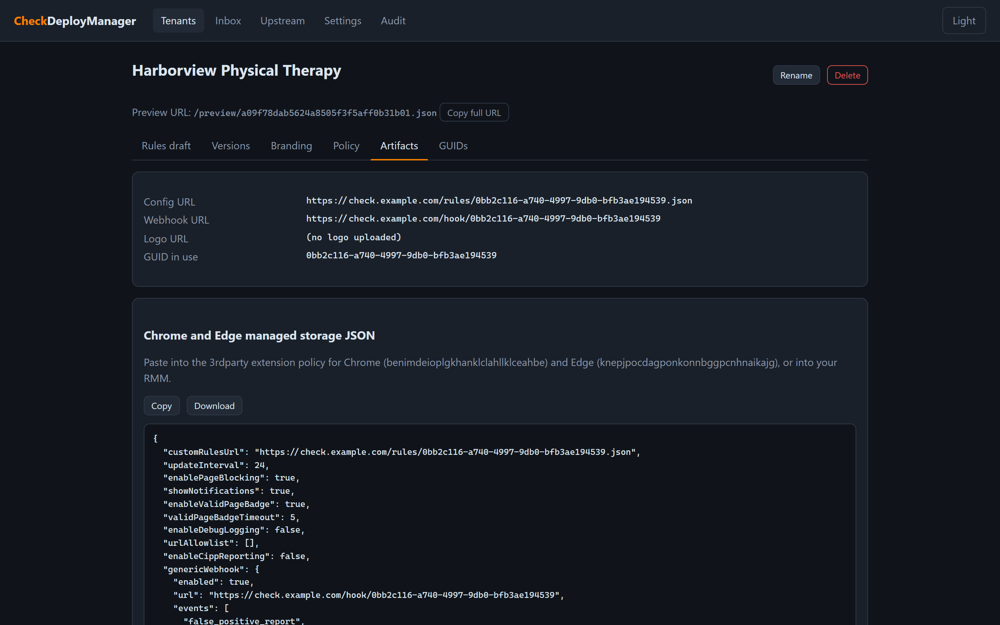
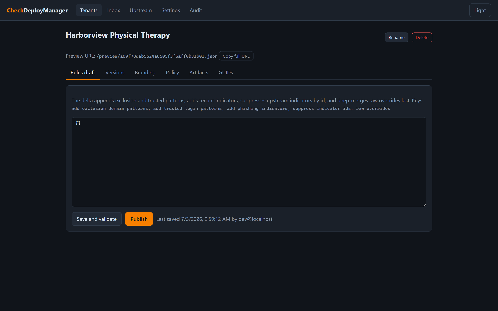
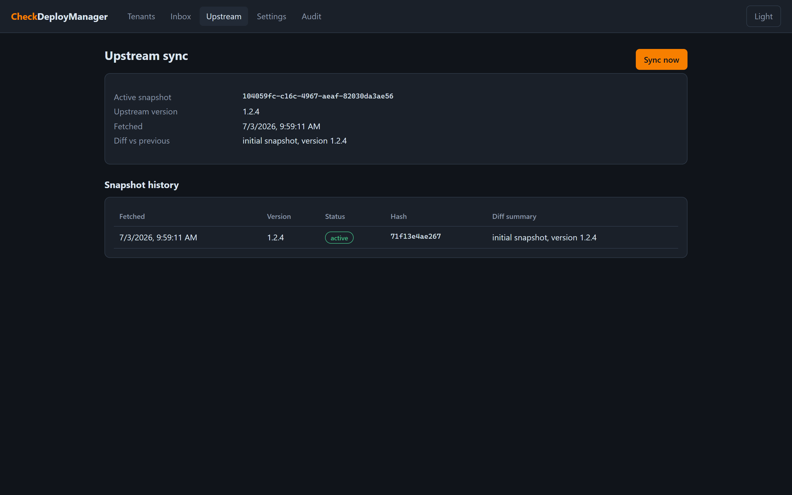
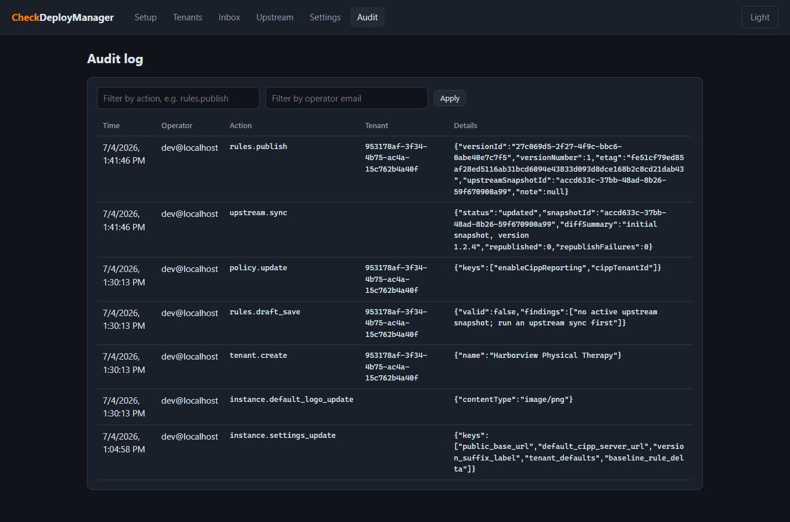

# CheckDeployManager

Multi tenant configuration service for the [Check by CyberDrain](https://docs.check.tech) browser extension, hosted entirely on Cloudflare Workers. Built for MSPs that manage Check across many client organizations, and comfortably inside the Cloudflare free tier at a few thousand endpoints.

[](https://deploy.workers.cloudflare.com/?url=https://github.com/DailenG/CheckDeployManager) [](https://github.com/DailenG/CheckDeployManager/actions/workflows/ci.yml) [](LICENSE) [](docs/wiki/README.md)

## What it does

- **Rules host.** Mirrors the upstream CyberDrain detection rules daily, layers an optional instance-wide baseline delta (standard MSP exclusions, set once) and a small per tenant delta on top (extra exclusions, trusted patterns, custom indicators, suppressions), validates everything, and serves each client an immutable published ruleset at an unguessable URL: `/rules/{guid}.json`.
- **Policy generator.** Renders ready-to-deploy managed policy artifacts per tenant: Chrome and Edge managed storage JSON, Firefox `policies.json` (fragment and full file), `.reg` files for GPO, a ready-to-run GPO creation script (`New-GPO` / `Set-GPRegistryValue`, provably in sync with the `.reg` files), the variable block for Check's Intune setup script, and the field values for CIPP's Check deployment standard.
- **Operations dashboard.** Draft and publish with validation gates, one-click rollback, GUID rotation and revocation with hit counters, tenant branding with logo hosting, instance-level tenant defaults (set MSP-standard branding, logo, and policy once; every tenant inherits until it overrides), a webhook inbox for false positive reports with an optional relay that forwards each report to n8n, Power Automate, or any webhook receiver, upstream diff history, and an indefinite audit log. Dark mode by default.

Two delivery paths stay separate by design: detection rules are URL fetched by the extension on its own schedule, while branding and enforcement settings are pushed to browsers via managed storage policy.

## Screenshots

All screenshots show a local instance seeded with the project's fictional sample tenant, Harborview Physical Therapy. Dark mode is the default; there is a light theme too.

| | |
|---|---|
|  |  |
|  |  |
|  |  |
|  |  |

## Architecture

One Worker serves everything: the public runtime endpoints (`/rules`, `/preview`, `/assets`, `/hook`), the management API and dashboard (`/api`, `/manage`, protected by Cloudflare Access plus in-Worker JWT validation), and a daily cron that syncs upstream rules and applies retention. State lives in D1 (tenants, versions, settings, audit, metrics) and R2 (upstream snapshots, published rulesets, logos). No KV, no frontend framework, no build step for the UI.

See [docs/architecture.md](docs/architecture.md) for the full design and threat model, or the [code wiki](docs/wiki/README.md) for a generated module-by-module tour of the implementation.

## Local development

```
npm install
cp .dev.vars.example .dev.vars
npx wrangler d1 migrations apply DB --local
npx wrangler dev
# open http://localhost:8787/manage
```

`.dev.vars` sets `ENVIRONMENT=development`, which bypasses Cloudflare Access JWT validation locally (Access only exists at the Cloudflare edge) and attributes audit entries to `DEV_OPERATOR_EMAIL`. The bypass activates only when `ENVIRONMENT` is exactly `development`; production fails closed until Access is configured.

The upstream sync fetches the live CyberDrain rules file, so the first sync needs internet. Tests run entirely offline against fixtures:

```
npm test
```

To exercise the daily cron locally:

```
npx wrangler dev --test-scheduled
curl "http://localhost:8787/__scheduled?cron=17+6+*+*+*"
```

## Deploy

1. Click the Deploy to Cloudflare button above. Cloudflare clones the repo into your account, provisions the D1 database and R2 bucket from `wrangler.jsonc`, runs the D1 migrations, and deploys the Worker to `checkdeploymanager.<your-account>.workers.dev`.
2. Complete the post-deploy runbook below. Steps 1 through 4 are one-time platform setup; 5 through 8 bring the service into operation.

### What the deploy form asks for

The button flow prompts for more than you might expect. Field by field:

- **Git repository.** The flow creates a copy of this repo in your own GitHub or GitLab account and deploys from that copy. Pick the account or org and a repository name, and check **Create private Git repository**: the copy is your operational config, and later runbook steps commit your Access values into it. If a repository with that name already exists (for example from a previous setup attempt), creation fails rather than reusing it; pick a different name or delete the old copy first.
- **Project name, D1 database, R2 bucket.** Accept the defaults or rename; choose "create new" for both resources unless you are intentionally reusing existing ones.
- **Build command.** Leave blank. There is no build step; Wrangler bundles the TypeScript and the dashboard is static files.
- **Deploy command.** Use `npm run deploy`. This applies the D1 migrations before `wrangler deploy`; a plain `wrangler deploy` would leave the database schemaless.
- **`ENVIRONMENT` (default `production`).** Keep it exactly `production`. The value `development` disables auth and exists only for local `wrangler dev`.
- **A second `ENVIRONMENT` and `DEV_OPERATOR_EMAIL`.** These are picked up from `.dev.vars.example`, which exists only for local development. Leave them blank or remove them; never set `ENVIRONMENT=development` on a deployed Worker. The flow stores this `ENVIRONMENT` as a remote secret regardless, so the first build logs a warning that the deploy replaces it with the config value `production`; that is expected and correct.
- **`ACCESS_TEAM_DOMAIN`.** The form may require a value. If you already know your Zero Trust team domain, enter it as a bare hostname (`<team>.cloudflareaccess.com`, no `https://`). Otherwise enter any placeholder and correct it in runbook step 3.
- **`ACCESS_APP_AUD`.** The AUD tag does not exist until you create the Access application in runbook step 2, so enter a placeholder and fill in the real value in runbook step 3.

Placeholder or empty Access values are safe: the Worker fails closed and rejects every `/manage` and `/api` request until both values validate real tokens. The public endpoints (`/rules`, `/preview`, `/assets`, `/hook`) work immediately.

If the deployed URL answers `Hello world` or shows "No URLs enabled", the button's build failed after provisioning and left a placeholder Worker; recover with one local `wrangler deploy` per the runbook's [section 0.1](docs/runbook.md) and check its troubleshooting table for other first-deploy symptoms.

### Post-deploy runbook

1. **Add the One-time PIN identity provider.** Zero Trust > Settings > Authentication > Add new > One-time PIN. New Zero Trust organizations default to the Cloudflare identity provider only, so this is an explicit step.
2. **Create the Access application.** Zero Trust > Access controls > Applications > Add > Self-hosted. Add destinations for `manage*` and `api*` on each hostname (destination type Workers for the `workers.dev` hostname, Public DNS for a custom one); never a blank path, which would put the public rules endpoints behind Access and break the extension. Policy: Allow, Emails ending in `@your-domain`. The AUD tag lives on the saved app's Additional Settings tab.
3. **Set Worker variables.** In the Worker's Settings > Variables, set `ACCESS_TEAM_DOMAIN` to `<your-team>.cloudflareaccess.com` and `ACCESS_APP_AUD` to the AUD tag from step 2, both as plain Text. Until both are set, the Worker rejects every management request.
4. **Attach your custom domain** (recommended before your first login: Access sets cookies by bouncing through every app hostname, so a not-yet-serving hostname in the app breaks logins). Worker > Settings > Domains and Routes > Custom domain; DNS and TLS are automatic.
On your first login the dashboard opens a **setup wizard** that walks steps 5 through 7 in-app (instance settings, first upstream sync, tenant zero) and verifies each against live server state. The list below stays as the manual reference; the wizard can be skipped and never traps you.

5. **First-run configuration.** Open `https://<your-hostname>/manage`, authenticate, and set instance settings: public base URL, default CIPP server URL (if any), retention values, and the stale-fetch threshold.
6. **Trigger the first upstream sync** from the Upstream page (or wait for the daily cron) and confirm the snapshot validates.
7. **Create tenant zero** (your own organization), publish, and point a test browser's Config URL at it.
8. **Create the first client tenant**, upload a logo, set branding and policy, publish, generate artifacts, deploy the policy to a pilot device, and verify the fetch appears on the dashboard.
9. **Optional hardening:** add a WAF rate-limiting rule on `/rules/*` and `/hook/*`, and a Cloudflare notification for Workers usage approaching limits.

The full runbook with verification steps lives in [docs/runbook.md](docs/runbook.md).

**Updating later:** the dashboard footer shows the running version and flags newer releases. Updates run through a **Sync upstream** workflow (Actions tab > Sync upstream > Run workflow): clean merges deploy automatically, conflicts become a pull request you resolve in the web editor. One caveat: Cloudflare's deploy flow cannot copy workflow files into your repo (its GitHub app lacks the `workflow` scope), so a fresh copy needs the one-time bootstrap described in the runbook's [Updating a deployed instance](docs/runbook.md#updating-a-deployed-instance) before the Actions tab has anything to run.

## Documentation

- [docs/architecture.md](docs/architecture.md): design, data model, endpoint contracts, threat model
- [docs/runbook.md](docs/runbook.md): full post-deploy and operations runbook
- [docs/wiki/](docs/wiki/README.md): code wiki generated from the GitNexus knowledge graph, one page per module (runtime, auth, data model, validation and merge, sync, publishing, audit, public delivery, API, UI)
- [CONTRIBUTING.md](CONTRIBUTING.md): development workflow and repository rules
- [SECURITY.md](SECURITY.md): threat model summary and disclosure contact

## License

MIT
