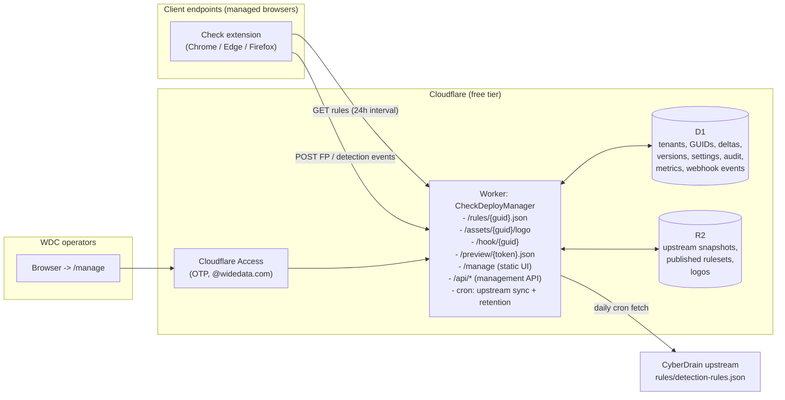

# CheckDeployManager - Design Document

Central, multi tenant configuration service for the Check by CyberDrain browser extension, hosted entirely on Cloudflare, operated by WideData Corporation, published open source under MIT at `github.com/DailenG/CheckDeployManager`.

Status: Design approved-pending-review. Scope: Tier 2 (rules host plus policy generator). All decisions below were dispositioned during discovery rounds 1 and 2.

---

## 1. Architecture Overview

### 1.1 Platform choice: Cloudflare Workers with static assets

Workers (not Pages) is the platform. Decisive reasons:

- **Cron triggers.** The upstream mirror requires a scheduled job. Workers has native cron triggers; Pages Functions does not.
- **Deploy to Cloudflare button.** The button targets Workers repos, reads the Wrangler config, and auto-provisions D1 and R2 bindings. Pages projects do not get this flow.
- **Single artifact.** One Worker serves the runtime rules endpoint, the management API, the webhook receiver, and the static dashboard UI (via the assets binding). One config, one deploy.
- **Direction of the platform.** Cloudflare's investment is in Workers; Pages Functions are billed and executed as Workers anyway.

### 1.2 Component diagram



### 1.3 Core flows

| Flow | Path |
|---|---|
| Rules fetch | Extension GET `/rules/{guid}.json` -> Worker resolves GUID in D1 (active?) -> reads published artifact from R2 -> responds with CORS + ETag; metrics upserted in D1 |
| Publish | Operator edits tenant delta (draft) -> validation gates -> merge delta onto current upstream snapshot -> write immutable version object to R2 -> update current-version pointer in D1 -> audit entry |
| Upstream sync | Daily cron fetches CyberDrain `detection-rules.json` -> validate -> if hash changed, store snapshot in R2, re-merge and auto-publish every tenant, record diff summary; on validation failure keep last good snapshot and flag the dashboard |
| Webhook | Extension POST `/hook/{guid}` -> size and content-type checks -> stored in D1 inbox -> reviewed in dashboard |
| Policy generation | Dashboard renders per tenant artifacts (Chrome/Edge JSON, Firefox JSON, registry/.reg, Intune variable block, CIPP field values) from D1 state; nothing is stored, always generated fresh |

### 1.4 Decisions carried in from discovery

- Rules composition: **Option A**, mirror upstream + per tenant deltas, daily cron, **auto-publish** after validation gates pass, diff notice + one-click rollback as the safety net.
- Tenant addressing: **path form** `/rules/{guid}.json`. Cleaner in policy files, cache-friendly, avoids query string mangling by proxies, and the `.json` suffix self-documents content type.
- KV: **not used in v1**. The 1k writes/day free cap constrains invalidation patterns, and R2 Class B quota (10M/month) plus browser-side ETag/304 makes a cache layer unnecessary at this workload. Verdict on the baseline "KV only if justified": not justified.
- Draft/publish per tenant with immutable versions and rollback; separate unguessable preview URL per tenant for drafts; WDC enrolls itself as tenant zero (documented practice, not a code feature).
- Revoked GUID: **404**. Rotation issues a new GUID while the old stays active until explicitly revoked; dashboard shows hit counts on both during migration.
- Retention: request metrics 7 days (configurable), operator audit log indefinite, webhook events until dispositioned or 90 days (configurable).
- Dashboard UI defaults to **dark mode** with a light toggle.

---

## 2. Data Model

### 2.1 D1 schema (migrations/0001_init.sql)

```sql
CREATE TABLE tenants (
    id TEXT PRIMARY KEY,                -- internal UUID, never exposed publicly
    name TEXT NOT NULL,
    notes TEXT,
    current_version_id TEXT,            -- FK -> ruleset_versions.id (published pointer)
    preview_token TEXT NOT NULL,        -- random 128-bit token for /preview/{token}.json
    created_at TEXT NOT NULL,
    updated_at TEXT NOT NULL
);

CREATE TABLE tenant_guids (
    guid TEXT PRIMARY KEY,              -- random UUIDv4, the public tenant vector
    tenant_id TEXT NOT NULL REFERENCES tenants(id),
    status TEXT NOT NULL DEFAULT 'active',   -- active | revoked
    label TEXT,                         -- operator note, e.g. 'pre-rotation 2026-07'
    created_at TEXT NOT NULL,
    revoked_at TEXT
);
CREATE INDEX idx_guids_tenant ON tenant_guids(tenant_id);

CREATE TABLE tenant_rule_deltas (
    tenant_id TEXT PRIMARY KEY REFERENCES tenants(id),
    draft_json TEXT NOT NULL DEFAULT '{}',   -- the delta document (see 2.3)
    updated_at TEXT NOT NULL,
    updated_by TEXT NOT NULL
);

CREATE TABLE ruleset_versions (
    id TEXT PRIMARY KEY,
    tenant_id TEXT NOT NULL REFERENCES tenants(id),
    version_number INTEGER NOT NULL,    -- monotonic per tenant
    r2_key TEXT NOT NULL,               -- rules/{tenant_id}/{version_number}.json
    etag TEXT NOT NULL,                 -- sha256 of body, doubles as HTTP ETag
    upstream_snapshot_id TEXT NOT NULL, -- which base this was merged against
    delta_json TEXT NOT NULL,           -- frozen copy of the delta used
    created_at TEXT NOT NULL,
    created_by TEXT NOT NULL,           -- operator email, or 'cron' for upstream republish
    note TEXT
);
CREATE INDEX idx_versions_tenant ON ruleset_versions(tenant_id, version_number);

CREATE TABLE tenant_branding (
    tenant_id TEXT PRIMARY KEY REFERENCES tenants(id),
    company_name TEXT DEFAULT '',
    product_name TEXT DEFAULT '',
    support_email TEXT DEFAULT '',
    support_url TEXT DEFAULT '',
    privacy_policy_url TEXT DEFAULT '',
    about_url TEXT DEFAULT '',
    primary_color TEXT DEFAULT '#F77F00',
    logo_r2_key TEXT,                   -- assets/{tenant_id}/logo.{ext}
    logo_content_type TEXT
);

CREATE TABLE tenant_policy_settings (
    tenant_id TEXT PRIMARY KEY REFERENCES tenants(id),
    settings_json TEXT NOT NULL DEFAULT '{}'
    -- managed-schema toggles: enablePageBlocking, showNotifications,
    -- enableValidPageBadge, validPageBadgeTimeout, enableDebugLogging,
    -- updateInterval, urlAllowlist[], domainSquatting{}, genericWebhook prefs,
    -- enableCippReporting, cippServerUrl override, cippTenantId
);

CREATE TABLE instance_settings (
    key TEXT PRIMARY KEY,
    value TEXT NOT NULL
    -- public_base_url, default_cipp_server_url, metrics_retention_days (7),
    -- webhook_retention_days (90), stale_fetch_hours (48),
    -- upstream_source_url, upstream_keep_snapshots (10)
);

CREATE TABLE upstream_snapshots (
    id TEXT PRIMARY KEY,
    fetched_at TEXT NOT NULL,
    upstream_version TEXT,              -- 'version' field from the file, e.g. 1.2.3
    r2_key TEXT NOT NULL,               -- upstream/{fetched_at}-{hash}.json
    hash TEXT NOT NULL,
    status TEXT NOT NULL,               -- active | superseded | failed_validation
    diff_summary TEXT                   -- human summary vs previous snapshot
);

CREATE TABLE audit_log (
    id TEXT PRIMARY KEY,
    ts TEXT NOT NULL,
    operator_email TEXT NOT NULL,       -- from verified Access JWT, or 'cron'
    action TEXT NOT NULL,               -- tenant.create, rules.publish, guid.revoke, ...
    tenant_id TEXT,
    details_json TEXT
);  -- retained indefinitely

CREATE TABLE fetch_metrics (
    tenant_id TEXT NOT NULL,
    guid TEXT NOT NULL,
    day TEXT NOT NULL,                  -- YYYY-MM-DD
    hits INTEGER NOT NULL DEFAULT 0,
    not_modified INTEGER NOT NULL DEFAULT 0,
    last_fetch_at TEXT,
    PRIMARY KEY (tenant_id, guid, day)
);  -- rows older than metrics_retention_days purged by cron

CREATE TABLE revoked_guid_hits (
    guid TEXT NOT NULL,
    day TEXT NOT NULL,
    hits INTEGER NOT NULL DEFAULT 0,
    PRIMARY KEY (guid, day)
);  -- surfaces clients still pointed at a dead GUID

CREATE TABLE webhook_events (
    id TEXT PRIMARY KEY,
    tenant_id TEXT NOT NULL,
    guid TEXT NOT NULL,
    received_at TEXT NOT NULL,
    event_type TEXT NOT NULL,           -- from payload reportType/event
    payload_json TEXT NOT NULL,         -- untrusted; always HTML-escaped on render
    status TEXT NOT NULL DEFAULT 'new'  -- new | reviewed | dismissed
);  -- purged when dispositioned or after webhook_retention_days
```

Free tier fit: ~3,000 endpoints at 1 fetch/day produces roughly 6k D1 row writes/day (metrics upserts) and a handful of indexed reads per request, far inside the 100k writes/day and 5M reads/day caps.

### 2.2 R2 object layout

```
upstream/{iso-ts}-{hash12}.json        mirrored CyberDrain base snapshots (keep last N, default 10)
rules/{tenant_id}/{version}.json       immutable published artifacts, one per publish
assets/{tenant_id}/logo.{png|jpg|svg}  tenant logo (48x48 recommended, 128x128 max, per Check docs)
```

The bucket is private. Everything is served through the Worker so revocation, metrics, and headers stay in one place.

### 2.3 Delta document shape (per tenant)

The tenant never edits the full ruleset. The delta is small, auditable, and survives upstream refreshes:

```json
{
  "add_exclusion_domain_patterns": [
    "^https://[^/]*\\.knowbe4\\.com(/.*)?$",
    "^https://[^/]*\\.harborviewpt\\.com(/.*)?$"
  ],
  "add_trusted_login_patterns": [],
  "add_phishing_indicators": [],
  "suppress_indicator_ids": ["phi_004"],
  "raw_overrides": {}
}
```

Merge semantics: arrays append onto the upstream section, `suppress_indicator_ids` removes upstream indicators by id, `raw_overrides` deep-merges last for escape-hatch cases. The merged output keeps the upstream `version` with a tenant suffix (`1.2.3+wdc.7`) and stamps `lastUpdated` at publish time.

### 2.4 Validation gates (run on every publish and every upstream sync)

1. JSON parses; body under 1 MB.
2. Top-level shape: required sections present (`trusted_login_patterns`, `exclusion_system`, `phishing_indicators`, `m365_detection_requirements`, `blocking_rules`, `detection_settings`); unknown extra sections are tolerated and passed through (upstream drift resilience).
3. Per indicator: `id` present and unique, regex `pattern`/`flags` compile in JS (same engine family as the extension), `severity`/`action`/`confidence` in legal ranges when present.
4. Exclusion and trusted patterns compile as regex.
5. Merged output re-parses and round-trips.

A failed gate blocks publish (operator sees the errors) or, on cron, keeps the last good upstream snapshot and raises a dashboard flag. Check publishes no formal JSON Schema, so these structural gates are deliberately tolerant of unknown keys.

---

## 3. Routes and Endpoint Specification

### 3.1 Public runtime endpoints (no auth; unguessable identifiers are the control)

| Route | Method | Behavior |
|---|---|---|
| `/rules/{guid}.json` | GET, HEAD | Resolve GUID (active) -> stream published artifact from R2 |
| `/preview/{token}.json` | GET | Serve the tenant draft merged live against the active upstream snapshot; `Cache-Control: no-store` |
| `/assets/{guid}/logo` | GET | Tenant logo from R2; `Cache-Control: public, max-age=86400`; correct image content type |
| `/hook/{guid}` | POST | Webhook receiver; requires `Content-Type: application/json`, body under 256 KB; stores event; returns 200 `{"received":true}` |

Rules response contract:

```
HTTP/1.1 200 OK
Content-Type: application/json; charset=utf-8
Access-Control-Allow-Origin: *
Access-Control-Allow-Methods: GET, HEAD, OPTIONS
Cache-Control: public, max-age=300
ETag: "sha256-<hash12>"
X-Content-Type-Options: nosniff
```

- `If-None-Match` match returns `304 Not Modified` (counted separately in metrics).
- Unknown, malformed, or revoked GUID returns a uniform bare `404` with identical timing characteristics (single indexed D1 lookup either way) to resist enumeration probing. Revoked GUID hits are counted for the dashboard.
- `max-age=300` keeps publish propagation fast; the real refresh cadence is the extension's own `updateInterval` (24 h aligned per discovery), so edge caching adds nothing worth the invalidation complexity.

Webhook receiver notes: payloads are stored verbatim but treated as hostile, always HTML-escaped on dashboard render, never interpreted. Events with unknown `reportType` are stored as `event_type = 'unknown'`.

### 3.2 Management surface (behind Cloudflare Access)

Static dashboard at `/manage` (dark mode default). JSON API under `/api`:

| Route | Methods | Purpose |
|---|---|---|
| `/api/tenants` | GET, POST | List / create tenant (create also mints GUID, preview token, default settings) |
| `/api/tenants/{id}` | GET, PATCH, DELETE | Tenant detail / rename / decommission (delete requires zero active GUIDs) |
| `/api/tenants/{id}/rules` | GET, PUT | Read / save draft delta (PUT runs gates in dry-run and returns findings) |
| `/api/tenants/{id}/publish` | POST | Gate, merge, write R2 version, move pointer, audit |
| `/api/tenants/{id}/rollback/{versionId}` | POST | Point tenant at a prior immutable version, audit |
| `/api/tenants/{id}/versions` | GET | Version history with diff summaries |
| `/api/tenants/{id}/branding` | GET, PUT | Branding fields; logo upload via multipart (validated: png/jpg/svg, 512 KB cap, https serving) |
| `/api/tenants/{id}/policy` | GET, PUT | Managed-schema toggles (2.1 settings_json) |
| `/api/tenants/{id}/artifacts` | GET | Generated policy outputs (section 5), rendered fresh |
| `/api/tenants/{id}/guids` | GET, POST | List / rotate (mint new active GUID) |
| `/api/guids/{guid}/revoke` | POST | Immediate 404 for that GUID, audit |
| `/api/instance/settings` | GET, PUT | Instance settings incl. default CIPP server URL, retention, base URL |
| `/api/upstream` | GET, POST | Snapshot status and diff history; POST forces a sync now |
| `/api/events` | GET, PATCH | Webhook inbox; disposition new/reviewed/dismissed |
| `/api/audit` | GET | Audit log, filterable by tenant/operator/action |

Dashboard indicators (v1 observability, per discovery): last fetch per tenant, warning badge when no fetch within `stale_fetch_hours` (default 48), revoked-GUID hit counts, upstream sync status and last diff, validation failures. No email/webhook alerting in v1.

---

## 4. Authentication and Authorization

- **Cloudflare Access self-hosted application** covering `check.widedata.host/manage*` and `check.widedata.host/api*` (and the `workers.dev` host during initial setup). Policy: allow emails ending `@widedata.com`. Identity provider: One-time PIN. Note: new Zero Trust orgs default to the Cloudflare identity provider and OTP is no longer added automatically, so adding the OTP IdP is an explicit runbook step. Free plan covers up to 50 users, which comfortably fits the WDC team.
- **Defense in depth in the Worker.** Every `/api` and `/manage` request validates the `cf-access-jwt-assertion` JWT: signature against the team JWKS (`https://<team>.cloudflareaccess.com/cdn-cgi/access/certs`), `aud` equals the Access app AUD tag, expiry. The verified email claim becomes the audit identity. A request without a valid JWT is rejected even if a routing mistake ever exposed the path. Team domain and AUD tag are Worker environment variables set post-deploy (they are identifiers, not secrets).
- **Authorization model:** flat. Every authenticated WDC operator can manage every tenant; the audit log provides accountability. No per-tenant permissions in v1 (single-MSP tool).
- **No handwritten auth, no passwords, no API keys, no secrets in the repo.** v1 requires zero Worker secrets.

The public endpoints (`/rules`, `/preview`, `/assets`, `/hook`) are intentionally outside Access because the extension cannot authenticate; unguessable 128-bit identifiers, uniform 404s, and rate limiting (section 8) are the controls there.

---

## 5. Policy Generator Specification

Generated per tenant from D1 state, always current, shown in the dashboard with copy buttons and file downloads. Fictional sample tenant throughout:

- Tenant: **Harborview Physical Therapy** (client of WDC)
- GUID: `f4a7c1d2-9b3e-4c8a-a1d6-2e5b7c9f0a34`
- Config URL: `https://check.widedata.host/rules/f4a7c1d2-9b3e-4c8a-a1d6-2e5b7c9f0a34.json`
- Logo URL: `https://check.widedata.host/assets/f4a7c1d2-9b3e-4c8a-a1d6-2e5b7c9f0a34/logo`

### 5.1 Chrome and Edge managed storage policy JSON

The `3rdparty > Extensions > <extension-id>` payload (Chrome id `benimdeioplgkhanklclahllklceahbe`, Edge id `knepjpocdagponkonnbggpcnhnaikajg`):

```json
{
  "customRulesUrl": "https://check.widedata.host/rules/f4a7c1d2-9b3e-4c8a-a1d6-2e5b7c9f0a34.json",
  "updateInterval": 24,
  "enablePageBlocking": true,
  "showNotifications": true,
  "enableValidPageBadge": true,
  "validPageBadgeTimeout": 5,
  "enableDebugLogging": false,
  "urlAllowlist": [
    "https://training.knowbe4.com/*",
    "https://*.harborviewpt.com/*"
  ],
  "enableCippReporting": true,
  "cippServerUrl": "https://cipp.widedata.com",
  "cippTenantId": "harborviewpt.onmicrosoft.com",
  "genericWebhook": {
    "enabled": true,
    "url": "https://check.widedata.host/hook/f4a7c1d2-9b3e-4c8a-a1d6-2e5b7c9f0a34",
    "events": ["false_positive_report", "page_blocked", "threat_detected"]
  },
  "domainSquatting": {
    "enabled": true,
    "deviationThreshold": 2,
    "Action": "block"
  },
  "customBranding": {
    "companyName": "WideData Corporation",
    "productName": "WideData Phishing Protection",
    "supportEmail": "support@widedata.com",
    "supportUrl": "https://support.widedata.com",
    "privacyPolicyUrl": "https://widedata.com/privacy",
    "aboutUrl": "",
    "primaryColor": "#1B6FA8",
    "logoUrl": "https://check.widedata.host/assets/f4a7c1d2-9b3e-4c8a-a1d6-2e5b7c9f0a34/logo"
  }
}
```

CIPP fields inherit `default_cipp_server_url` from instance settings with per tenant override; a fresh open source install with no CIPP configured emits `"enableCippReporting": false` and omits the server URL. The false positive path is delivered via `genericWebhook` with the `false_positive_report` event (verified against Check's deploy script; there is no dedicated managed policy key for it).

### 5.2 Firefox policies.json fragment

Firefox extension id is `check@cyberdrain.com`:

```json
{
  "policies": {
    "3rdparty": {
      "Extensions": {
        "check@cyberdrain.com": {
          "customRulesUrl": "https://check.widedata.host/rules/f4a7c1d2-9b3e-4c8a-a1d6-2e5b7c9f0a34.json",
          "updateInterval": 24,
          "enablePageBlocking": true,
          "showNotifications": true,
          "enableValidPageBadge": true,
          "validPageBadgeTimeout": 5,
          "urlAllowlist": [
            "https://training.knowbe4.com/*",
            "https://*.harborviewpt.com/*"
          ],
          "enableCippReporting": true,
          "cippServerUrl": "https://cipp.widedata.com",
          "cippTenantId": "harborviewpt.onmicrosoft.com",
          "genericWebhook": {
            "enabled": true,
            "url": "https://check.widedata.host/hook/f4a7c1d2-9b3e-4c8a-a1d6-2e5b7c9f0a34",
            "events": ["false_positive_report", "page_blocked", "threat_detected"]
          },
          "customBranding": {
            "companyName": "WideData Corporation",
            "productName": "WideData Phishing Protection",
            "supportEmail": "support@widedata.com",
            "supportUrl": "https://support.widedata.com",
            "privacyPolicyUrl": "https://widedata.com/privacy",
            "aboutUrl": "",
            "primaryColor": "#1B6FA8",
            "logoUrl": "https://check.widedata.host/assets/f4a7c1d2-9b3e-4c8a-a1d6-2e5b7c9f0a34/logo"
          }
        }
      }
    }
  }
}
```

The generator emits both the fragment above and a merged full `policies.json` (with `ExtensionSettings` force-install for the Firefox add-on) for drop-in use.

### 5.3 GPO / registry artifact (.reg download plus value table)

Registry layout verified against Check's own deploy script: managed storage under `...\3rdparty\extensions\<id>\policy`, force-install under `...\ExtensionSettings\<id>`, booleans as DWORD 0/1, `urlAllowlist` as a subkey with numbered string values, `genericWebhook`/`domainSquatting`/`customBranding` as subkeys. Chrome shown; the Edge output is identical under `HKLM\SOFTWARE\Policies\Microsoft\Edge` with the Edge extension id.

```reg
Windows Registry Editor Version 5.00

[HKEY_LOCAL_MACHINE\SOFTWARE\Policies\Google\Chrome\ExtensionSettings\benimdeioplgkhanklclahllklceahbe]
"installation_mode"="force_installed"
"update_url"="https://clients2.google.com/service/update2/crx"

[HKEY_LOCAL_MACHINE\SOFTWARE\Policies\Google\Chrome\3rdparty\extensions\benimdeioplgkhanklclahllklceahbe\policy]
"customRulesUrl"="https://check.widedata.host/rules/f4a7c1d2-9b3e-4c8a-a1d6-2e5b7c9f0a34.json"
"updateInterval"=dword:00000018
"enablePageBlocking"=dword:00000001
"showNotifications"=dword:00000001
"enableValidPageBadge"=dword:00000001
"validPageBadgeTimeout"=dword:00000005
"enableDebugLogging"=dword:00000000
"enableCippReporting"=dword:00000001
"cippServerUrl"="https://cipp.widedata.com"
"cippTenantId"="harborviewpt.onmicrosoft.com"

[HKEY_LOCAL_MACHINE\SOFTWARE\Policies\Google\Chrome\3rdparty\extensions\benimdeioplgkhanklclahllklceahbe\policy\urlAllowlist]
"1"="https://training.knowbe4.com/*"
"2"="https://*.harborviewpt.com/*"

[HKEY_LOCAL_MACHINE\SOFTWARE\Policies\Google\Chrome\3rdparty\extensions\benimdeioplgkhanklclahllklceahbe\policy\genericWebhook]
"enabled"=dword:00000001
"url"="https://check.widedata.host/hook/f4a7c1d2-9b3e-4c8a-a1d6-2e5b7c9f0a34"

[HKEY_LOCAL_MACHINE\SOFTWARE\Policies\Google\Chrome\3rdparty\extensions\benimdeioplgkhanklclahllklceahbe\policy\genericWebhook\events]
"1"="false_positive_report"
"2"="page_blocked"
"3"="threat_detected"

[HKEY_LOCAL_MACHINE\SOFTWARE\Policies\Google\Chrome\3rdparty\extensions\benimdeioplgkhanklclahllklceahbe\policy\domainSquatting]
"enabled"=dword:00000001
"deviationThreshold"=dword:00000002
"Action"="block"

[HKEY_LOCAL_MACHINE\SOFTWARE\Policies\Google\Chrome\3rdparty\extensions\benimdeioplgkhanklclahllklceahbe\policy\customBranding]
"companyName"="WideData Corporation"
"productName"="WideData Phishing Protection"
"supportEmail"="support@widedata.com"
"supportUrl"="https://support.widedata.com"
"privacyPolicyUrl"="https://widedata.com/privacy"
"aboutUrl"=""
"primaryColor"="#1B6FA8"
"logoUrl"="https://check.widedata.host/assets/f4a7c1d2-9b3e-4c8a-a1d6-2e5b7c9f0a34/logo"
```

For admins using the Check ADMX (Deploy-ADMX.ps1 workflow), the dashboard also renders the same values as a field-by-field table matching the template UI under `Computer Configuration > Policies > Administrative Templates > CyberDrain > Check`.

### 5.4 Intune artifact (Check Setup script variable block)

Tier 2 emits values, not packages. The generator renders the exact variable assignments for Check's own `Setup-Windows-Chrome-and-Edge.ps1` / `Deploy-...ps1` workflow, so the operator pastes and packages per the Check docs:

```powershell
$enableCippReporting = 1
$cippServerUrl = "https://cipp.widedata.com"
$cippTenantId = "harborviewpt.onmicrosoft.com"
$customRulesUrl = "https://check.widedata.host/rules/f4a7c1d2-9b3e-4c8a-a1d6-2e5b7c9f0a34.json"
$urlAllowlist = @("https://training.knowbe4.com/*", "https://*.harborviewpt.com/*")
$enableGenericWebhook = 1
$webhookUrl = "https://check.widedata.host/hook/f4a7c1d2-9b3e-4c8a-a1d6-2e5b7c9f0a34"
$webhookEvents = @("false_positive_report", "page_blocked", "threat_detected")
$companyName = "WideData Corporation"
$productName = "WideData Phishing Protection"
$supportEmail = "support@widedata.com"
$supportUrl = "https://support.widedata.com"
$privacyPolicyUrl = "https://widedata.com/privacy"
$aboutUrl = ""
$primaryColor = "#1B6FA8"
$logoUrl = "https://check.widedata.host/assets/f4a7c1d2-9b3e-4c8a-a1d6-2e5b7c9f0a34/logo"
$domainSquattingEnabled = 1
```

(Variable names mirror Check's upstream script exactly; full `.intunewin` production remains Tier 3.)

### 5.5 CIPP artifact

CIPP's `deploycheckchromeextension` standard builds the install and detection scripts itself, so the generator emits the field values to enter into the standard for this tenant rather than inventing a JSON schema for it:

| CIPP standard field | Value |
|---|---|
| Custom Rules / Config URL | `https://check.widedata.host/rules/f4a7c1d2-9b3e-4c8a-a1d6-2e5b7c9f0a34.json` |
| CIPP Reporting | Enabled |
| CIPP Server URL | `https://cipp.widedata.com` |
| Tenant ID / Domain | `harborviewpt.onmicrosoft.com` (auto-filled per CIPP tenant) |
| Branding fields | Same values as section 5.1 `customBranding` |

---

## 6. Repository Layout and Wrangler Configuration

### 6.1 Repository layout (github.com/DailenG/CheckDeployManager, MIT)

```
CheckDeployManager/
  README.md                  Deploy button, overview, runbook link
  LICENSE                    MIT
  CONTRIBUTING.md
  SECURITY.md                Threat model summary + disclosure contact
  docs/
    runbook.md               Full post-deploy runbook (section 7.2)
    architecture.md          This design, maintained
  wrangler.jsonc
  package.json               scripts: dev, deploy (runs D1 migrations then wrangler deploy), test
  migrations/
    0001_init.sql
  src/
    index.ts                 Router entry (fetch + scheduled handlers)
    routes/
      rules.ts               /rules, /preview, /assets
      hook.ts                /hook
      api/                   management API modules per resource
    lib/
      access-jwt.ts          Access JWT validation (JWKS cache, aud check)
      merge.ts               delta merge engine
      validate.ts            validation gates (section 2.4)
      artifacts.ts           policy generator renderers (section 5)
      upstream.ts            cron sync + diffing
      db.ts                  D1 helpers
      audit.ts
    ui/                      static dashboard assets (dark default), served via assets binding
  test/
    merge.test.ts
    validate.test.ts
    artifacts.test.ts
    rules-endpoint.test.ts
```

Repo hygiene rules (enforced in CONTRIBUTING and CI lint): no secrets, no tokens, no client names, no real GUIDs anywhere in the repo; samples use fictional tenants only. All tenant data lives exclusively in the deployer's D1 and R2.

### 6.2 wrangler.jsonc

```jsonc
{
  "$schema": "node_modules/wrangler/config-schema.json",
  "name": "checkdeploymanager",
  "main": "src/index.ts",
  "compatibility_date": "2026-06-01",
  "assets": { "directory": "src/ui", "binding": "ASSETS" },
  "d1_databases": [
    {
      "binding": "DB",
      "database_name": "checkdeploymanager-db",
      "database_id": ""
    }
  ],
  "r2_buckets": [
    { "binding": "STORAGE", "bucket_name": "checkdeploymanager-storage" }
  ],
  "triggers": { "crons": ["17 6 * * *"] },
  "vars": {
    "ACCESS_TEAM_DOMAIN": "",
    "ACCESS_APP_AUD": ""
  },
  "observability": { "enabled": true }
}
```

Notes:

- Bindings carry default names and blank IDs so the Deploy button (and Wrangler auto-provisioning) creates and links the resources on first deploy.
- No `routes` block ships in the repo: the custom domain is instance specific (`check.widedata.host` for WDC) and is attached post-deploy so other deployers are not broken by a hardcoded WDC hostname. The app derives self-referencing URLs from `instance_settings.public_base_url`.
- `ACCESS_TEAM_DOMAIN` / `ACCESS_APP_AUD` are non-secret identifiers filled in post-deploy; until they are set, the Worker fails closed on all `/api` and `/manage` requests.
- `package.json` deploy script runs `wrangler d1 migrations apply DB --remote` before `wrangler deploy`, referencing the binding name so migrations succeed regardless of the database name a deployer chooses (the button auto-detects and pre-populates this deploy command).

---

## 7. Deploy to Cloudflare Plan and Post-Deploy Runbook

### 7.1 What the button automates

From the README button (`https://deploy.workers.cloudflare.com/?url=https://github.com/DailenG/CheckDeployManager`): Cloudflare clones the repo to the user's account, reads `wrangler.jsonc`, provisions the D1 database and R2 bucket, injects the generated resource IDs, runs the build/deploy scripts (including D1 migrations), and deploys the Worker to `checkdeploymanager.<account>.workers.dev`.

### 7.2 Post-deploy runbook (everything the button cannot do)

1. **Add the One-time PIN identity provider.** Zero Trust > Settings > Authentication (new orgs default to the Cloudflare IdP; OTP must be added manually).
2. **Create the Access application.** Self-hosted app covering `checkdeploymanager.<account>.workers.dev/manage*` and `/api*`. Policy: Allow, Emails ending in `@widedata.com`. Record the application AUD tag.
3. **Set Worker variables.** `ACCESS_TEAM_DOMAIN` = `<team>.cloudflareaccess.com`, `ACCESS_APP_AUD` = the AUD tag (dashboard > Worker > Settings > Variables). Redeploy is automatic.
4. **Attach the custom domain.** Worker > Settings > Domains and Routes > add `check.widedata.host` (zone `widedata.host` is already on Cloudflare Registrar, so this is one click). Add the same hostname paths to the Access application.
5. **First-run configuration.** Open `https://check.widedata.host/manage`, authenticate via OTP, set instance settings: public base URL (`https://check.widedata.host`), default CIPP server URL (`https://cipp.widedata.com`), retention values (defaults 7/90), stale-fetch threshold (48 h).
6. **Trigger the first upstream sync** from the dashboard (or wait for the daily cron) and confirm the snapshot validates.
7. **Create tenant zero (WideData internal)**, publish, and point a test browser's Config URL at it.
8. **Create the first client tenant**, upload logo, set branding/policy, publish, generate artifacts, deploy the policy to a pilot device, verify a fetch appears on the dashboard.
9. **Optional hardening:** WAF rate-limiting rule on `/rules/*` and `/hook/*` (free plan includes custom rules), and Cloudflare notification for Workers usage approaching limits.

Steps 1 through 4 are one-time; 5 through 8 are the operational bring-up. The public README carries this runbook genericized (no WDC values).

---

## 8. Security, Privacy, and Threat Model

Assets worth protecting: integrity of served detection rules (tampering would weaken phishing protection fleet-wide), confidentiality of the tenant-to-client mapping, operator access, and webhook payload contents (they include URLs users visited).

| Threat | Vector | Mitigations |
|---|---|---|
| Rules poisoning | Compromised operator session or Access misconfig | Access OTP in front, JWT re-validation in Worker (fails closed), immutable versioning + one-click rollback, full audit log, validation gates on every publish |
| Tenant enumeration | Guessing/scanning `/rules/{guid}.json` | 128-bit random GUIDs, uniform bare 404 for unknown and revoked alike, no readable slugs anywhere public, WAF rate limit, revoked-hit counters for detection |
| Client identity leakage | Public endpoint contents | Served rules and logo paths contain only GUIDs; branding content is inherently client-visible on their own endpoints anyway; tenant names live only behind Access |
| Upstream compromise or breakage | Malicious/broken CyberDrain snapshot | Validation gates before any republish, last-good snapshot retained, dashboard diff + flag, per tenant rollback; snapshots kept (default 10) |
| Webhook abuse | Spam, oversized bodies, stored XSS via payload rendered in dashboard | 256 KB cap, content-type enforcement, rate limit, payloads always HTML-escaped on render and never executed/interpreted, 90-day retention |
| DoS / quota exhaustion | Flood of public requests burning the 100k/day Worker cap | Cloudflare absorbs volumetric attacks; WAF rate rule on public paths; dashboard shows daily request trend; failure mode is extension falling back to cached rules (degrades gracefully) |
| Access lockout | OTP IdP misconfigured or team domain typo | Break-glass: account owner can edit the Access policy from the Cloudflare dashboard, which is independent of this app |
| Repo leakage | Secrets or client data committed | None required by design (zero secrets in v1); CONTRIBUTING rule + CI grep for GUID/email patterns in fixtures |

Privacy: fetch metrics store GUID-level counters only (no client IPs retained beyond Cloudflare's own edge logs); webhook payloads are the most sensitive stored data and follow the 90-day/disposition retention; the operator audit log stores WDC operator emails only. Log retention values are instance settings, satisfying the configurable requirement.

Licensing: MIT for this repository. AGPL-3.0 obligations do not attach because no Check source code is reused; the service only produces and serves JSON that Check consumes.

---

## 9. Test and Rollback Plan

### 9.1 Automated (Vitest + Workers test pool, run in CI)

- Merge engine: delta append, suppression by id, raw override precedence, version suffixing, idempotency across re-merges.
- Validation gates: each gate has a failing fixture; tolerant-pass fixtures with unknown top-level sections (upstream drift simulation).
- Rules endpoint: 200 with exact header contract, 304 on matching ETag, uniform 404 for unknown and revoked, HEAD support.
- Artifact renderers: golden-file comparisons for Chrome/Edge JSON, Firefox JSON, .reg output, Intune variable block.
- Access JWT: expired, wrong aud, wrong issuer, and missing-token all reject.

### 9.2 Manual verification checklist (runbook appendix)

1. `curl -i` the tenant rules URL: verify CORS, ETag, content type; repeat with `If-None-Match` and confirm 304.
2. Load Check in a test browser, set Config URL to the tenant preview URL, use Update Rules Now, confirm the Configuration Overview shows the tenant version string (`x.y.z+wdc.n`).
3. Confirm a tenant exclusion works: add a phishing-simulation domain to the delta, publish, verify the extension no longer flags it.
4. Import the generated .reg on a test VM, `gpupdate /force`, verify managed-by-policy banner and values in the extension options page.
5. Firefox: place generated policies.json, restart, verify branding and Config URL applied.
6. Intune: paste generated variable block into the Check setup workflow, package, deploy to a pilot ring, confirm detection script passes.
7. Webhook: click Report False Positive on a blocked test page, confirm the event lands in the dashboard inbox.
8. Rotation drill: rotate a GUID, confirm both serve, revoke the old, confirm 404 and revoked-hit counter increments.
9. Rollback drill: publish a deliberately noisy rule, roll back one version, confirm the endpoint ETag reverts.

### 9.3 Rollback and recovery

- **Rules:** every publish is an immutable R2 object; rollback is a pointer move, one click, audited. Draft is never served.
- **Upstream:** a failed sync never replaces the active snapshot; a bad-but-valid upstream change is recoverable per tenant via version rollback (versions record which snapshot they were merged against).
- **Service:** Worker deploys are versioned by Cloudflare; `wrangler rollback` restores the prior deployment. D1 supports Time Travel restore as the disaster fallback.
- **GUID compromise:** rotate, roll client policies, revoke old, watch revoked-hit counter drain.

---

## 10. Registers

### 10.1 Open questions (minor, none block the build)

1. Preview token lifetime: static per tenant with manual regenerate (proposed default) vs auto-expiring. Proposed: static + regenerate button.
2. Upstream snapshot retention count: default 10, confirm.
3. Whether the dashboard should offer a merged-full `policies.json` download for Firefox including force-install (proposed: yes, both fragment and full file).

### 10.2 Assumptions

- Workload up to a few thousand endpoints, ~1 rules fetch per endpoint per day, infrequent operator writes: verified to fit free tier with wide margin (Workers 100k req/day, D1 5M reads / 100k writes per day, R2 10 GB + 1M Class A + 10M Class B per month, Access free to 50 users).
- Chrome/Edge extension IDs and the Firefox id `check@cyberdrain.com` remain stable; managed schema drift is tolerated by the pass-through merge design and surfaced by the daily diff.
- `widedata.host` remains on Cloudflare; `check.widedata.host` is dedicated to this service permanently, since it is baked into client policies.
- WDC team stays under 50 Access seats.

### 10.3 Risks

- **Upstream schema drift** (Check publishes no formal schema): mitigated by tolerant structural validation, pass-through of unknown sections, daily diff summaries, and golden tests updated on drift.
- **Silent degradation on revocation**: endpoints on a revoked GUID quietly fall back to cached rules; mitigated by revoked-hit counters and the stale-fetch badge.
- **Free tier caps under abuse**: Worker daily request cap is the realistic pressure point; WAF rate rules and the request-trend indicator are the guards, and the failure mode is graceful (extensions keep cached rules).
- **Access misconfiguration window**: Worker-side JWT validation fails closed, so an unprotected route never exposes the API.
- **Policy propagation lag** (15-30 min for browser policy, 24 h default rules interval): inherent to Check's model, documented in the runbook so expectations are set with clients.

---

End of design. Build proceeds on approval via the BUILD HANDOFF PROMPT.

---

## Appendix: Implementation notes (build deviations)

Two concrete conflicts between section 6.2 and platform reality surfaced during the build; both were resolved with the minimal change:

1. **`database_id` is omitted rather than blank.** Wrangler v4 rejects an empty-string `database_id` at `wrangler dev` startup. Omitting the key entirely preserves the intended behavior: the Deploy to Cloudflare button and Wrangler auto-provisioning create and link the database on first deploy.
2. **`run_worker_first` added for `/manage` paths.** With a static assets binding, asset requests are served before the Worker runs by default, which would have bypassed the in-Worker Access JWT validation on `/manage`. `"run_worker_first": ["/manage", "/manage/*"]` routes those paths through the Worker so the defense-in-depth check from section 4 actually executes; the Worker then serves the asset via the `ASSETS` binding after validation.

One addition: the published version suffix label (`1.2.3+wdc.7` in the examples) is the instance setting `version_suffix_label`, defaulting to `cdm` so a fresh open source install carries no WDC branding. WDC sets it to `wdc` during first-run configuration.
