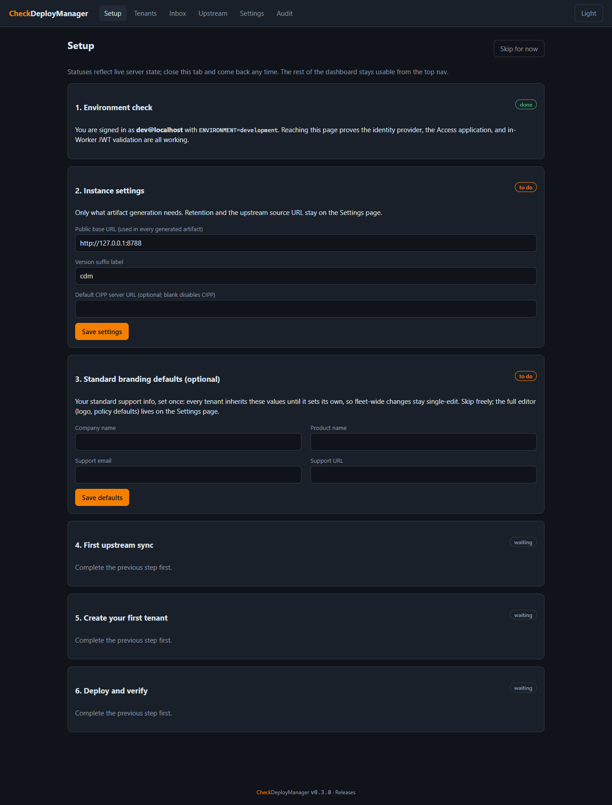
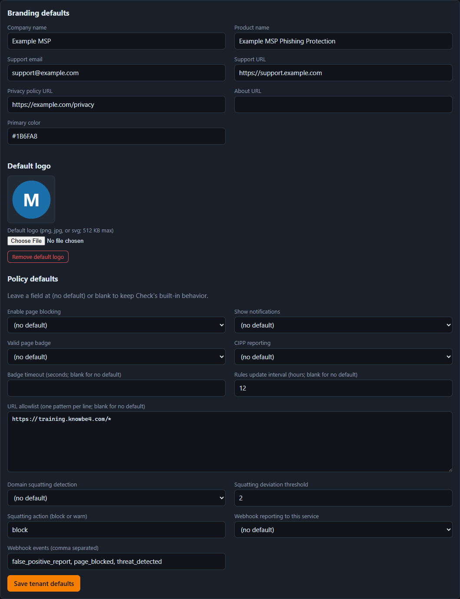
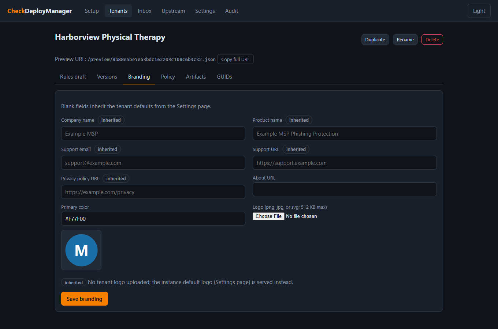
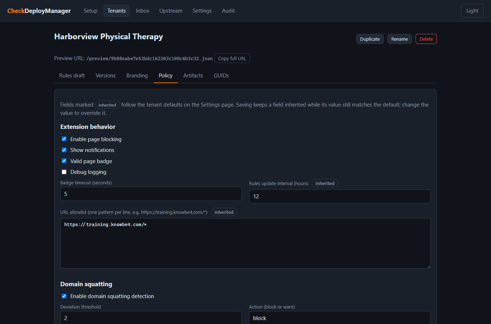
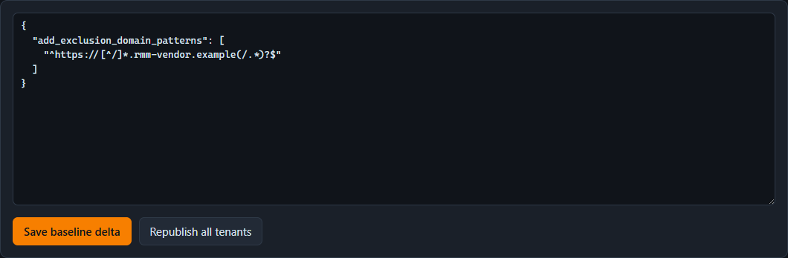

# CheckDeployManager Runbook

Post-deploy setup and day-to-day operations. Hostnames below are placeholders; substitute your own. The sample tenant used throughout the documentation, Harborview Physical Therapy, is fictional.

## 0. Deploy button walkthrough

The Deploy to Cloudflare flow asks for the following. Fields not listed here (project name, D1 database, R2 bucket) are self-explanatory; create new resources unless deliberately reusing existing ones.

| Field | What to enter |
|---|---|
| Git repository | The flow clones this repo into your own GitHub or GitLab account and deploys from that copy; pick the destination account and name |
| Build command | Leave blank; there is no build step |
| Deploy command | `npm run deploy` (runs D1 migrations, then `wrangler deploy`) |
| `ENVIRONMENT` (default `production`) | Keep `production`; `development` disables auth and is local-only |
| Second `ENVIRONMENT` / `DEV_OPERATOR_EMAIL` | Sourced from `.dev.vars.example`; leave blank or remove |
| `ACCESS_TEAM_DOMAIN` | Your Zero Trust team domain as a bare hostname (`<team>.cloudflareaccess.com`) if known, else any placeholder, corrected in 1.3 |
| `ACCESS_APP_AUD` | Placeholder; the real AUD tag is created in 1.2 and set in 1.3 |

Placeholder Access values are safe: management routes fail closed until both values validate real tokens, while the public endpoints serve immediately.

### 0.1 If the first build fails

The button flow can provision the resources and apply migrations but still fail at its deploy step, leaving a placeholder Worker. Symptoms: the Worker URL answers `Hello world`, the overview shows "No URLs enabled", and no bindings are listed. Recovery from a local clone:

1. `npx wrangler login` (choose the target account), then `npx wrangler d1 list` and copy the UUID of `checkdeploymanager-db`.
2. In `wrangler.jsonc`, temporarily set `database_id` to that UUID and fill in the real `ACCESS_TEAM_DOMAIN` and `ACCESS_APP_AUD` values.
3. `npx wrangler d1 migrations apply DB --remote` (it may report nothing to apply if the build got that far).
4. `npx wrangler deploy`. The output should list the DB, STORAGE, and ASSETS bindings, the vars, the cron trigger, and the live URL.
5. Verify: `curl -i https://<worker-host>/rules/test.json` returns a bare 404 (proves the Worker and D1 are live), and `/manage` redirects to your Access login.
6. If the Worker URL still does not resolve, enable the Worker URLs toggle under the Worker's Settings > Domains and Routes.

Include the real Access values in step 2 rather than deploying with blanks: `wrangler deploy` treats the config as the source of truth for vars and overwrites anything set in the dashboard. For the same reason, either update the git clone the button created with these values (they are not secrets) or disconnect its build integration; otherwise the next push to the clone rebuilds with placeholders and locks you out of `/manage` until the values are re-entered.

## 1. Post-deploy setup (one time)

Prerequisite: the Deploy to Cloudflare button (or `npm run deploy` from a clone) has already provisioned the D1 database and R2 bucket, applied migrations, and deployed the Worker to `checkdeploymanager.<account>.workers.dev`.

### 1.1 Add the One-time PIN identity provider

Zero Trust > Settings > Authentication > Login methods > Add new > One-time PIN.

New Zero Trust organizations default to the Cloudflare identity provider and do not include OTP automatically. Any IdP works if you prefer another; the policy in the next step is what gates access.

### 1.2 Create the Access application

Zero Trust > Access controls > Applications > Add an application > Self-hosted.

**Destinations.** The hostname picker offers destination types; use **Workers** for the `workers.dev` hostname (it exists because `workers.dev` is not a DNS zone in your account) and **Public DNS** for a custom hostname on one of your zones. Add four entries in this one application:

| Destination type | Hostname | Path |
|---|---|---|
| Workers | `checkdeploymanager.<subdomain>.workers.dev` | `manage*` |
| Workers | `checkdeploymanager.<subdomain>.workers.dev` | `api*` |
| Public DNS | `<your-custom-hostname>` | `manage*` |
| Public DNS | `<your-custom-hostname>` | `api*` |

The path field is not optional in practice. Never leave it blank: a blank path puts the whole hostname behind Access, including `/rules`, `/preview`, `/assets`, and `/hook`, and the extension cannot complete an Access login, so every managed browser silently stops fetching rules. The trailing `*` covers the sub-paths. Keeping all hostnames in one application means one AUD tag; adding hostnames later never changes it.

**Login flow caveat.** Access sets its session cookie by bouncing the browser through every destination hostname after login. If any destination hostname is not serving yet (for example the custom domain before section 1.4 is done), logins dead-end on a "site cannot be reached" page for that hostname. Either attach the custom domain to the Worker before your first login, or add its destinations only when it is live.

**Policy.** Policies are standalone objects you attach to the app. Create one: name `Operators`, action **Allow**, include rule: selector **Emails ending in**, value `@<your-domain>`. Session duration default (24 h) is fine. Do not add Bypass or Service Auth policies for these paths.

**Login methods.** Select One-time PIN (or accept all if OTP is your only IdP). If OTP is not offered, section 1.1 was skipped.

**Other settings.** All defaults are fine. App Launcher visibility is a nice-to-have (operators find the dashboard at `https://<team>.cloudflareaccess.com`). Leave CORS settings untouched; the endpoints that need CORS are public and set their own headers.

**Record the AUD tag.** Save the application, then open it again and switch to the **Additional Settings** tab (next to Application Details at the top); the **Application Audience (AUD) Tag** is a 64-character hex string with a copy button. Note that the copyable application JSON on the list screen does not include it, and the `id` UUID in that JSON is not the AUD.

The Access free plan covers up to 50 users.

### 1.3 Set the Worker variables

Workers and Pages > checkdeploymanager > Settings > Variables and Secrets:

- `ACCESS_TEAM_DOMAIN` = `<your-team>.cloudflareaccess.com` (bare hostname, no `https://`)
- `ACCESS_APP_AUD` = the AUD tag from 1.2

Use type **Text**, not Secret: these are identifiers, not credentials (the AUD appears in every Access JWT), Text keeps them visible for debugging, and a Secret colliding with the same-named config var breaks deploys.

The Worker validates the `cf-access-jwt-assertion` header on every `/manage` and `/api` request: signature against the team JWKS, audience match, and expiry. Until both variables are set, every management request is rejected (fail closed), so complete this step before first use.

Durability caveat: any deploy from a wrangler config (including the git clone's automatic builds) overwrites dashboard-set vars with the config's values. If your deployment repo still carries blank or placeholder values, mirror the real ones into its `wrangler.jsonc` so a future redeploy cannot lock you out.

### 1.4 Attach the custom domain (recommended)

Workers and Pages > checkdeploymanager > Settings > Domains and Routes > Add > Custom domain.

Cloudflare creates the DNS record and issues the certificate automatically; the hostname is usually live within a minute or two. The hostname you choose is baked into every generated client policy, so treat it as permanent: keep the zone's registration on auto-renew and reserve the subdomain for this service indefinitely. If you did not already add the hostname's `manage*` and `api*` destinations to the Access application in 1.2, add them now.

Once the custom domain serves, two follow-ups:

1. Set the dashboard's public base URL to the custom hostname (section 2) **before** generating any artifacts, so client policies never carry the `workers.dev` hostname.
2. Optionally retire the `workers.dev` hostname so the custom domain is the only management surface. Do these two changes together or not at all: remove the `workers.dev` destinations from the Access application **and** disable the Worker URLs toggle under Domains and Routes. An Access destination pointing at a hostname that no longer serves breaks every login (see the login flow caveat in 1.2). Custom domains attached in the dashboard survive `wrangler deploy`, since the repo config ships no routes block.

## 2. First-run configuration

On a fresh instance the dashboard redirects your first visit to a **setup
wizard** (`#/setup`) covering steps 2 through 5 below: instance settings,
an optional standard-branding-defaults step, the first upstream sync, and
tenant zero with a published ruleset. Each
step's badge derives from live server state, so the wizard is resumable
(close the tab, come back, nothing is lost) and safe with several operators
working at once. **Skip for now** dismisses it permanently, as does
finishing it; either writes the `onboarding_completed_at` instance setting.
The top navigation stays fully usable throughout, and instances that
predate the wizard never see it. The manual steps below remain the
reference for what the wizard automates.



1. Open `https://<your-hostname>/manage` and authenticate via OTP.
2. Go to **Settings** (in the dashboard's own top navigation, not the Cloudflare dashboard) and configure:
   - **Public base URL**: `https://<your-hostname>` with the scheme and no trailing slash (used in every rules URL, hook URL, and artifact; set it to the permanent custom hostname before generating anything)
   - **Default CIPP server URL**: your CIPP instance, or blank to disable CIPP fields by default
   - **Version suffix label**: short label stamped into published versions (`1.2.3+<label>.<n>`)
   - Retention: metrics days (default 7), webhook days (default 90), stale-fetch hours (default 48), snapshots to keep (default 10)
3. Go to **Upstream** and click **Sync now**. Confirm the snapshot validates and shows as active.
4. Create **tenant zero** for your own organization, publish, and point a test browser at its Config URL (enroll yourself the same way clients are enrolled).
5. Optional but recommended for fleets: fill in **Tenant defaults** on the Settings page (your standard support info, product name, logo, and policy values) so every tenant starts correct without per-tenant copy-paste. See "Tenant defaults" under routine operations.
6. Create the first client tenant: branding (logo up to 512 KB, png/jpg/svg, 48x48 recommended), policy settings, publish, then copy artifacts from the Artifacts tab into your deployment tooling.

## 3. Routine operations

### Publishing a rules change

1. Tenant > Rules draft: edit the delta JSON. Keys: `add_exclusion_domain_patterns`, `add_trusted_login_patterns`, `add_phishing_indicators`, `suppress_indicator_ids`, `raw_overrides`.
2. **Save and validate** runs the gates in dry-run and reports findings.
3. Use the tenant preview URL in a test browser to confirm behavior against the live draft.
4. **Publish**. The merge runs against the active upstream snapshot, writes an immutable version to R2, and moves the serving pointer. Extensions pick it up within their update interval (24 h by default; `max-age` on the endpoint is 300 s).

### Rolling back

Tenant > Versions > Roll back to this. The pointer moves to the selected immutable version instantly; the endpoint ETag reverts with it.

### GUID rotation and revocation

1. Tenant > GUIDs > Rotate. The new GUID serves immediately; the old one keeps serving.
2. Regenerate artifacts (they use the newest active GUID) and roll them out to client policies.
3. Watch traffic move to the new GUID, then **Revoke** the old one.
4. After revocation, the old URL returns a bare 404 and hits are counted on the GUIDs tab; a nonzero count means some endpoints still carry the old policy.

### Tenant defaults (instance-level inheritance)

The **Tenant defaults** panel on the Settings page holds branding and policy
values every tenant inherits until it sets its own. Values are resolved at
artifact generation time, never copied into tenant rows, so changing a
default once reaches every non-overridden tenant's next artifact with no
republish.

- **Branding**: a tenant branding field left blank inherits the default; any
  non-empty value overrides it. The default logo is served through each
  tenant's own `/assets/{guid}/logo` URL whenever the tenant has no logo of
  its own, so already-deployed policies pick up a new default logo without a
  policy change.
- **Policy**: a policy field the tenant never overrode inherits. The Policy
  tab marks inherited fields with an "inherited" badge; saving the tab keeps
  a field inherited while its value still matches the default, so tenants
  follow future default changes until you deliberately change their value.
- **Never inherited**: the CIPP tenant id (it maps a client to its CIPP
  tenant), the CIPP server URL (use the dedicated **Default CIPP server
  URL** setting), and debug logging.

**Propagation caveat**: dashboards and generated artifacts reflect a
defaults change immediately, but browsers already deployed only change when
their policy is re-pushed -- re-import the GPO or reg file, re-sync Intune,
or re-run the CIPP standard. The logo is the exception: it is fetched live
from the asset URL.

The setup wizard offers a small optional "Standard branding defaults" step
(company name, product name, support email and URL) that writes the same
setting; the full editor stays on the Settings page.



On the tenant tabs, inherited fields are marked and show the inherited
value, so an override is always distinguishable from a default:





### Baseline rules delta

The **Baseline rules delta** panel on the Settings page holds an
instance-level rule delta (same keys as a tenant delta) that merges beneath
every tenant delta at publish time. Standard MSP exclusions -- RMM domains,
your PSA, tools every client runs -- belong here instead of being pasted
into each tenant's delta.

- Order: upstream rules, then the baseline delta, then the tenant delta.
  A tenant can suppress an indicator the baseline added; if both add the
  same indicator id, the duplicate-id validation gate blocks the publish.
- The baseline is validated on save with the same checks as a tenant delta.
- **Propagation**: published versions are immutable, so a baseline change
  reaches a tenant on its next publish. **Republish all tenants** (next to
  the editor) re-merges and republishes every tenant with a published
  version immediately, using the delta frozen in its current version --
  never unpublished drafts. Failures land in the audit log per tenant.



### Duplicating a tenant

**Duplicate** on the tenant header creates a fresh tenant carrying only the
source's rules delta draft (new GUID, new preview token, nothing published).
Branding and policy intentionally do not copy: they inherit the tenant
defaults, and copying would freeze values that should keep inheriting. Use
it when a new client needs the same rule adjustments as an existing one.

### Updating a deployed instance

The dashboard footer shows the running version and, when a newer release
exists, a "vX.Y.Z available" link (checked from your browser against the
GitHub releases API once per page load; the Worker itself never calls out
for this).

How you update depends on how you deployed:

- **Deploy button, one click (recommended).** Your copy of the repo ships
  with a **Sync upstream** workflow. In your copy on GitHub: Actions >
  Sync upstream > Run workflow. A clean merge is pushed immediately and
  Workers Builds redeploys (`npm run deploy` applies any new D1
  migrations). If the merge conflicts, the workflow opens a pull request
  named `upstream-sync` listing the conflicted files; resolve them with
  the Resolve conflicts button in the GitHub web editor (or locally) and
  merge. Nothing deploys until the conflict is resolved. Note: the
  workflow's own push does not re-trigger your copy's GitHub Actions CI,
  but Workers Builds still receives it and deploys.

  First run only: deploy-button copies start as a snapshot import with no
  shared git history, so the first sync reports that a one-time step is
  needed. Rerun the workflow with **Adopt upstream history** checked: your
  current main is saved to a backup branch, upstream history becomes main
  with your `wrangler.jsonc` kept, and every later sync is a normal merge.
  If you customized files other than `wrangler.jsonc`, restore them from
  the backup branch afterward.

- **Deploy button, manually.** Same result from a clone of your copy:

  ```
  git remote add upstream https://github.com/DailenG/CheckDeployManager.git
  git fetch upstream
  git merge upstream/main
  git push
  ```

  (`remote add` only the first time.) The push triggers Workers Builds,
  which runs the configured deploy command.

- **Local clone with wrangler.** `git pull`, then `npm run deploy`.

To keep merges conflict-free, confine your customizations to
`wrangler.jsonc` (your Access values and provisioned ids) where possible;
everything you have not touched merges cleanly.

Notes for either path:

- Read the release notes first: https://github.com/DailenG/CheckDeployManager/releases
- Migrations are additive and applied automatically by `npm run deploy`;
  never edit or reorder shipped migration files.
- A deploy overwrites dashboard-set Worker vars with the config's values
  (see 1.3): keep your real `ACCESS_TEAM_DOMAIN` and `ACCESS_APP_AUD` in
  your copy's `wrangler.jsonc` so an update cannot lock you out.
- If your copy has local changes, the merge may conflict; resolve in your
  copy, or keep customizations in separate files where possible.

### Upstream sync

The cron runs daily (06:17 UTC). Each sync fetches the CyberDrain rules file; on change it validates, snapshots to R2, records a diff summary, and republishes every tenant with a published version using that tenant's frozen delta. A snapshot that fails validation never replaces the active one; it is stored, flagged in the history, and the dashboard shows the failure. Force a sync any time from Upstream > Sync now.

### Webhook inbox

False positive reports and other extension events POST to `/hook/{guid}` and land in the Inbox. Payloads are stored verbatim, treated as hostile, and always rendered escaped. Disposition events as reviewed or dismissed; dispositioned events are purged by the daily cleanup, undispositioned ones after the retention window.

**Relay to automations.** Set the **False positive relay URL** instance setting to forward every inbound event to an automation platform (n8n, Power Automate, Zapier, or any webhook receiver) for tickets or notifications. Each event is POSTed once as JSON: `{source, kind, event}` where `event` carries the inbox row (id, tenant id and name, GUID, received time, event type) and the original `payload_json` as a verbatim string. Notes:

- The URL must be `https://`. Platforms like n8n and Power Automate embed a capability token in the URL itself; treat the configured URL as sensitive.
- Delivery is best effort: one attempt, no retry queue. The Inbox row is the durable record; the relay is a convenience copy, and a failed relay never fails or delays the reporting extension.
- The relayed `payload_json` is untrusted extension input forwarded verbatim. Automations consuming it must apply the same hostility assumptions this service does: parse defensively, never render unescaped, never execute.

### Decommissioning a tenant

Revoke all GUIDs, wait for revoked-hit counters to drain (confirming no clients still point at it), then Tenant > Delete. Deletion removes the tenant's rows and R2 objects; audit entries are retained.

## 4. Verification checklist

After bring-up or a significant change:

1. `curl -i https://<host>/rules/<guid>.json`: expect 200, `Content-Type: application/json; charset=utf-8`, `Access-Control-Allow-Origin: *`, `Cache-Control: public, max-age=300`, an `ETag`, and `X-Content-Type-Options: nosniff`. Repeat with `If-None-Match: <etag>` and expect 304.
2. Load Check in a test browser, set the Config URL to the tenant preview URL, use Update Rules Now, and confirm the Configuration Overview shows the tenant version string (`x.y.z+<label>.<n>`).
3. Add a phishing-simulation domain to the delta, publish, and verify the extension no longer flags it.
4. Import the generated `.reg` on a test VM, run `gpupdate /force`, and verify the managed-by-policy banner and values in the extension options page.
5. Firefox: place the generated `policies.json` in the distribution directory, restart, and verify branding and Config URL.
6. Intune: paste the generated variable block into Check's setup script workflow, package, deploy to a pilot ring, and confirm the detection script passes.
7. Click Report False Positive on a blocked test page and confirm the event lands in the Inbox.
8. Rotation drill: rotate, confirm both GUIDs serve, revoke the old, confirm 404 and the revoked-hit counter increments.
9. Rollback drill: publish a deliberately noisy rule, roll back one version, and confirm the endpoint ETag reverts.

## 5. Troubleshooting

Symptoms observed on real deployments, with causes and fixes:

| Symptom | Cause | Fix |
|---|---|---|
| Worker URL answers `Hello world`; no bindings; "No URLs enabled" | The deploy button's build failed after provisioning, leaving the placeholder Worker | Deploy locally per section 0.1 |
| Worker URL does not resolve at all | Worker URLs toggle disabled | Worker > Settings > Domains and Routes > enable the `workers.dev` Worker URL |
| Login succeeds but ends on "site cannot be reached" at another hostname | The Access app has a destination for a hostname that is not serving yet (Access bounces through every destination to set cookies) | Attach the custom domain to the Worker (1.4), or remove that hostname's destinations until it is live |
| `/manage` returns JSON `{"error":"audience mismatch"}` after login | `ACCESS_APP_AUD` does not match the application's AUD tag | Re-copy the AUD from the app's Additional Settings tab |
| `/manage` returns JSON `{"error":"issuer mismatch"}` after login | `ACCESS_TEAM_DOMAIN` wrong or not a bare hostname | Set it to exactly `<team>.cloudflareaccess.com` |
| `/manage` returns JSON `{"error":"Access is not configured..."}` | Both Access vars empty, often right after a redeploy overwrote dashboard-set values with config placeholders | Re-enter the values and mirror them into the deploying config (1.3) |
| `/manage` returns a bare JSON 403 with no Access login page first | The hostname or path is not covered by any Access application destination | Add the missing destination (1.2) |
| Cannot find the AUD tag | It is not in the copyable application JSON and not on the Application Details tab | App editor > Additional Settings tab; or the Access API (`GET /accounts/{id}/access/apps`, field `aud`) |
| Extension stops fetching rules after Access changes | A blank destination path put the public endpoints behind Access | Scope destinations to `manage*` and `api*` only |
| Artifacts carry the `workers.dev` hostname | Public base URL was unset or set to the temporary hostname when they were copied | Set the public base URL (section 2) and re-copy; artifacts always render fresh |

## 6. Recovery

- **Bad tenant publish**: roll back from the Versions tab (pointer move, audited).
- **Bad upstream snapshot**: failed validation never activates. For a bad-but-valid upstream change, roll back affected tenants; versions record which snapshot they merged against.
- **Bad Worker deploy**: `npx wrangler rollback` restores the previous deployment.
- **Data disaster**: D1 Time Travel restore, plus R2 objects are immutable per publish.
- **GUID compromise**: rotate, roll client policies, revoke the old GUID, watch the revoked-hit counter drain.
- **Access lockout**: the account owner can edit the Access policy from the Cloudflare dashboard, which is independent of this app.
