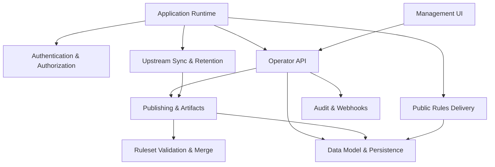

<!-- GENERATED FILE, do not edit by hand.
     Mirrored from .gitnexus/wiki (GitNexus knowledge graph wiki), source commit c6c9201.
     Regenerate: node .gitnexus/run.cjs wiki, then: npm run docs:wiki -->

# CheckDeployManager

> Generated from the GitNexus code knowledge graph at commit `c6c9201`.
> Do not edit these pages by hand. To refresh after code changes, run
> `node .gitnexus/run.cjs analyze`, `node .gitnexus/run.cjs wiki`, then `npm run docs:wiki`.


CheckDeployManager is a multi-tenant configuration service for the Check by CyberDrain browser extension. It runs on Cloudflare Workers and gives MSPs a central place to manage Check rules, tenant-specific overrides, deployment artifacts, webhook intake, branding, audit history, and upstream rule synchronization.

The project is designed around a small Cloudflare-native runtime: a Worker built with Hono, D1 for metadata, R2 for published ruleset artifacts, and a dependency-free management UI served from the same application. A new developer should start with the [Application Runtime](application-runtime.md), then follow the request paths into the [Operator API](operator-api.md), [Public Rules Delivery](public-rules-delivery.md), and the core publishing and sync modules.



## What The Service Does

At a high level, CheckDeployManager mirrors the upstream CyberDrain Check ruleset, lets operators layer MSP-wide and tenant-specific changes on top of it, then publishes stable tenant rulesets for the browser extension to consume.

Operators use the [Management UI](management-ui.md), a vanilla JavaScript dashboard under `src/ui/manage/`, to create tenants, edit deltas, publish rulesets, configure branding, inspect webhooks, view audit events, and manage instance settings. The UI talks to authenticated routes in the [Operator API](operator-api.md), which is composed in `src/routes/api/index.ts`.

Public browser extension traffic does not use operator authentication. Instead, [Public Rules Delivery](public-rules-delivery.md) exposes unauthenticated rules, draft preview, and logo routes guarded by unguessable GUIDs or preview tokens. Those routes are intentionally narrow and return bare `404` responses for misses.

The service keeps upstream rules current through [Upstream Sync & Retention](upstream-sync-retention.md). Scheduled Worker execution calls `runScheduledTasks()` in `src/lib/cron.ts`, which syncs upstream rules through `src/lib/upstream.ts`, records snapshots, republishes affected tenants, writes audit entries, and prunes older operational data.

## How The Code Is Organized

The Worker entry point is `src/index.ts`, covered in [Application Runtime](application-runtime.md). It wires together the Hono app, public routes, management routes, API routes, static UI assets, and the scheduled handler. Shared Worker bindings and environment types live in `src/types.ts`, while `src/middleware.ts` provides the authenticated operator boundary.

Authentication is handled by [Authentication & Authorization](authentication-authorization.md). The important path is `requireOperator()` calling `authenticateRequest()` in `src/lib/access-jwt.ts`. The production behavior is fail-closed: Cloudflare Access must be configured and requests must carry a valid Access JWT.

Most persistent state flows through [Data Model & Persistence](data-model-persistence.md). The D1 schema starts in `migrations/0001_init.sql`, while `src/lib/db.ts` centralizes typed rows, default settings, ID generation, token and hash helpers, and reusable queries. Operator routes, public routes, publishing, upstream sync, audit logging, webhook intake, cleanup, and tests all depend on this layer.

Ruleset correctness is concentrated in [Ruleset Validation & Merge](ruleset-validation-merge.md). `src/lib/validate.ts` validates upstream rulesets and tenant deltas, and `src/lib/merge.ts` applies validated deltas to upstream snapshots. This keeps publishing deterministic and testable without requiring the rest of the application to understand the full Check ruleset structure.

[Publishing & Artifacts](publishing-artifacts.md) turns tenant configuration into deployable outputs. `src/lib/publish.ts` validates and publishes tenant ruleset versions, storing artifacts in R2 and recording metadata in D1. `src/lib/artifacts.ts` renders browser deployment artifacts from current database state on demand.

[Audit & Webhooks](audit-webhooks.md) provides the persistence surfaces for operator/system activity and tenant webhook events. `writeAudit()` in `src/lib/audit.ts` is the central audit writer, and `src/routes/hook.ts` accepts tenant webhook payloads at `POST /hook/:guid`.

## Key End-To-End Flows

### Operator Management Flow

A signed-in operator opens the management dashboard from `/manage`. The [Management UI](management-ui.md) renders the current hash route, calls the [Operator API](operator-api.md), and relies on `requireOperator()` to enforce the [Authentication & Authorization](authentication-authorization.md) boundary.

From there, API handlers read and write D1 through [Data Model & Persistence](data-model-persistence.md). Actions such as creating tenants, changing settings, publishing rules, rotating GUIDs, or reviewing webhook data are recorded through [Audit & Webhooks](audit-webhooks.md).

### Rules Publishing Flow

Publishing starts with tenant configuration and a delta document submitted through the [Operator API](operator-api.md). The API delegates to [Publishing & Artifacts](publishing-artifacts.md), which loads the active upstream snapshot, validates the tenant delta through [Ruleset Validation & Merge](ruleset-validation-merge.md), builds the merged ruleset, stores the published artifact, and records the new version in [Data Model & Persistence](data-model-persistence.md).

Once published, browser clients fetch the tenant ruleset through [Public Rules Delivery](public-rules-delivery.md), not through the authenticated operator API.

### Scheduled Upstream Sync Flow

Cloudflare invokes the Worker scheduled handler in `src/index.ts`. That enters [Upstream Sync & Retention](upstream-sync-retention.md), where `runScheduledTasks()` calls `syncUpstream()`. The sync path fetches the upstream Check ruleset, validates it, snapshots the result, compares it with the active version, republishes tenant rules when needed, writes audit records, and performs retention cleanup.

This path connects the application runtime, upstream sync, publishing, validation, audit logging, and persistence layers.

### Public Extension Delivery Flow

The Check browser extension requests tenant rules or branding assets through public routes in `src/routes/rules.ts`. [Public Rules Delivery](public-rules-delivery.md) looks up the requested tenant or artifact in [Data Model & Persistence](data-model-persistence.md), serves the published object, and uses intentionally minimal responses for missing or invalid requests.

This separation keeps operator management and public extension delivery independent: operators authenticate with Cloudflare Access, while extension-facing routes use stable tenant identifiers and tokens.

## Local Development

Install dependencies and run the Worker locally:

```bash
npm install
npm run dev
```

Useful scripts:

```bash
npm test
npm run typecheck
npm run migrate:local
npm run deploy
npm run docs:wiki
```

Use `npm run dev` for local Worker development, `npm run test` and `npm run typecheck` before changes are merged, `npm run migrate:local` when working with the D1 schema locally, and `npm run docs:wiki` when regenerating the repository wiki documentation.

## Module pages

- [Application Runtime](application-runtime.md)
- [Authentication & Authorization](authentication-authorization.md)
- [Data Model & Persistence](data-model-persistence.md)
- [Ruleset Validation & Merge](ruleset-validation-merge.md)
- [Upstream Sync & Retention](upstream-sync-retention.md)
- [Publishing & Artifacts](publishing-artifacts.md)
- [Audit & Webhooks](audit-webhooks.md)
- [Public Rules Delivery](public-rules-delivery.md)
- [Operator API](operator-api.md)
- [Management UI](management-ui.md)

## Hand-written documentation

- [Architecture, data model, and threat model](../architecture.md)
- [Post-deploy and operations runbook](../runbook.md)
- [Contributing guide](../../CONTRIBUTING.md)
