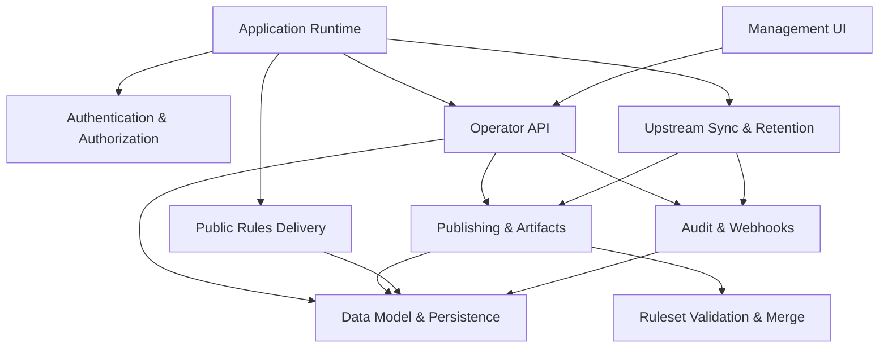

<!-- GENERATED FILE, do not edit by hand.
     Mirrored from .gitnexus/wiki (GitNexus knowledge graph wiki), source commit 3fe8c14.
     Regenerate: node .gitnexus/run.cjs wiki, then: npm run docs:wiki -->

# CheckDeployManager

> Generated from the GitNexus code knowledge graph at commit `3fe8c14`.
> Do not edit these pages by hand. To refresh after code changes, run
> `node .gitnexus/run.cjs analyze`, `node .gitnexus/run.cjs wiki`, then `npm run docs:wiki`.


CheckDeployManager is a multi-tenant configuration service for the Check by CyberDrain browser extension, hosted on Cloudflare Workers. It helps MSPs manage Check rules across many client organizations by mirroring upstream detection rules, applying tenant-specific changes, publishing versioned rulesets, and serving deployment artifacts from a lightweight Cloudflare-native stack.

The service is designed around a small Worker runtime, D1 metadata storage, R2-backed rule artifacts, Cloudflare Access-protected administration, and unauthenticated public delivery URLs that rely on unguessable tenant identifiers.



## What It Does

At a high level, CheckDeployManager keeps an instance-wide copy of the upstream Check ruleset, lets operators maintain tenant-specific deltas, and publishes each tenant’s final browser policy output.

The main runtime is described in [Application Runtime](application-runtime.md). `src/index.ts` creates the Cloudflare Worker entry point, registers the Hono routes, and wires scheduled tasks. Protected routes pass through [Authentication & Authorization](authentication-authorization.md), where `requireOperator()` validates Cloudflare Access JWTs before administrative requests reach the API.

Operators usually work through the dependency-free [Management UI](management-ui.md), served from `src/ui/manage/`. That UI talks to the authenticated [Operator API](operator-api.md), which manages tenants, drafts, publishing, logos, policy settings, upstream sync state, webhook events, audit logs, and instance settings.

Published rulesets and tenant assets are delivered through [Public Rules Delivery](public-rules-delivery.md). These routes are intentionally unauthenticated: access is controlled by tenant GUIDs and preview tokens, while missing resources return minimal `404` responses.

## Architecture

The repository is organized around a few core boundaries:

[Data Model & Persistence](data-model-persistence.md) is the shared storage layer. It defines the D1 schema in `migrations/0001_init.sql` and centralizes reusable helpers in `src/lib/db.ts`, including IDs, timestamps, hashes, instance settings, and common queries.

[Ruleset Validation & Merge](ruleset-validation-merge.md) keeps ruleset handling predictable. `src/lib/validate.ts` validates upstream rulesets and tenant deltas, while `src/lib/merge.ts` applies tenant changes to the active upstream snapshot.

[Publishing & Artifacts](publishing-artifacts.md) turns validated tenant configuration into deployable outputs. `src/lib/publish.ts` publishes tenant ruleset versions, and `src/lib/artifacts.ts` renders browser deployment artifacts such as registry payloads from current D1 state.

[Upstream Sync & Retention](upstream-sync-retention.md) owns scheduled maintenance. It fetches upstream rules, validates and snapshots them, republishes affected tenant rulesets when needed, and prunes old operational data.

[Audit & Webhooks](audit-webhooks.md) records system and operator activity. API routes, publishing, and scheduled workflows use `writeAudit()`, while webhook ingestion stores tenant event payloads for later review.

## Key Flows

### Operator Management

An operator opens the Management UI, which calls the authenticated Operator API. The Worker checks Cloudflare Access through `requireOperator()`, then the API reads and writes D1 records through the persistence helpers. Actions such as publishing, GUID rotation, settings changes, and webhook review are written to the audit log.

### Ruleset Publishing

Publishing starts with a tenant delta JSON document. The publishing layer loads the active upstream snapshot, validates the delta, merges it with upstream rules, stores the resulting ruleset artifact, and records the published version in D1. Public delivery routes then serve that version by tenant GUID.

### Scheduled Upstream Sync

Cloudflare invokes the Worker’s scheduled handler, which runs `runScheduledTasks()`. The sync process fetches the upstream Check ruleset, validates it, snapshots the result, records audit activity, and republishes tenant rulesets when upstream changes affect their generated output.

### Deployment Artifact Generation

Artifact generation reads current tenant and policy state from D1, builds an artifact bundle, and renders deployment formats on demand. Registry output flows through helpers such as `buildRegFile()`, `regNumberedStrings()`, `regString()`, and `regEscape()` so generated Windows artifacts remain consistently escaped.

### Public Runtime Delivery

Browser clients fetch rules, previews, and logos through public routes. These endpoints avoid session authentication and instead rely on unguessable identifiers or preview tokens. They read published state from D1 and return only the requested tenant-specific content.

## Local Development

Install dependencies first:

```bash
npm install
```

Run the Worker locally:

```bash
npm run dev
```

Run validation before changing behavior:

```bash
npm run test
npm run typecheck
```

Apply local D1 migrations when working with persistence:

```bash
npm run migrate:local
```

Deploy through the configured Cloudflare Workers project:

```bash
npm run deploy
```

Regenerate the repository wiki from the indexed code model:

```bash
npm run docs:wiki
```

## Where To Start

New developers should begin with [Application Runtime](application-runtime.md) to understand how the Worker is assembled, then read [Data Model & Persistence](data-model-persistence.md) because most modules depend on the D1 schema and shared helpers.

For feature work, follow the request path: UI behavior usually starts in [Management UI](management-ui.md), administrative behavior in [Operator API](operator-api.md), generated ruleset behavior in [Publishing & Artifacts](publishing-artifacts.md), and scheduled upstream behavior in [Upstream Sync & Retention](upstream-sync-retention.md).

## Module pages

- [Application Runtime](application-runtime.md)
- [Authentication & Authorization](authentication-authorization.md)
- [Data Model & Persistence](data-model-persistence.md)
- [Ruleset Validation & Merge](ruleset-validation-merge.md)
- [Upstream Sync & Retention](upstream-sync-retention.md)
- [Publishing & Artifacts](publishing-artifacts.md)
- [Audit & Webhooks](audit-webhooks.md)
- [Public Rules Delivery](public-rules-delivery.md)
- [Operator API](operator-api.md)
- [Management UI](management-ui.md)

## Hand-written documentation

- [Architecture, data model, and threat model](../architecture.md)
- [Post-deploy and operations runbook](../runbook.md)
- [Contributing guide](../../CONTRIBUTING.md)
