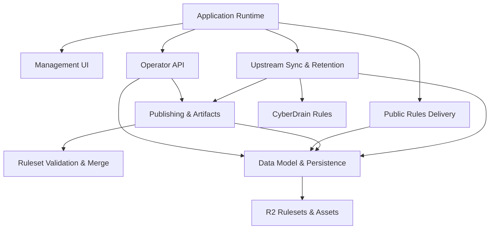

<!-- GENERATED FILE, do not edit by hand.
     Mirrored from .gitnexus/wiki (GitNexus knowledge graph wiki), source commit aec45f0.
     Regenerate: node .gitnexus/run.cjs wiki, then: npm run docs:wiki -->

# CheckDeployManager

> Generated from the GitNexus code knowledge graph at commit `aec45f0`.
> Do not edit these pages by hand. To refresh after code changes, run
> `node .gitnexus/run.cjs analyze`, `node .gitnexus/run.cjs wiki`, then `npm run docs:wiki`.


CheckDeployManager is a multi-tenant configuration service for the Check by CyberDrain browser extension. It is designed for MSPs that manage Check across many client organizations, with the full application hosted on Cloudflare Workers and backed by Cloudflare D1 and R2.

At a high level, the service mirrors upstream CyberDrain detection rules, applies optional instance-wide and tenant-specific changes, publishes versioned rulesets, and exposes deployment assets for endpoints. Operators manage tenants and settings through a lightweight browser dashboard, while endpoint-facing routes stay unauthenticated and rely on unguessable tenant GUIDs or preview tokens.



## How The System Fits Together

The Worker entry point is described in [Application Runtime](application-runtime.md). It wires the Hono application, registers public routes, mounts the authenticated operator API, serves the management dashboard, and runs scheduled maintenance through Cloudflare Worker lifecycle hooks.

Administrative requests pass through [Authentication & Authorization](authentication-authorization.md), which validates Cloudflare Access JWTs before allowing access to management routes. The authenticated API surface is documented in [Operator API](operator-api.md), and it is the main control plane for tenants, drafts, publishing, branding, upstream sync status, webhook events, audit logs, GUID rotation, and instance settings.

The browser dashboard in [Management UI](management-ui.md) is intentionally simple: static HTML, CSS, and vanilla JavaScript under `src/ui/manage/`. It talks to the Operator API and provides the day-to-day operator workflow without a separate frontend build system.

Persistent state is centralized in [Data Model & Persistence](data-model-persistence.md). D1 stores tenants, settings, published version metadata, audit records, webhook events, upstream snapshots, and operational state. R2 stores versioned ruleset artifacts and tenant assets that are too large or too file-like for relational storage.

Ruleset correctness is handled before anything is published. [Ruleset Validation & Merge](ruleset-validation-merge.md) validates upstream rulesets and tenant delta documents, then produces merged tenant outputs. [Publishing & Artifacts](publishing-artifacts.md) turns that validated state into deployable rulesets and browser deployment assets.

The runtime delivery side is covered by [Public Rules Delivery](public-rules-delivery.md). These endpoints serve published rulesets, draft previews, and tenant logos without operator authentication. Access is controlled by high-entropy tenant GUIDs and preview tokens, with intentionally quiet `404` responses for misses.

Background operation is handled by [Upstream Sync & Retention](upstream-sync-retention.md). On the scheduled path, the Worker fetches the upstream CyberDrain rules, validates and snapshots them, republishes tenant rules when needed, records audit activity, and prunes old operational data.

[Audit & Webhooks](audit-webhooks.md) provides the shared audit writer and tenant webhook ingestion path. Operator actions, system events, and accepted webhook payloads all flow into D1 for traceability.

## Key End-To-End Flows

### Operator Publishes Tenant Rules

An operator works in the Management UI, which calls authenticated routes in the Operator API. The API reads tenant configuration from D1, validates the submitted delta, merges it with the active upstream snapshot, stores the published ruleset in R2, records the version in D1, and writes audit entries for the action.

The main modules involved are [Management UI](management-ui.md), [Operator API](operator-api.md), [Ruleset Validation & Merge](ruleset-validation-merge.md), [Publishing & Artifacts](publishing-artifacts.md), [Data Model & Persistence](data-model-persistence.md), and [Audit & Webhooks](audit-webhooks.md).

### Endpoint Fetches Rules

A browser extension or deployment client requests a public rules URL using a tenant GUID or preview token. [Public Rules Delivery](public-rules-delivery.md) looks up the matching tenant or preview state through shared database helpers, resolves the current artifact, and returns the ruleset with permissive CORS headers for browser consumption.

This path is deliberately separate from operator authentication so managed endpoints can fetch configuration without an interactive login.

### Scheduled Upstream Sync

Cloudflare invokes the Worker schedule handler in [Application Runtime](application-runtime.md). The scheduled task runner calls [Upstream Sync & Retention](upstream-sync-retention.md), which fetches the current CyberDrain rules, validates the payload, snapshots the result, compares it to the active upstream version, republishes affected tenant rules, records audit events, and performs cleanup.

This is the main automated maintenance loop that keeps tenant rules current without requiring an operator to republish everything manually.

### Webhook Ingestion

Tenant webhook requests arrive at `POST /hook/:guid`. [Audit & Webhooks](audit-webhooks.md) validates the route target by GUID, stores accepted JSON payloads in D1, and timestamps them with shared helpers from [Data Model & Persistence](data-model-persistence.md). Operators can later inspect those events through the authenticated API and dashboard.

## Local Development

Install dependencies first:

```bash
npm install
```

Run the local Worker development server:

```bash
npm run dev
```

Run the local D1 migration workflow:

```bash
npm run migrate:local
```

Use the standard validation commands before changing behavior:

```bash
npm run typecheck
npm test
```

Generate or refresh the repository wiki docs with:

```bash
npm run docs:wiki
```

Deploy to Cloudflare with:

```bash
npm run deploy
```

## Module pages

- [Application Runtime](application-runtime.md)
- [Authentication & Authorization](authentication-authorization.md)
- [Data Model & Persistence](data-model-persistence.md)
- [Ruleset Validation & Merge](ruleset-validation-merge.md)
- [Upstream Sync & Retention](upstream-sync-retention.md)
- [Publishing & Artifacts](publishing-artifacts.md)
- [Audit & Webhooks](audit-webhooks.md)
- [Public Rules Delivery](public-rules-delivery.md)
- [Operator API](operator-api.md)
- [Management UI](management-ui.md)

## Hand-written documentation

- [Architecture, data model, and threat model](../architecture.md)
- [Post-deploy and operations runbook](../runbook.md)
- [Contributing guide](../../CONTRIBUTING.md)
