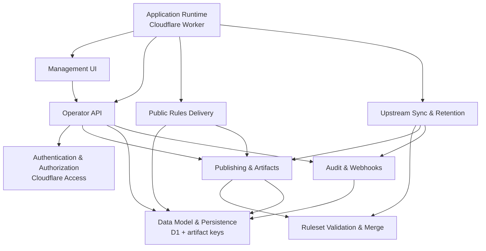

<!-- GENERATED FILE, do not edit by hand.
     Mirrored from .gitnexus/wiki (GitNexus knowledge graph wiki), source commit 43ef23d.
     Regenerate: node .gitnexus/run.cjs wiki, then: npm run docs:wiki -->

# CheckDeployManager

> Generated from the GitNexus code knowledge graph at commit `43ef23d`.
> Do not edit these pages by hand. To refresh after code changes, run
> `node .gitnexus/run.cjs analyze`, `node .gitnexus/run.cjs wiki`, then `npm run docs:wiki`.


CheckDeployManager is a multi-tenant configuration service for the Check by CyberDrain browser extension. It runs on Cloudflare Workers and is designed for MSPs that manage Check across many client organizations.

At a high level, it mirrors upstream Check detection rules, applies small tenant-specific deltas, publishes immutable rulesets at unguessable URLs, and generates browser deployment policy artifacts for Chrome, Edge, and Firefox.



## What This Service Does

CheckDeployManager has two main jobs.

First, it acts as a rules host. The [Upstream Sync & Retention](upstream-sync-retention.md) module fetches the upstream CyberDrain ruleset on a schedule, validates it, snapshots it, and republishes tenant rules when the upstream source changes. Tenant-specific changes are handled as small delta documents, validated by [Ruleset Validation & Merge](ruleset-validation-merge.md), then merged into the active upstream ruleset.

Second, it acts as a policy generator. The [Publishing & Artifacts](publishing-artifacts.md) module turns tenant configuration into deployable browser artifacts, including managed storage JSON, Firefox policy output, registry files, and related deployment formats. Published rulesets are versioned and stored as immutable artifacts, while deployment artifacts are generated fresh from the current database state.

The public browser-facing surface is intentionally small. [Public Rules Delivery](public-rules-delivery.md) serves published rulesets, draft previews, and tenant logos through GUID- or token-based URLs. Administrative operations are handled separately through the authenticated [Operator API](operator-api.md) and the dependency-free [Management UI](management-ui.md).

## Runtime Shape

The Worker entry point, routing, scheduled handler, and shared middleware live in [Application Runtime](application-runtime.md). The application is built around Hono routes running inside Cloudflare Workers.

Persistent state is centralized in [Data Model & Persistence](data-model-persistence.md). D1 stores tenants, upstream snapshots, publishing metadata, settings, audit rows, and webhook events. Versioned rule artifacts and tenant assets are referenced externally by key.

Protected management routes pass through [Authentication & Authorization](authentication-authorization.md). In production, operator access is fail-closed behind Cloudflare Access JWT validation. Local development has explicit development behavior so the app remains easy to run without weakening the deployed boundary.

Operational records are written through [Audit & Webhooks](audit-webhooks.md). API actions and background sync events use the shared audit writer, while tenant webhook payloads are accepted through public hook routes and stored for later review.

## Key End-to-End Flows

### Scheduled Upstream Sync

Cloudflare invokes the Worker scheduled handler in `src/index.ts`, which calls `runScheduledTasks()` in `src/lib/cron.ts`. The sync path fetches the upstream ruleset, validates it, snapshots the result, records audit activity, and republishes tenant rules if needed.

This flow crosses [Application Runtime](application-runtime.md), [Upstream Sync & Retention](upstream-sync-retention.md), [Ruleset Validation & Merge](ruleset-validation-merge.md), [Publishing & Artifacts](publishing-artifacts.md), [Audit & Webhooks](audit-webhooks.md), and [Data Model & Persistence](data-model-persistence.md).

### Operator Management

Operators use the [Management UI](management-ui.md), which calls the authenticated [Operator API](operator-api.md). The API manages tenants, deltas, publishing, branding, GUID rotation, instance settings, upstream sync state, webhook events, and audit logs.

Every API route is protected by `requireOperator()` from `src/middleware.ts`, which delegates Cloudflare Access JWT verification to `authenticateRequest()` in `src/lib/access-jwt.ts`.

### Tenant Rules Publishing

Publishing starts from tenant configuration and a validated delta document. [Publishing & Artifacts](publishing-artifacts.md) builds a merged ruleset using the active upstream snapshot, writes the published artifact, updates D1 metadata, and records audit activity. Public clients then retrieve that immutable version through [Public Rules Delivery](public-rules-delivery.md).

### Deployment Artifact Generation

When an operator requests deployment outputs, `generateArtifacts()` in `src/lib/artifacts.ts` builds a tenant artifact bundle from current D1 state. The artifact path includes browser-specific renderers and registry escaping helpers, but the output is not stored permanently; it is generated on demand.

## Local Development

Install dependencies, initialize the local database, then run the Worker locally:

```bash
npm install
npm run migrate:local
npm run dev
```

Run the test suite with:

```bash
npm test
```

Deploy to Cloudflare with:

```bash
npm run deploy
```

## Module pages

- [Application Runtime](application-runtime.md)
- [Authentication & Authorization](authentication-authorization.md)
- [Data Model & Persistence](data-model-persistence.md)
- [Ruleset Validation & Merge](ruleset-validation-merge.md)
- [Upstream Sync & Retention](upstream-sync-retention.md)
- [Publishing & Artifacts](publishing-artifacts.md)
- [Audit & Webhooks](audit-webhooks.md)
- [Public Rules Delivery](public-rules-delivery.md)
- [Operator API](operator-api.md)
- [Management UI](management-ui.md)

## Hand-written documentation

- [Architecture, data model, and threat model](../architecture.md)
- [Post-deploy and operations runbook](../runbook.md)
- [Contributing guide](../../CONTRIBUTING.md)
