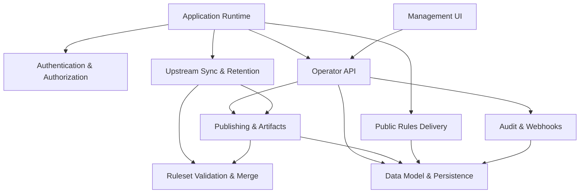

<!-- GENERATED FILE, do not edit by hand.
     Mirrored from .gitnexus/wiki (GitNexus knowledge graph wiki), source commit 8784ca7.
     Regenerate: node .gitnexus/run.cjs wiki, then: npm run docs:wiki -->

# CheckDeployManager

> Generated from the GitNexus code knowledge graph at commit `8784ca7`.
> Do not edit these pages by hand. To refresh after code changes, run
> `node .gitnexus/run.cjs analyze`, `node .gitnexus/run.cjs wiki`, then `npm run docs:wiki`.


CheckDeployManager is a multi-tenant configuration service for the Check by CyberDrain browser extension. It is built for MSPs that manage Check across many client organizations, and it runs as a Cloudflare Worker backed by D1 and R2.

At a high level, the service mirrors upstream Check detection rules, lets operators apply tenant-specific deltas, publishes per-tenant rulesets, serves those rulesets to browser clients, and provides a small management dashboard for day-to-day administration.



## How The System Fits Together

The Worker entry point and route wiring live in [Application Runtime](application-runtime.md). That layer registers the public rules routes, protected operator API routes, management UI, and scheduled handler.

Administrative access is protected by [Authentication & Authorization](authentication-authorization.md), which validates Cloudflare Access JWTs before requests reach the operator API. The [Management UI](management-ui.md) is a lightweight browser dashboard that calls the authenticated [Operator API](operator-api.md) for tenant management, rule publishing, branding, webhook review, audit history, and instance settings.

Most runtime state is stored through [Data Model & Persistence](data-model-persistence.md). D1 holds tenants, settings, upstream snapshot metadata, publish records, audit entries, webhook events, and related operational data. Published rule payloads and larger artifacts are addressed by key, with R2 used for versioned ruleset storage.

Ruleset correctness is handled by [Ruleset Validation & Merge](ruleset-validation-merge.md). Upstream rulesets and tenant deltas are validated before publish-time merge logic combines them into tenant-specific outputs. [Publishing & Artifacts](publishing-artifacts.md) then records published versions and generates deployment artifacts such as registry output from current state.

The service also runs scheduled maintenance through [Upstream Sync & Retention](upstream-sync-retention.md). That path fetches upstream Check rules, validates and snapshots them, republishes affected tenants when needed, writes audit records, and prunes older operational data.

Unauthenticated browser clients do not use the operator API. They retrieve tenant rulesets, previews, and logos through [Public Rules Delivery](public-rules-delivery.md), where access is based on unguessable tenant GUIDs or preview tokens. Webhook ingestion and operational audit logging are covered by [Audit & Webhooks](audit-webhooks.md).

## Key End-To-End Flows

### Operator publishes tenant rules

An operator uses the management dashboard to edit tenant configuration. The request enters the [Operator API](operator-api.md), passes through `requireOperator`, reads and writes D1 state through [Data Model & Persistence](data-model-persistence.md), validates the tenant delta, merges it with the active upstream snapshot, stores the published ruleset, and records the action through [Audit & Webhooks](audit-webhooks.md).

### Browser extension fetches rules

A Check browser client requests a public rules URL using a tenant GUID. [Public Rules Delivery](public-rules-delivery.md) looks up the matching tenant and current published version, returns the ruleset when available, and intentionally uses bare `404` responses for misses so invalid identifiers do not reveal extra information.

### Scheduled upstream sync runs

Cloudflare invokes the Worker scheduled handler in [Application Runtime](application-runtime.md). The scheduled path calls [Upstream Sync & Retention](upstream-sync-retention.md), which reads instance settings, fetches upstream rules, validates the payload, snapshots the result, republishes tenant rules when upstream content changes, and writes audit records using shared persistence helpers.

### Deployment artifacts are generated

Artifact generation starts in [Publishing & Artifacts](publishing-artifacts.md). The artifact builder reads current tenant and ruleset state, constructs a deployment bundle, and renders platform-specific outputs such as registry content using escaping helpers designed for Windows deployment formats.

## Local Development

Install dependencies first:

```bash
npm install
```

Common project scripts are:

```bash
npm run dev
npm run test
npm run typecheck
npm run migrate:local
npm run deploy
npm run docs:wiki
```

Use `npm run dev` for the local Worker development loop, `npm run migrate:local` to prepare the local D1 schema, `npm run test` and `npm run typecheck` before changing behavior, and `npm run docs:wiki` when regenerating the repository wiki.

## Module pages

- [Application Runtime](application-runtime.md)
- [Authentication & Authorization](authentication-authorization.md)
- [Data Model & Persistence](data-model-persistence.md)
- [Ruleset Validation & Merge](ruleset-validation-merge.md)
- [Upstream Sync & Retention](upstream-sync-retention.md)
- [Publishing & Artifacts](publishing-artifacts.md)
- [Audit & Webhooks](audit-webhooks.md)
- [Public Rules Delivery](public-rules-delivery.md)
- [Operator API](operator-api.md)
- [Management UI](management-ui.md)

## Hand-written documentation

- [Architecture, data model, and threat model](../architecture.md)
- [Post-deploy and operations runbook](../runbook.md)
- [Contributing guide](../../CONTRIBUTING.md)
