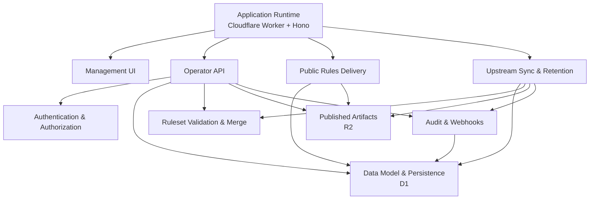

<!-- GENERATED FILE, do not edit by hand.
     Mirrored from .gitnexus/wiki (GitNexus knowledge graph wiki), source commit 0730976.
     Regenerate: node .gitnexus/run.cjs wiki, then: npm run docs:wiki -->

# CheckDeployManager

> Generated from the GitNexus code knowledge graph at commit `0730976`.
> Do not edit these pages by hand. To refresh after code changes, run
> `node .gitnexus/run.cjs analyze`, `node .gitnexus/run.cjs wiki`, then `npm run docs:wiki`.


CheckDeployManager is a multi-tenant configuration service for the Check by CyberDrain browser extension. It runs on Cloudflare Workers and gives MSPs a central place to mirror upstream Check detection rules, apply tenant-specific configuration, publish deployable rulesets, and manage browser deployment assets.

The service is intentionally small and Cloudflare-native: the Worker handles HTTP and scheduled jobs, D1 stores tenant and operational metadata, R2 stores published ruleset artifacts, and Cloudflare Access protects the operator-facing surfaces.



## What The Service Does

At its core, CheckDeployManager is a rules host and tenant configuration manager.

It mirrors the upstream CyberDrain ruleset, validates it, snapshots it, and republishes tenant-specific rules when the upstream source changes. Tenant deltas are validated and merged through [Ruleset Validation & Merge](ruleset-validation-merge.md), then published by [Publishing & Artifacts](publishing-artifacts.md) into versioned R2 objects with metadata recorded in D1.

Operators manage tenants through the [Management UI](management-ui.md), which talks to the authenticated [Operator API](operator-api.md). Public browser clients do not use operator auth; they fetch published rules, previews, and tenant branding through [Public Rules Delivery](public-rules-delivery.md) using unguessable GUIDs or preview tokens.

## Runtime Shape

The Worker entry point and route registration live in [Application Runtime](application-runtime.md). `src/index.ts` composes the Hono application, wires public routes, protected API routes, the management UI, and scheduled tasks. Shared runtime types and middleware are defined in `src/types.ts` and `src/middleware.ts`.

Protected management requests pass through [Authentication & Authorization](authentication-authorization.md), where `requireOperator()` calls `authenticateRequest()` to validate Cloudflare Access JWTs. The service is fail-closed outside local development: if Access is not configured or the request does not carry a valid assertion, protected routes are rejected.

Persistent state is centralized in [Data Model & Persistence](data-model-persistence.md). The D1 schema lives in `migrations/0001_init.sql`, while `src/lib/db.ts` provides typed helpers for IDs, timestamps, hashes, instance settings, tenants, snapshots, publishing records, webhook events, and audit data.

## Key End-To-End Flows

### Operator Management Flow

An operator opens the management dashboard from the Worker, signs in through Cloudflare Access, and uses the UI to manage tenants, drafts, publishing, settings, branding, events, and audit records.

The request path is:

```text
Management UI -> Operator API -> requireOperator -> D1 / publishing / audit helpers
```

Most administrative work flows through the [Operator API](operator-api.md), which uses [Data Model & Persistence](data-model-persistence.md) heavily and writes audit records through [Audit & Webhooks](audit-webhooks.md).

### Rules Publishing Flow

Tenant rules start as a delta document. The system validates the delta, combines it with the active upstream snapshot, stores the published ruleset in R2, records the published version in D1, and logs the action.

```text
Tenant delta -> validation -> merge with upstream -> R2 artifact -> D1 publish record -> audit log
```

The important modules for this path are [Ruleset Validation & Merge](ruleset-validation-merge.md), [Publishing & Artifacts](publishing-artifacts.md), [Data Model & Persistence](data-model-persistence.md), and [Audit & Webhooks](audit-webhooks.md).

### Public Delivery Flow

Browser clients fetch published rulesets and deployment assets without an operator session. Access is controlled by tenant GUIDs and preview tokens, not user login state.

```text
Browser extension -> Public Rules Delivery -> D1 lookup -> R2 ruleset or generated artifact
```

Misses intentionally return the same bare `404` shape so callers cannot infer whether a tenant, file, or token exists.

### Scheduled Upstream Sync Flow

The Worker scheduled handler runs daily maintenance. It fetches the upstream ruleset, validates it, snapshots accepted or invalid payloads, republishes tenant rules when needed, writes audit entries, and prunes old operational data.

```text
scheduled handler -> runScheduledTasks -> syncUpstream -> validate -> publish affected tenants -> audit
```

This behavior is documented in [Upstream Sync & Retention](upstream-sync-retention.md), with persistence handled by [Data Model & Persistence](data-model-persistence.md).

### Webhook Intake Flow

Tenants can send webhook payloads to `POST /hook/:guid`. Accepted JSON payloads are stored in D1 for later review by operators.

```text
Tenant webhook -> hook route -> D1 webhook_events
```

Webhook storage and audit logging are covered in [Audit & Webhooks](audit-webhooks.md).

## Local Development

Install dependencies, then use the project scripts from the repository root:

```bash
npm install
npm run migrate:local
npm run dev
```

Useful validation commands:

```bash
npm run test
npm run typecheck
npm run docs:wiki
```

Deployment is handled with:

```bash
npm run deploy
```

## Module pages

- [Application Runtime](application-runtime.md)
- [Authentication & Authorization](authentication-authorization.md)
- [Data Model & Persistence](data-model-persistence.md)
- [Ruleset Validation & Merge](ruleset-validation-merge.md)
- [Upstream Sync & Retention](upstream-sync-retention.md)
- [Publishing & Artifacts](publishing-artifacts.md)
- [Audit & Webhooks](audit-webhooks.md)
- [Public Rules Delivery](public-rules-delivery.md)
- [Operator API](operator-api.md)
- [Management UI](management-ui.md)

## Hand-written documentation

- [Architecture, data model, and threat model](../architecture.md)
- [Post-deploy and operations runbook](../runbook.md)
- [Contributing guide](../../CONTRIBUTING.md)
