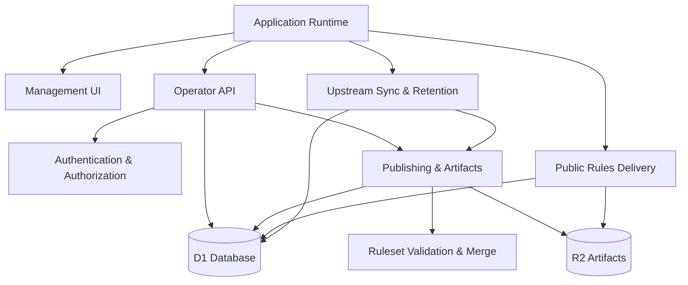

<!-- GENERATED FILE, do not edit by hand.
     Mirrored from .gitnexus/wiki (GitNexus knowledge graph wiki), source commit 921327d.
     Regenerate: node .gitnexus/run.cjs wiki, then: npm run docs:wiki -->

# CheckDeployManager

> Generated from the GitNexus code knowledge graph at commit `921327d`.
> Do not edit these pages by hand. To refresh after code changes, run
> `node .gitnexus/run.cjs analyze`, `node .gitnexus/run.cjs wiki`, then `npm run docs:wiki`.


CheckDeployManager is a multi-tenant configuration service for the Check by CyberDrain browser extension. It is built for MSPs managing Check across many client organizations, and it runs entirely on Cloudflare Workers with D1 for metadata and R2 for published rule artifacts.

At a high level, the service mirrors CyberDrain’s upstream detection rules, applies small tenant-specific deltas, validates the result, publishes immutable tenant rulesets, and serves them from unguessable public URLs such as `/rules/{guid}.json`. Operators manage tenants, branding, policies, publishing, webhooks, and audit history through the authenticated management surface.



## How the System Fits Together

The [Application Runtime](application-runtime.md) is the Cloudflare Worker entry point. It wires the Hono application together, registers public rules routes, protected operator API routes, the management UI, and scheduled background work.

Administrative access is handled by [Authentication & Authorization](authentication-authorization.md). Protected routes pass through `requireOperator()`, which validates Cloudflare Access JWTs through `authenticateRequest()`. The boundary is intentionally fail-closed outside local development.

Most application state lives in [Data Model & Persistence](data-model-persistence.md). The D1 schema tracks tenants, settings, upstream snapshots, published versions, webhook events, and audit records. R2 holds immutable published ruleset JSON and related public assets.

Rules are checked and assembled by [Ruleset Validation & Merge](ruleset-validation-merge.md). This module validates upstream rulesets and tenant delta documents, then produces the merged tenant rulesets that can be published safely.

[Publishing & Artifacts](publishing-artifacts.md) turns validated tenant configuration into outputs: published ruleset versions stored in R2 and deployment artifacts generated on demand from current D1 state.

The daily refresh path lives in [Upstream Sync & Retention](upstream-sync-retention.md). It fetches upstream Check rules, validates and snapshots them, republishes tenant rules when needed, and prunes old operational data.

Operators interact with the system through the [Management UI](management-ui.md), a dependency-free dashboard under `src/ui/manage/`, backed by the authenticated [Operator API](operator-api.md). Browser extensions and deployment tools consume unauthenticated outputs through [Public Rules Delivery](public-rules-delivery.md), where access depends on unguessable GUIDs and preview tokens rather than login sessions.

Operational records are handled by [Audit & Webhooks](audit-webhooks.md). API actions and background workflows write audit entries, while tenant webhook payloads are accepted at `/hook/:guid` and persisted for later review.

## Key End-to-End Flows

### Publishing Tenant Rules

An operator changes tenant configuration through the Management UI. The Operator API validates the request, stores the tenant delta in D1, and calls the publishing path. Publishing loads the active upstream snapshot, validates the tenant delta, merges both inputs, writes the published ruleset to R2, records the version in D1, and writes audit history.

### Serving Rules to Check Clients

A browser extension requests a public rules URL such as `/rules/{guid}.json`. Public Rules Delivery resolves the GUID through D1, finds the current published version, and returns the immutable ruleset artifact from R2. Missing, unknown, or inaccessible resources return the same bare `404` shape to avoid leaking tenant details.

### Daily Upstream Sync

Cloudflare invokes the Worker scheduled handler. The Application Runtime calls the scheduled task runner, which checks instance settings, fetches the upstream ruleset, validates the payload, snapshots the result, writes audit entries, and republishes tenant rules if the upstream changed.

### Deployment Artifact Generation

Operators can request deployment artifacts from the API. Publishing & Artifacts reads tenant and instance state from D1, renders the required browser deployment outputs, escapes registry values where needed, and returns a generated bundle without storing those artifacts permanently.

### Authentication Boundary

Protected management requests enter through the Operator API and pass through `requireOperator()`. That middleware calls the Cloudflare Access JWT validation path, decodes and verifies the token, and places operator identity into request context for downstream handlers and audit records.

## Local Development

Install dependencies first:

```bash
npm install
```

Run the Worker locally:

```bash
npm run dev
```

Run tests and type checks before submitting changes:

```bash
npm test
npm run typecheck
```

Apply local D1 migrations when setting up or resetting the development database:

```bash
npm run migrate:local
```

Deploy to Cloudflare Workers with:

```bash
npm run deploy
```

Regenerate wiki documentation with:

```bash
npm run docs:wiki
```

## Where to Start

For a first code walkthrough, start with [Application Runtime](application-runtime.md) to see how requests enter the Worker, then read [Operator API](operator-api.md) and [Public Rules Delivery](public-rules-delivery.md) to understand the two main HTTP surfaces. From there, [Data Model & Persistence](data-model-persistence.md), [Publishing & Artifacts](publishing-artifacts.md), and [Upstream Sync & Retention](upstream-sync-retention.md) explain the core state transitions that make the service work.

## Module pages

- [Application Runtime](application-runtime.md)
- [Authentication & Authorization](authentication-authorization.md)
- [Data Model & Persistence](data-model-persistence.md)
- [Ruleset Validation & Merge](ruleset-validation-merge.md)
- [Upstream Sync & Retention](upstream-sync-retention.md)
- [Publishing & Artifacts](publishing-artifacts.md)
- [Audit & Webhooks](audit-webhooks.md)
- [Public Rules Delivery](public-rules-delivery.md)
- [Operator API](operator-api.md)
- [Management UI](management-ui.md)

## Hand-written documentation

- [Architecture, data model, and threat model](../architecture.md)
- [Post-deploy and operations runbook](../runbook.md)
- [Contributing guide](../../CONTRIBUTING.md)
