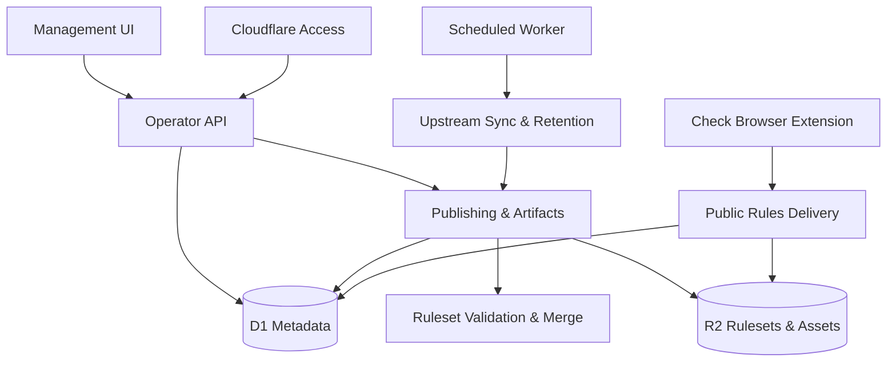

<!-- GENERATED FILE, do not edit by hand.
     Mirrored from .gitnexus/wiki (GitNexus knowledge graph wiki), source commit 5adb17f.
     Regenerate: node .gitnexus/run.cjs wiki, then: npm run docs:wiki -->

# CheckDeployManager

> Generated from the GitNexus code knowledge graph at commit `5adb17f`.
> Do not edit these pages by hand. To refresh after code changes, run
> `node .gitnexus/run.cjs analyze`, `node .gitnexus/run.cjs wiki`, then `npm run docs:wiki`.


CheckDeployManager is a multi-tenant configuration service for the Check by CyberDrain browser extension. It lets MSPs manage detection rules, branding, policy settings, and deployment artifacts for many client organizations from one Cloudflare-hosted control plane.

At its core, the system combines three layers of configuration:

1. The upstream CyberDrain Check ruleset.
2. An instance-wide MSP baseline.
3. Tenant-specific rule deltas.

The result is a published ruleset per tenant, delivered through unguessable public GUIDs that the browser extension can fetch without operator authentication.



## How The System Fits Together

The [Application Runtime](application-runtime.md) is the Cloudflare Worker entrypoint. It wires the Hono app, mounts the public and authenticated route modules, serves the management dashboard, exposes generated deployment helpers, and runs scheduled background jobs.

Operator-facing requests flow through [Authentication & Authorization](authentication-authorization.md), which validates Cloudflare Access JWTs before protected management routes are allowed to continue. Once authenticated, the [Operator API](operator-api.md) handles administrative workflows such as tenant management, rule draft editing, publishing, branding, policy settings, GUID lifecycle, upstream syncs, webhook review, audit history, and instance settings.

The browser dashboard itself is the [Management UI](management-ui.md), a small vanilla JavaScript application under `src/ui/manage/`. It talks to the Operator API and provides the main workflows for setup, onboarding, tenant management, rule editing, publishing, artifact generation, webhook review, and upstream synchronization.

Persistent control-plane state lives in [Data Model & Persistence](data-model-persistence.md). Cloudflare D1 stores metadata such as tenants, public GUIDs, draft deltas, published version records, branding and policy settings, audit records, upstream snapshot metadata, fetch metrics, revoked GUID telemetry, and webhook events. Large JSON rulesets and binary assets are stored in R2, with D1 keeping references to those objects.

## Rules, Publishing, And Delivery

Ruleset handling is split deliberately. [Ruleset Validation & Merge](ruleset-validation-merge.md) validates upstream rulesets and tenant delta documents, then applies deltas to produce publishable output. Because Check does not provide a formal JSON Schema, validation focuses on required structure, safety checks, and regex correctness.

[Publishing & Artifacts](publishing-artifacts.md) turns tenant configuration into deployable outputs. Publishing reads the active upstream snapshot, applies tenant deltas, validates the merged ruleset, writes the final JSON to R2, and records the published version in D1. The same module family also generates browser policy deployment artifacts on demand.

Published rules are served by [Public Rules Delivery](public-rules-delivery.md). This is the unauthenticated runtime surface used by the Check browser extension. Access is based on unguessable GUIDs or preview tokens, and lookup failures intentionally return the same bare `404` response so callers cannot distinguish unknown, revoked, inactive, or missing resources.

## Background Maintenance

The scheduled Worker path is handled by [Upstream Sync & Retention](upstream-sync-retention.md). It fetches the upstream CyberDrain ruleset, validates it, stores meaningful snapshots, detects changes, republishes tenant outputs when needed, and prunes old operational data.

A typical scheduled flow is:

1. `scheduled` in `src/index.ts` runs on the Worker cron trigger.
2. `runScheduledTasks` in `src/lib/cron.ts` coordinates maintenance.
3. `syncUpstream` in `src/lib/upstream.ts` fetches and validates upstream rules.
4. Changed upstream snapshots trigger tenant republishing through the publishing layer.
5. `writeAudit` records the scheduled action for operator visibility.

[Audit & Webhooks](audit-webhooks.md) provides the durable event trail around administrative and system activity. It records audit log entries and stores incoming webhook payloads before attempting best-effort relay behavior.

## Key End-To-End Flows

The setup and onboarding flow starts in the Management UI. `renderSetup` and `finishSetup` refresh onboarding state, update the footer, and check for available application updates before returning operators to the main dashboard.

The publishing flow starts from the Operator API. A tenant draft is loaded from D1, validated and merged with the active upstream snapshot, stored as a versioned R2 object, and recorded back into D1. Audit entries capture who performed the action.

The delivery flow starts from the browser extension. The extension requests a tenant ruleset by public GUID, Public Rules Delivery resolves the GUID through D1, reads the published object from R2, and returns the ruleset without requiring Cloudflare Access authentication.

The upstream sync flow starts from cron or an operator-triggered sync. The upstream module fetches the latest CyberDrain rules, validates them, stores a snapshot when meaningful, republishes affected tenant rulesets, records metrics, and writes audit history.

## Local Development

The project is a Cloudflare Workers application with scripts for common development tasks:

```bash
npm install
npm run dev
npm run test
npm run typecheck
```

Use `npm run migrate:local` when local D1 schema setup or migration is needed, and `npm run deploy` to deploy to Cloudflare. The repository wiki can be regenerated with:

```bash
npm run docs:wiki
```

Cloudflare bindings for D1, R2, scheduled jobs, and Access configuration are defined through the project’s Worker configuration. The runtime is designed so local development can run without Cloudflare Access, while deployed environments fail closed unless Access authentication is configured correctly.

## Where To Go Next

Start with [Application Runtime](application-runtime.md) to understand how requests enter the Worker, then read [Operator API](operator-api.md), [Publishing & Artifacts](publishing-artifacts.md), and [Public Rules Delivery](public-rules-delivery.md) to follow the main control-plane and delivery paths. For storage details, continue into [Data Model & Persistence](data-model-persistence.md); for scheduled behavior, read [Upstream Sync & Retention](upstream-sync-retention.md).

## Module pages

- [Application Runtime](application-runtime.md)
- [Authentication & Authorization](authentication-authorization.md)
- [Data Model & Persistence](data-model-persistence.md)
- [Ruleset Validation & Merge](ruleset-validation-merge.md)
- [Upstream Sync & Retention](upstream-sync-retention.md)
- [Publishing & Artifacts](publishing-artifacts.md)
- [Audit & Webhooks](audit-webhooks.md)
- [Public Rules Delivery](public-rules-delivery.md)
- [Operator API](operator-api.md)
- [Management UI](management-ui.md)

## Hand-written documentation

- [Architecture, data model, and threat model](../architecture.md)
- [Post-deploy and operations runbook](../runbook.md)
- [Contributing guide](../../CONTRIBUTING.md)
