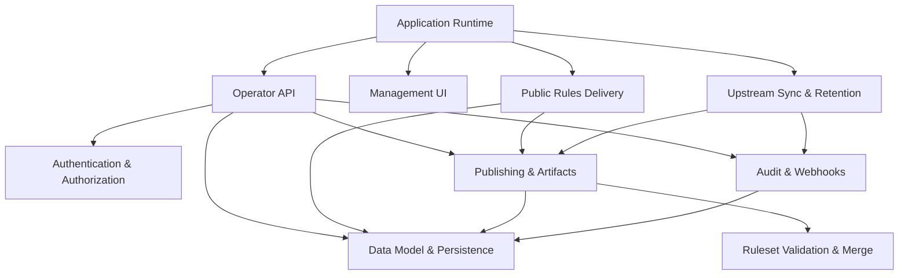

<!-- GENERATED FILE, do not edit by hand.
     Mirrored from .gitnexus/wiki (GitNexus knowledge graph wiki), source commit dc26798.
     Regenerate: node .gitnexus/run.cjs wiki, then: npm run docs:wiki -->

# CheckDeployManager

> Generated from the GitNexus code knowledge graph at commit `dc26798`.
> Do not edit these pages by hand. To refresh after code changes, run
> `node .gitnexus/run.cjs analyze`, `node .gitnexus/run.cjs wiki`, then `npm run docs:wiki`.


CheckDeployManager is a multi-tenant configuration service for the Check by CyberDrain browser extension. It runs entirely on Cloudflare Workers and is designed for MSPs that manage Check policy across many client organizations.

At a high level, the service mirrors upstream CyberDrain detection rules, lets operators apply instance-wide and tenant-specific policy deltas, publishes tenant-ready rulesets, and serves those rulesets to browser clients through stable public endpoints. It also provides a lightweight management dashboard for operators, webhook ingestion for tenant events, audit logging, and scheduled upstream synchronization.

## Architecture

The Worker entry point is described in [Application Runtime](application-runtime.md). It wires together the public rules delivery surface, authenticated operator API, management UI, scheduled jobs, and webhook routes.



Most runtime behavior centers on [Data Model & Persistence](data-model-persistence.md), which defines the D1 schema, shared row types, identifiers, tokens, hashes, and reusable database helpers. Rulesets and deployable outputs are managed by [Publishing & Artifacts](publishing-artifacts.md), while structural checks and tenant delta application live in [Ruleset Validation & Merge](ruleset-validation-merge.md).

The management path starts in the dependency-free [Management UI](management-ui.md), which calls the protected [Operator API](operator-api.md). Operator routes are guarded by [Authentication & Authorization](authentication-authorization.md), backed by Cloudflare Access outside local development.

The public runtime path is handled by [Public Rules Delivery](public-rules-delivery.md). These endpoints are unauthenticated by design and rely on unguessable tenant GUIDs or preview tokens rather than operator sessions.

## Key Flows

### Operator Management

An operator signs in through the Cloudflare Access-protected management surface, uses the [Management UI](management-ui.md), and sends API requests to [Operator API](operator-api.md). The API reads and writes tenant configuration through [Data Model & Persistence](data-model-persistence.md), records important actions through [Audit & Webhooks](audit-webhooks.md), and calls [Publishing & Artifacts](publishing-artifacts.md) when a ruleset or deployment artifact needs to be generated.

### Ruleset Publishing

Publishing starts with tenant configuration and an active upstream snapshot. [Ruleset Validation & Merge](ruleset-validation-merge.md) validates the upstream ruleset and tenant delta, then applies the delta to produce a merged tenant ruleset. [Publishing & Artifacts](publishing-artifacts.md) stores the published ruleset artifact and records the version metadata in D1.

### Public Rules Delivery

The Check browser extension retrieves tenant rules through public routes in [Public Rules Delivery](public-rules-delivery.md). Those routes look up tenant and version state in [Data Model & Persistence](data-model-persistence.md), then return the published ruleset or related assets. Failed lookups intentionally return minimal responses so tenant identifiers and preview tokens are not leaked.

### Scheduled Upstream Sync

The Worker scheduled handler runs [Upstream Sync & Retention](upstream-sync-retention.md). It fetches upstream CyberDrain rules, validates and snapshots the payload, republishes affected tenant rules when needed, records audit activity through [Audit & Webhooks](audit-webhooks.md), and prunes old operational data according to retention policy.

### Webhooks And Audit

[Audit & Webhooks](audit-webhooks.md) provides the shared audit writer used by operator and system workflows, and the public webhook ingestion route used by tenant integrations. Both paths persist through [Data Model & Persistence](data-model-persistence.md), keeping operational history separate from published ruleset artifacts.

## Local Development

Install dependencies, create or migrate the local database, and start the Worker:

```bash
npm install
npm run migrate:local
npm run dev
```

Useful scripts:

```bash
npm test
npm run typecheck
npm run deploy
npm run docs:wiki
```

## Module pages

- [Application Runtime](application-runtime.md)
- [Authentication & Authorization](authentication-authorization.md)
- [Data Model & Persistence](data-model-persistence.md)
- [Ruleset Validation & Merge](ruleset-validation-merge.md)
- [Upstream Sync & Retention](upstream-sync-retention.md)
- [Publishing & Artifacts](publishing-artifacts.md)
- [Audit & Webhooks](audit-webhooks.md)
- [Public Rules Delivery](public-rules-delivery.md)
- [Operator API](operator-api.md)
- [Management UI](management-ui.md)

## Hand-written documentation

- [Architecture, data model, and threat model](../architecture.md)
- [Post-deploy and operations runbook](../runbook.md)
- [Contributing guide](../../CONTRIBUTING.md)
