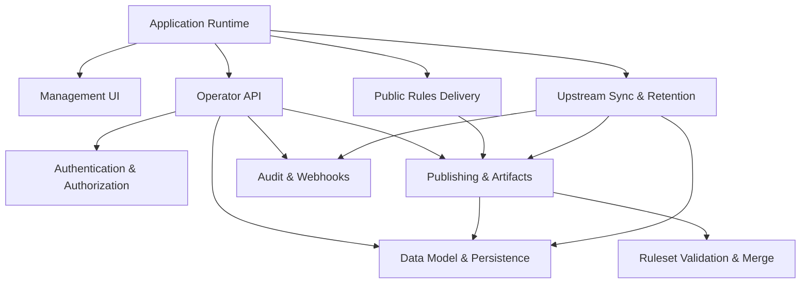

<!-- GENERATED FILE, do not edit by hand.
     Mirrored from .gitnexus/wiki (GitNexus knowledge graph wiki), source commit b99d78c.
     Regenerate: node .gitnexus/run.cjs wiki, then: npm run docs:wiki -->

# CheckDeployManager

> Generated from the GitNexus code knowledge graph at commit `b99d78c`.
> Do not edit these pages by hand. To refresh after code changes, run
> `node .gitnexus/run.cjs analyze`, `node .gitnexus/run.cjs wiki`, then `npm run docs:wiki`.


CheckDeployManager is a multi-tenant configuration service for the Check by CyberDrain browser extension. It runs on Cloudflare Workers and gives MSPs a central place to mirror upstream Check detection rules, apply shared baseline changes, publish tenant-specific rulesets, manage deployment artifacts, and review operational activity.

At a high level, the Worker serves three audiences:

- Check browser clients fetch published rules and branding through public, GUID-based routes.
- Operators manage tenants, deltas, publishing, webhook activity, and settings through the authenticated management surface.
- Scheduled jobs keep upstream rule snapshots current, republish affected tenant rulesets, and prune old operational data.



## How The System Fits Together

The [Application Runtime](application-runtime.md) is the Cloudflare Worker entry point. `src/index.ts` creates the Hono app, registers public rules routes, authenticated API routes, management UI routes, and the scheduled handler. The runtime boundary is intentionally small: routing, environment bindings, static UI delivery, and scheduled orchestration.

Administrative access is protected by [Authentication & Authorization](authentication-authorization.md). Operator routes pass through `requireOperator()` in `src/middleware.ts`, which delegates Cloudflare Access JWT validation to `authenticateRequest()` in `src/lib/access-jwt.ts`. Outside local development, the service fails closed unless Cloudflare Access is configured and the request includes a valid assertion.

The authenticated control plane lives in the [Operator API](operator-api.md). `src/routes/api/index.ts` composes tenant management, rule draft validation, publishing, branding, policy settings, GUID rotation, upstream state, webhook review, audit logs, and instance settings. These routes are the main writers into the system, so they call heavily into [Data Model & Persistence](data-model-persistence.md), [Publishing & Artifacts](publishing-artifacts.md), [Audit & Webhooks](audit-webhooks.md), and [Ruleset Validation & Merge](ruleset-validation-merge.md).

The [Management UI](management-ui.md) is a vanilla browser dashboard under `src/ui/manage/`. It has no client build step: `index.html`, `app.js`, and `styles.css` are served by the Worker and communicate with the Operator API. This keeps the operator experience simple while leaving all durable decisions on the server side.

## Rule Publishing

The core data path starts with upstream Check rules and ends with tenant-specific published rulesets.

[Upstream Sync & Retention](upstream-sync-retention.md) fetches the upstream ruleset on the scheduled path, validates it, snapshots accepted or invalid payloads, records summary changes, and republishes tenants when the upstream source changes. Publishing itself is handled by [Publishing & Artifacts](publishing-artifacts.md), which combines the active upstream snapshot with a tenant delta and writes the resulting versioned ruleset to R2 while recording metadata in D1.

The merge operation is deliberately isolated in [Ruleset Validation & Merge](ruleset-validation-merge.md). `src/lib/validate.ts` checks upstream and tenant delta structure, while `src/lib/merge.ts` applies a validated delta to an upstream ruleset. Keeping this logic pure makes it easier to test and safer to reuse from API routes, publishing flows, scheduled sync, and fixtures.

## Public Delivery

The [Public Rules Delivery](public-rules-delivery.md) module exposes unauthenticated runtime endpoints for browser clients. These routes serve published rulesets, draft previews, and tenant logos using unguessable GUIDs or preview tokens rather than operator sessions.

Public delivery intentionally depends on persisted publish state instead of recalculating tenant policy on every client request. Draft preview routes can call into publishing helpers, but normal rules delivery reads the current published version and associated artifacts from storage.

## Persistence And Audit Trail

[Data Model & Persistence](data-model-persistence.md) defines the D1 schema in `migrations/0001_init.sql` and centralizes shared database helpers in `src/lib/db.ts`. D1 stores tenants, settings, upstream snapshots, publish metadata, audit records, webhook events, and related operational state. R2 stores versioned ruleset artifacts and assets by key.

[Audit & Webhooks](audit-webhooks.md) provides the two persistence-focused activity surfaces. `writeAudit()` records operator and system actions, while `src/routes/hook.ts` accepts tenant webhook payloads at `POST /hook/:guid` and stores accepted JSON bodies for later review.

## Key End-To-End Flows

A typical operator flow starts in the [Management UI](management-ui.md), calls the [Operator API](operator-api.md), passes through [Authentication & Authorization](authentication-authorization.md), validates input through [Ruleset Validation & Merge](ruleset-validation-merge.md), persists changes through [Data Model & Persistence](data-model-persistence.md), and records important actions through [Audit & Webhooks](audit-webhooks.md).

A tenant publish flow starts with a delta document, validates it, loads the active upstream snapshot, builds the merged ruleset, stores the published artifact, updates D1 metadata, and writes an audit entry. The published result is then available through [Public Rules Delivery](public-rules-delivery.md).

A scheduled maintenance flow starts in `scheduled()` in `src/index.ts`, runs `runScheduledTasks()` in `src/lib/cron.ts`, calls upstream synchronization in `src/lib/upstream.ts`, republishes affected tenants through the publishing path, writes audit records, and applies retention cleanup.

A browser delivery flow starts when a Check client requests a public rules URL. `src/routes/rules.ts` resolves the tenant by GUID or preview token, returns the current ruleset or logo when available, and uses intentionally plain `404` responses for misses.

## Local Development

The repository is a Node/Cloudflare Workers project. The main scripts are:

```sh
npm run dev
npm run test
npm run typecheck
npm run migrate:local
npm run deploy
npm run docs:wiki
```

Use `npm run dev` for local Worker development, `npm run migrate:local` to apply the local D1 schema, `npm run test` and `npm run typecheck` before changing behavior, and `npm run docs:wiki` when regenerating the repository wiki.

## Module pages

- [Application Runtime](application-runtime.md)
- [Authentication & Authorization](authentication-authorization.md)
- [Data Model & Persistence](data-model-persistence.md)
- [Ruleset Validation & Merge](ruleset-validation-merge.md)
- [Upstream Sync & Retention](upstream-sync-retention.md)
- [Publishing & Artifacts](publishing-artifacts.md)
- [Audit & Webhooks](audit-webhooks.md)
- [Public Rules Delivery](public-rules-delivery.md)
- [Operator API](operator-api.md)
- [Management UI](management-ui.md)

## Hand-written documentation

- [Architecture, data model, and threat model](../architecture.md)
- [Post-deploy and operations runbook](../runbook.md)
- [Contributing guide](../../CONTRIBUTING.md)
