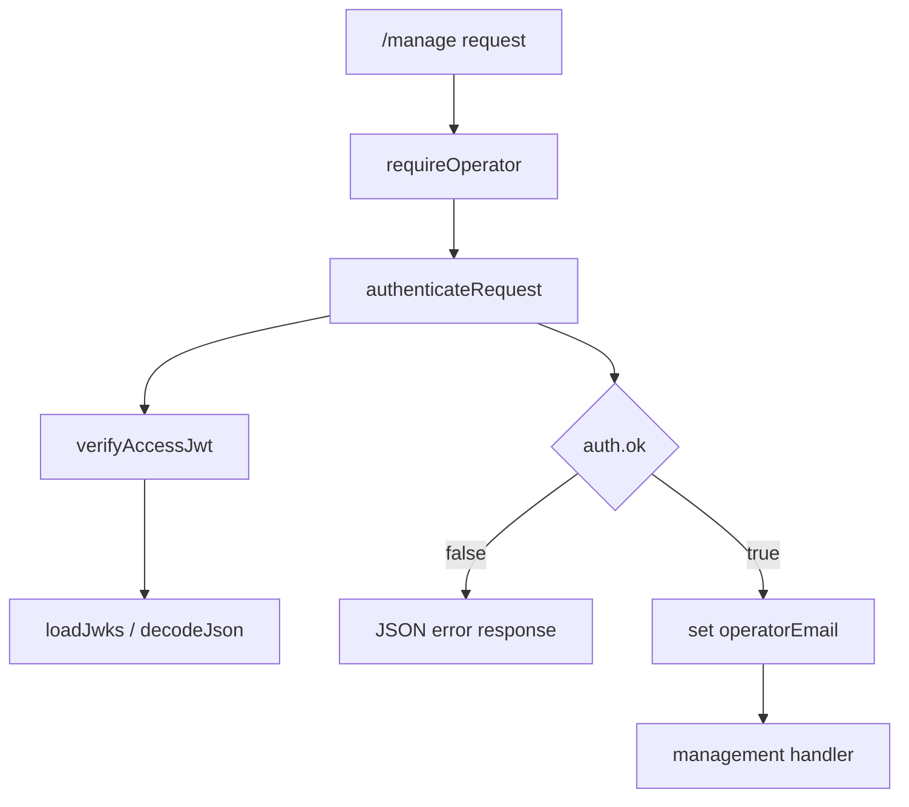
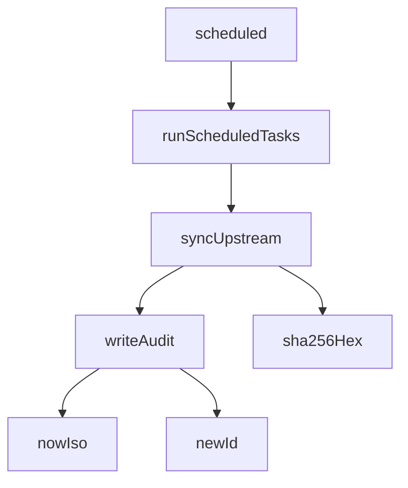

<!-- GENERATED FILE, do not edit by hand.
     Mirrored from .gitnexus/wiki (GitNexus knowledge graph wiki), source commit 5adb17f.
     Regenerate: node .gitnexus/run.cjs wiki, then: npm run docs:wiki -->

# Application Runtime

The Application Runtime is the Cloudflare Worker entrypoint for CheckDeployManager. It wires the Hono application, mounts route modules, protects the management UI, serves static dashboard assets, exposes the bundled GPO export script, and runs scheduled background maintenance.

This module is intentionally thin: request handling is delegated to route modules, authentication is delegated to `authenticateRequest`, and cron work is delegated to `runScheduledTasks`.

## Entry Points

`src/index.ts` exports the Worker handler:

```ts
export default {
  fetch: app.fetch,
  scheduled: async (controller, env, ctx) => { ... },
} satisfies ExportedHandler<Env>;
```

The runtime has two Cloudflare Worker entry points:

- `fetch`: handled by the Hono app instance.
- `scheduled`: invoked by Cloudflare Cron Triggers and delegated to `runScheduledTasks(env)`.

`Env` is imported from `src/types.ts`, where it aliases the generated Cloudflare binding type:

```ts
export type Env = Cloudflare.Env;
```

The actual binding shape comes from `worker-configuration.d.ts`, generated by `wrangler types --strict-vars=false`.

## Request Routing

The Hono app is created with the project-specific environment type:

```ts
const app = new Hono<AppEnv>();
```

Routes are mounted in `src/index.ts`:

```ts
app.route("/", rulesRoutes);
app.route("/", hookRoutes);
app.route("/api", apiRoutes);
```

The runtime composes three route groups:

- `rulesRoutes` under `/`
- `hookRoutes` under `/`
- `apiRoutes` under `/api`

The root path redirects users to the management interface:

```ts
app.get("/", (c) => c.redirect("/manage/"));
```

Management routes are protected by `requireOperator`:

```ts
app.use("/manage", requireOperator);
app.use("/manage/*", requireOperator);
```

After authentication, the Worker handles two management surfaces:

- `/manage/export-checkgpoconfig.ps1`: returns the bundled PowerShell migration helper script.
- `/manage` and `/manage/*`: forwards the request to the static asset binding with `c.env.ASSETS.fetch(c.req.raw)`.

## Management Authentication

`src/middleware.ts` defines the Hono environment type used by the application runtime:

```ts
export type AppEnv = {
  Bindings: Env;
  Variables: { operatorEmail: string };
};
```

`Bindings` gives handlers access to Cloudflare environment bindings. `Variables.operatorEmail` is set after a successful operator authentication check.

The `requireOperator` middleware validates every management request:

```ts
export const requireOperator = createMiddleware<AppEnv>(async (c, next) => {
  const auth = await authenticateRequest(c.req.raw, c.env);
  if (!auth.ok) {
    return c.json({ error: auth.reason }, auth.status);
  }
  c.set("operatorEmail", auth.email);
  await next();
});
```

This is defense in depth. Even if Cloudflare Access routing is misconfigured, the Worker still validates the Access JWT before serving the dashboard or helper script.

Authentication flow:



Downstream management handlers can read the authenticated operator email from the Hono context variable:

```ts
c.get("operatorEmail");
```

## Static Management UI

The runtime serves the dashboard through the `ASSETS` binding:

```ts
app.get("/manage", (c) => c.env.ASSETS.fetch(c.req.raw));
app.get("/manage/*", (c) => c.env.ASSETS.fetch(c.req.raw));
```

Because these handlers are registered after the `/manage` middleware, dashboard assets are only served after `requireOperator` succeeds.

## Bundled GPO Export Script

The runtime imports the PowerShell script at build time:

```ts
import exportGpoConfigScript from "../scripts/Export-CheckGpoConfig.ps1";
```

It exposes the script as a protected download:

```ts
app.get("/manage/export-checkgpoconfig.ps1", (c) =>
  c.body(exportGpoConfigScript, 200, {
    "Content-Type": "text/plain; charset=utf-8",
    "Content-Disposition": 'attachment; filename="Export-CheckGpoConfig.ps1"',
  }),
);
```

This keeps the onboarding helper behind the same operator gate as the rest of the dashboard.

## Scheduled Runtime

The `scheduled` handler runs background work through `runScheduledTasks(env)`:

```ts
scheduled: async (controller, env, ctx) => {
  ctx.waitUntil(
    (async () => {
      const { sync, cleanup } = await runScheduledTasks(env);
      console.log(
        "cron complete:",
        JSON.stringify({ sync: sync.status, diff: sync.diffSummary, cleanup }),
      );
    })(),
  );
},
```

The runtime uses `ctx.waitUntil()` so the scheduled task can continue running asynchronously within the Worker execution lifecycle.

The scheduled flow delegates into the cron library and then into sync, audit, and database helpers:



The runtime logs a compact completion record containing:

- `sync.status`
- `sync.diffSummary`
- `cleanup`

## Module Boundaries

The Application Runtime should stay focused on composition:

- Mount route modules.
- Apply cross-cutting middleware.
- Serve Worker assets.
- Expose Worker lifecycle handlers.
- Delegate business logic to libraries and route modules.

Avoid placing feature-specific behavior directly in `src/index.ts` unless it is truly runtime-level wiring, such as mounting a route group, registering middleware, or connecting a Cloudflare handler.

## Contributing Notes

When adding a new public route group, mount it before the management middleware if it should be unauthenticated.

When adding a management route, register it after:

```ts
app.use("/manage", requireOperator);
app.use("/manage/*", requireOperator);
```

That ensures the route is protected by `requireOperator`.

When adding scheduled behavior, prefer extending `runScheduledTasks` in `src/lib/cron.ts` instead of adding more logic to the Worker `scheduled` handler. The runtime should continue to act as the lifecycle bridge, not the owner of cron business logic.
