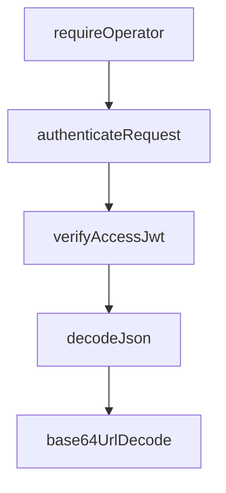

<!-- GENERATED FILE, do not edit by hand.
     Mirrored from .gitnexus/wiki (GitNexus knowledge graph wiki), source commit dc26798.
     Regenerate: node .gitnexus/run.cjs wiki, then: npm run docs:wiki -->

# Application Runtime

The Application Runtime module defines the Cloudflare Worker entry point, request router, runtime bindings, and management-route authentication boundary.

It is composed of:

- `src/index.ts`: Worker runtime entry point and Hono route registration.
- `src/types.ts`: Cloudflare binding contract for the Worker environment.
- `src/middleware.ts`: shared Hono environment typing and operator authentication middleware.

```mermaid
flowchart TD
  Worker[Cloudflare Worker]
  Hono[Hono app]
  Public[Rules / Hook routes]
  Api[/api routes]
  Manage[/manage assets]
  Auth[requireOperator]
  Cron[scheduled handler]
  Tasks[runScheduledTasks]

  Worker --> Hono
  Hono --> Public
  Hono --> Api
  Hono --> Auth --> Manage
  Worker --> Cron --> Tasks
```

## Runtime Entry Point

`src/index.ts` creates the application with:

```ts
const app = new Hono<AppEnv>();
```

`AppEnv` provides Hono with the Worker binding types and per-request variables declared in `src/middleware.ts`.

The module exports an object satisfying `ExportedHandler<Env>`:

```ts
export default {
  fetch: app.fetch,
  scheduled: async (controller, env, ctx) => {
    // ...
  },
} satisfies ExportedHandler<Env>;
```

This gives the Worker two runtime entry points:

- `fetch`: handles HTTP requests through the Hono router.
- `scheduled`: handles Cloudflare Cron Trigger executions.

## HTTP Routing

The runtime mounts three route groups before defining the management UI routes:

```ts
app.route("/", rulesRoutes);
app.route("/", hookRoutes);
app.route("/api", apiRoutes);
```

`rulesRoutes` and `hookRoutes` are mounted at the root path, so those modules own their own concrete URL patterns. `apiRoutes` is mounted below `/api`.

The root URL redirects operators to the management UI:

```ts
app.get("/", (c) => c.redirect("/manage/"));
```

Management routes are protected before asset handling is registered:

```ts
app.use("/manage", requireOperator);
app.use("/manage/*", requireOperator);
app.get("/manage", (c) => c.env.ASSETS.fetch(c.req.raw));
app.get("/manage/*", (c) => c.env.ASSETS.fetch(c.req.raw));
```

Both `/manage` and `/manage/*` pass through `requireOperator`. If authentication succeeds, the request is forwarded to the `ASSETS` binding using the original raw request. This keeps the management UI served by Cloudflare assets while still enforcing Worker-side authorization.

## Operator Authentication Middleware

`src/middleware.ts` defines the shared Hono environment type:

```ts
export type AppEnv = {
  Bindings: Env;
  Variables: { operatorEmail: string };
};
```

`Bindings` maps to the Worker `Env` interface. `Variables.operatorEmail` is a per-request value set after successful authentication.

`requireOperator` is a Hono middleware created with `createMiddleware<AppEnv>()`:

```ts
export const requireOperator = createMiddleware<AppEnv>(async (c, next) => {
  const auth = await authenticateRequest(c.req.raw, c.env);
  if (!auth.ok) {
    return c.json({ error: auth.reason }, auth.status);
  }
  c.set("operatorEmail", auth.email);
  await next();
});
```

The middleware delegates Access validation to `authenticateRequest` from `src/lib/access-jwt.ts`. That function is responsible for validating the Cloudflare Access JWT and returns a structured result.

Behavior:

- On failure, the request stops immediately with JSON `{ error: auth.reason }` and the provided HTTP status.
- On success, `operatorEmail` is stored in Hono context variables and downstream handlers continue.
- The middleware validates every management request inside the Worker, providing defense in depth even if external Access routing is misconfigured.

The relevant authentication execution flow is:



## Scheduled Runtime

The `scheduled` handler runs background maintenance work through `runScheduledTasks`:

```ts
scheduled: async (controller, env, ctx) => {
  ctx.waitUntil(
    (async () => {
      const { sync, cleanup } = await runScheduledTasks(env);
      console.log(
        "cron complete:",
        JSON.stringify({ sync: sync.status, diff: sync.diffSummary, cleanup }),
      );
    })(),
  );
},
```

The handler uses `ctx.waitUntil(...)` so the scheduled work can continue asynchronously within the Worker runtime lifecycle.

`runScheduledTasks(env)` returns `sync` and `cleanup` results. The runtime logs:

- `sync.status`
- `sync.diffSummary`
- `cleanup`

The scheduled flow connects this runtime module to upstream sync, audit writing, database helpers, snapshot lookup, and retention cleanup:

- `scheduled`
- `runScheduledTasks`
- `syncUpstream`
- `writeAudit`
- `newId`
- `nowIso`
- `getActiveSnapshot`

Retention cleanup follows:

- `scheduled`
- `runScheduledTasks`
- `runRetentionCleanup`
- `pruneSnapshots`

## Environment Bindings

`src/types.ts` defines the Worker binding contract:

```ts
export interface Env {
  DB: D1Database;
  STORAGE: R2Bucket;
  ASSETS: Fetcher;
  ACCESS_TEAM_DOMAIN: string;
  ACCESS_APP_AUD: string;
  ENVIRONMENT: string;
  DEV_OPERATOR_EMAIL?: string;
}
```

Bindings used directly in this module:

- `ASSETS`: serves the management UI for `/manage` and `/manage/*`.
- `ACCESS_TEAM_DOMAIN`, `ACCESS_APP_AUD`, and optionally `DEV_OPERATOR_EMAIL`: passed through `c.env` to `authenticateRequest`.
- `DB` and `STORAGE`: passed into scheduled work through `runScheduledTasks(env)` and used by downstream modules.

The runtime itself does not directly query D1 or R2. It owns the binding shape and passes the complete `Env` object to lower-level modules.

## Integration Points

The Application Runtime is intentionally thin. It wires together the major application surfaces without implementing domain behavior directly.

Primary dependencies:

- `rulesRoutes` from `src/routes/rules`
- `hookRoutes` from `src/routes/hook`
- `apiRoutes` from `src/routes/api`
- `runScheduledTasks` from `src/lib/cron`
- `authenticateRequest` from `src/lib/access-jwt`

Primary responsibilities:

- Register public, hook, API, and management routes.
- Protect management routes with `requireOperator`.
- Serve management assets through the `ASSETS` binding.
- Expose Cloudflare Worker `fetch` and `scheduled` handlers.
- Define the Worker environment contract used across the app.

Because this module sits at the edge of the application, changes here can affect request routing, authentication enforcement, static asset serving, and scheduled maintenance behavior. Keep route order and middleware placement explicit when adding new runtime surfaces.
