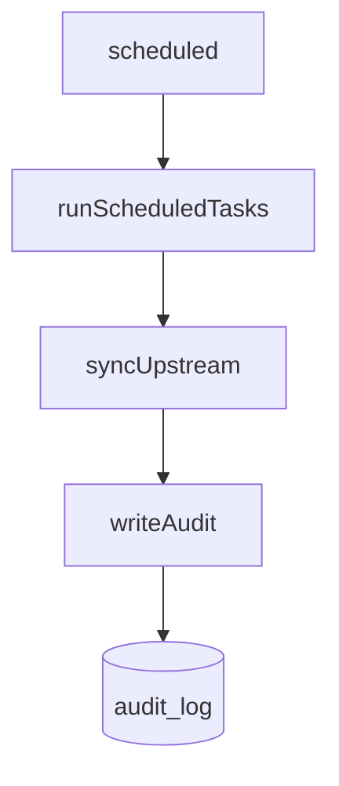
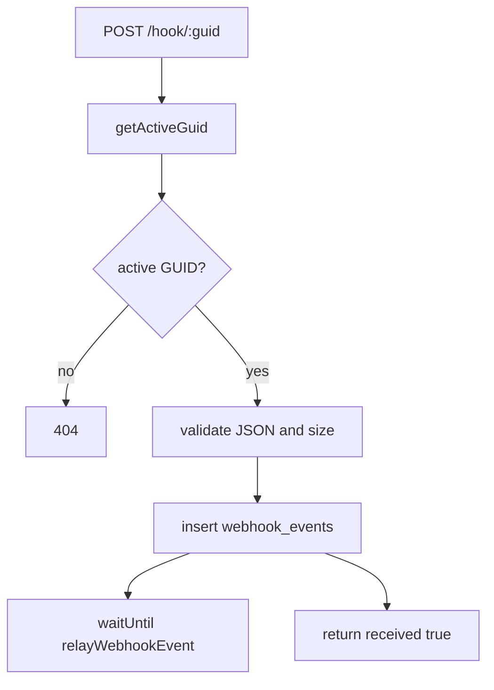

<!-- GENERATED FILE, do not edit by hand.
     Mirrored from .gitnexus/wiki (GitNexus knowledge graph wiki), source commit 5adb17f.
     Regenerate: node .gitnexus/run.cjs wiki, then: npm run docs:wiki -->

# Audit & Webhooks

The Audit & Webhooks module provides two small but important persistence paths:

- `writeAudit()` records administrative and scheduled-system actions in `audit_log`.
- `hookRoutes` receives external webhook payloads, stores them durably in `webhook_events`, and then attempts a best-effort relay.

Both paths share the same database utility conventions from `src/lib/db.ts`: `newId()` for generated row IDs and `nowIso()` for timestamps.

## Audit Logging

`src/lib/audit.ts` exports one function:

```ts
export async function writeAudit(
  db: D1Database,
  operatorEmail: string,
  action: string,
  tenantId: string | null,
  details: unknown,
): Promise<void>
```

`writeAudit()` inserts a single row into `audit_log`:

```sql
INSERT INTO audit_log (
  id,
  ts,
  operator_email,
  action,
  tenant_id,
  details_json
)
VALUES (?, ?, ?, ?, ?, ?)
```

The values are bound as:

- `id`: generated by `newId()`
- `ts`: generated by `nowIso()`
- `operator_email`: verified Access email, development bypass identity, or `"cron"`
- `action`: caller-defined action name
- `tenant_id`: tenant identifier or `null`
- `details_json`: `null` when `details === undefined`; otherwise `JSON.stringify(details)`

Callers are responsible for choosing stable `action` strings and passing details that can be serialized safely with `JSON.stringify()`.

## Audit Callers

`writeAudit()` is used by API routes and scheduled/publishing workflows to create a uniform activity trail.

Known callers include:

- `routes/api/guids.ts`
- `routes/api/events.ts`
- `routes/api/rules.ts`
- `routes/api/instance.ts`
- `routes/api/branding.ts`
- `routes/api/tenants.ts`
- `routes/api/policy.ts`
- `src/lib/publish.ts`
  - `publishTenant`
  - `republishAllTenants`
- `src/lib/upstream.ts`
  - `syncUpstream`

Scheduled work reaches audit logging through the cron path:



In that path, the operator identity is expected to be `"cron"`.

## Webhook Receiver

`src/routes/hook.ts` defines the public webhook route collection:

```ts
export const hookRoutes = new Hono<{ Bindings: Env }>();
```

It registers one route:

```ts
hookRoutes.post("/hook/:guid", async (c) => { ... });
```

The route accepts webhook events for an active tenant GUID. Payloads are stored verbatim and treated as hostile. The receiver validates transport constraints and JSON shape enough to store and classify the event, but it does not trust or deeply interpret the payload.

## Request Validation

The webhook route performs validation in this order:

1. Resolve the GUID:

   ```ts
   const guidRow = await getActiveGuid(c.env.DB, c.req.param("guid"));
   if (guidRow === null) return new Response(null, { status: 404 });
   ```

   Unknown or inactive GUIDs receive `404`.

2. Require JSON content type:

   ```ts
   const contentType = c.req.header("Content-Type") ?? "";
   if (!contentType.toLowerCase().startsWith("application/json")) {
     return c.json({ error: "Content-Type must be application/json" }, 415);
   }
   ```

   Values such as `application/json; charset=utf-8` are accepted because the check uses `startsWith()`.

3. Enforce the declared size limit:

   ```ts
   export const MAX_HOOK_BYTES = 256 * 1024;
   ```

   If `Content-Length` is greater than `MAX_HOOK_BYTES`, the route returns `413`.

4. Read the body and enforce the actual encoded byte size:

   ```ts
   const body = await c.req.text();
   if (new TextEncoder().encode(body).length > MAX_HOOK_BYTES) {
     return c.json({ error: "body exceeds 256 KB" }, 413);
   }
   ```

5. Parse JSON:

   Invalid JSON returns `400`.

## Event Type Extraction

The payload is parsed only to derive `event_type`.

Default value:

```ts
let eventType = "unknown";
```

If the parsed payload is a non-null object, the receiver checks:

1. `payload.reportType`
2. `payload.event`

The first non-empty string among those fields becomes `eventType`.

```ts
const candidate =
  (payload as Record<string, unknown>).reportType ??
  (payload as Record<string, unknown>).event;
```

No other payload fields are interpreted by this module.

## Durable Event Storage

After validation, the route inserts the event into `webhook_events`:

```sql
INSERT INTO webhook_events (
  id,
  tenant_id,
  guid,
  received_at,
  event_type,
  payload_json
)
VALUES (?, ?, ?, ?, ?, ?)
```

The values are bound as:

- `id`: generated by `newId()`
- `tenant_id`: from the active GUID row
- `guid`: from the active GUID row
- `received_at`: generated by `nowIso()`
- `event_type`: extracted from `reportType`, `event`, or `"unknown"`
- `payload_json`: the original request body string

Because `payload_json` is stored verbatim, any code that renders webhook payloads must HTML-escape the content.

## Best-Effort Relay

After the database insert succeeds, the route starts an asynchronous relay using `c.executionCtx.waitUntil()`:

```ts
c.executionCtx.waitUntil(
  (async () => {
    const tenant = await getTenant(c.env.DB, guidRow.tenant_id);
    const outcome = await relayWebhookEvent(c.env, {
      id: eventId,
      tenant_id: guidRow.tenant_id,
      tenant_name: tenant?.name ?? "",
      guid: guidRow.guid,
      received_at: receivedAt,
      event_type: eventType,
      payload_json: body,
    });
    if (outcome.status === "failed") {
      console.log(`webhook relay failed: ${outcome.error}`);
    }
  })(),
);
```

The relay receives the same durable event fields plus `tenant_name`, resolved through `getTenant()`.

The response to the webhook sender does not depend on relay success. Once the event is stored, the route returns:

```json
{ "received": true }
```

If `relayWebhookEvent()` returns `{ status: "failed" }`, the failure is logged with `console.log()`.

## Webhook Flow



## Error Responses

The webhook route uses specific HTTP status codes for validation failures:

| Condition | Status | Response |
|---|---:|---|
| GUID is not active or does not exist | `404` | empty response |
| `Content-Type` does not start with `application/json` | `415` | `{ "error": "Content-Type must be application/json" }` |
| Declared or actual body size exceeds `256 KB` | `413` | `{ "error": "body exceeds 256 KB" }` |
| Body is not valid JSON | `400` | `{ "error": "body is not valid JSON" }` |
| Event stored successfully | `200` | `{ "received": true }` |

## Design Notes

Audit logging is intentionally simple: callers provide the semantic action and details, while `writeAudit()` centralizes ID generation, timestamping, and persistence.

Webhook handling is deliberately conservative. The route validates that the body is JSON, extracts only a coarse event type, stores the original payload, and defers any relay behavior until after durable storage. This keeps webhook receipt reliable even if downstream relay logic is unavailable or returns a failed outcome.
