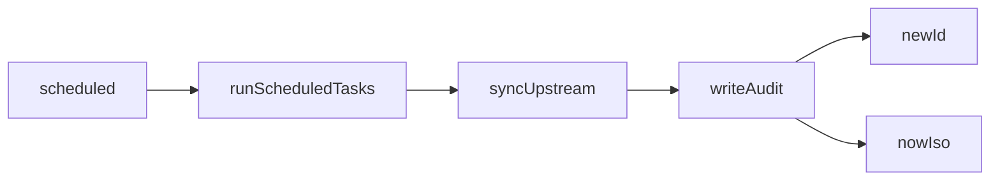

<!-- GENERATED FILE, do not edit by hand.
     Mirrored from .gitnexus/wiki (GitNexus knowledge graph wiki), source commit 921327d.
     Regenerate: node .gitnexus/run.cjs wiki, then: npm run docs:wiki -->

# Audit & Webhooks

The Audit & Webhooks module provides two persistence-focused surfaces:

- `writeAudit()` in `src/lib/audit.ts` records operator and system activity in `audit_log`.
- `hookRoutes` in `src/routes/hook.ts` receives tenant webhook payloads at `POST /hook/:guid` and stores accepted JSON bodies in `webhook_events`.

Both paths use shared database helpers from `src/lib/db.ts`: `newId()` for row identifiers and `nowIso()` for timestamps.

## Audit Logging

`writeAudit()` is the single audit-log writer used by API routes and background workflows.

```ts
export async function writeAudit(
  db: D1Database,
  operatorEmail: string,
  action: string,
  tenantId: string | null,
  details: unknown,
): Promise<void>
```

It inserts one row into `audit_log` with:

- `id`: generated by `newId()`
- `ts`: generated by `nowIso()`
- `operator_email`: the verified Access email, dev bypass identity, or `"cron"`
- `action`: caller-defined action name
- `tenant_id`: tenant scope, or `null` for global/system actions
- `details_json`: `JSON.stringify(details)`, except `undefined` is stored as SQL `NULL`

`writeAudit()` does not validate action names, tenant IDs, or detail shape. Callers are responsible for passing stable action labels and serializable detail objects.

### Audit Callers

The function is used across administrative and system paths, including:

- `routes/api/guids.ts`
- `routes/api/events.ts`
- `routes/api/rules.ts`
- `routes/api/instance.ts`
- `routes/api/branding.ts`
- `routes/api/tenants.ts`
- `routes/api/policy.ts`
- `src/lib/upstream.ts` via `syncUpstream()`
- `src/lib/publish.ts` via `publishTenant()`

Scheduled work reaches the audit log through:



This means audit rows can represent both user-initiated changes and automated maintenance work. Scheduled operations should use `"cron"` as the operator identity.

## Webhook Receiver

`hookRoutes` is a Hono router bound to `Env`:

```ts
export const hookRoutes = new Hono<{ Bindings: Env }>();
```

It exposes one route:

```ts
hookRoutes.post("/hook/:guid", async (c) => { ... });
```

The route accepts webhook events for an active GUID. It resolves the path parameter with:

```ts
const guidRow = await getActiveGuid(c.env.DB, c.req.param("guid"));
```

If no active GUID exists, the handler returns `404` without storing anything.

## Webhook Validation Flow

The webhook handler intentionally treats request bodies as hostile. It performs only minimal validation needed for safe storage and indexing:

1. Resolve `:guid` with `getActiveGuid()`.
2. Require `Content-Type` to start with `application/json`, case-insensitively.
3. Reject declared `Content-Length` values larger than `MAX_HOOK_BYTES`.
4. Read the body as text.
5. Re-check actual UTF-8 byte length with `TextEncoder`.
6. Parse the body as JSON only to validate syntax and derive `event_type`.
7. Insert the original body string into `webhook_events.payload_json`.

The maximum accepted payload size is:

```ts
export const MAX_HOOK_BYTES = 256 * 1024;
```

Oversized payloads return `413` with:

```json
{ "error": "body exceeds 256 KB" }
```

Invalid content types return `415`, invalid JSON returns `400`, and accepted payloads return:

```json
{ "received": true }
```

## Event Type Extraction

Webhook payloads are stored verbatim, but the handler derives a small metadata field named `event_type` for indexing or filtering.

The default is:

```ts
let eventType = "unknown";
```

After parsing JSON, the handler checks object payloads for:

1. `reportType`
2. `event`

The first non-empty string found becomes `event_type`. Other fields are ignored.

```ts
const candidate =
  (payload as Record<string, unknown>).reportType ??
  (payload as Record<string, unknown>).event;
```

The parsed object is not stored. The original request body text is inserted unchanged into `payload_json`.

## Webhook Persistence

Accepted webhook events are inserted into `webhook_events`:

```sql
INSERT INTO webhook_events
  (id, tenant_id, guid, received_at, event_type, payload_json)
VALUES (?, ?, ?, ?, ?, ?)
```

Values come from:

- `newId()` for `id`
- `guidRow.tenant_id` from the active GUID lookup
- `guidRow.guid` for the canonical GUID value
- `nowIso()` for `received_at`
- extracted `eventType`
- raw JSON body text for `payload_json`

The route does not call `writeAudit()`. Webhook delivery creates an event record, not an audit-log record.

## Security Model

Webhook payloads are deliberately not trusted or interpreted beyond JSON validation and event-type extraction. The file-level comment in `src/routes/hook.ts` states the rendering contract: payloads are stored verbatim and must always be HTML-escaped when rendered.

Important contribution rules:

- Do not render `payload_json` directly into HTML.
- Do not add business logic that trusts webhook payload fields.
- Keep size checks based on bytes, not JavaScript string length.
- Preserve the active GUID lookup before accepting a request.
- If additional metadata is extracted, keep the raw payload as the source of truth.
