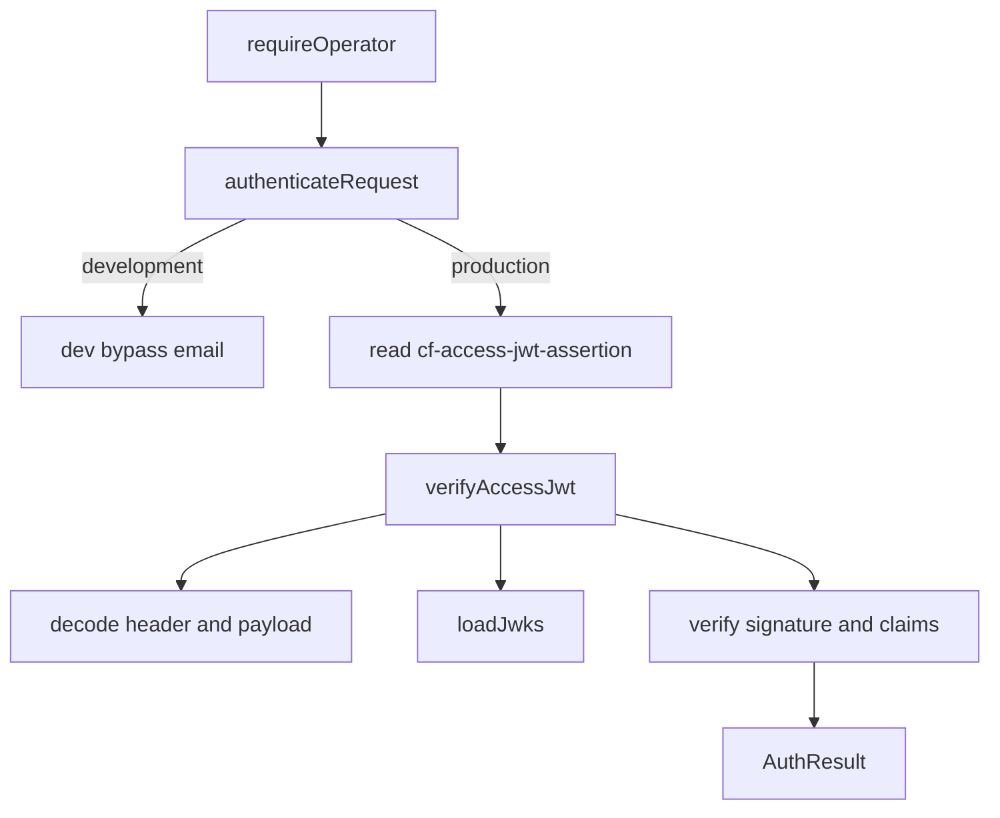

<!-- GENERATED FILE, do not edit by hand.
     Mirrored from .gitnexus/wiki (GitNexus knowledge graph wiki), source commit 3fe8c14.
     Regenerate: node .gitnexus/run.cjs wiki, then: npm run docs:wiki -->

# Authentication & Authorization

The Authentication & Authorization module validates Cloudflare Access JWTs for protected worker requests. Its main entry point is `authenticateRequest()` in `src/lib/access-jwt.ts`, which is called by `requireOperator()` in `src/middleware.ts`.

The module is deliberately fail-closed: outside local development, requests are rejected unless Cloudflare Access is fully configured and the request carries a valid `cf-access-jwt-assertion` token.



## Public API

### `AuthResult`

```ts
export type AuthResult =
  | { ok: true; email: string }
  | { ok: false; status: 401 | 403; reason: string };
```

All authentication decisions return an `AuthResult`.

Successful authentication returns the operator email from the JWT `email` claim:

```ts
{ ok: true, email: payload.email }
```

Failures include an HTTP status and a human-readable reason:

```ts
{ ok: false, status: 403, reason: "audience mismatch" }
```

The module uses `401` only when the Access JWT header is missing or empty. Invalid tokens, misconfiguration, JWKS failures, signature failures, and claim mismatches return `403`.

### `authenticateRequest(request, env, fetcher)`

```ts
export async function authenticateRequest(
  request: Request,
  env: Env,
  fetcher: typeof fetch = fetch,
): Promise<AuthResult>
```

`authenticateRequest()` is the integration point used by middleware. It applies environment-level behavior before delegating token validation to `verifyAccessJwt()`.

Behavior:

1. If `env.ENVIRONMENT === "development"`, Cloudflare Access validation is bypassed.
2. If either `env.ACCESS_TEAM_DOMAIN` or `env.ACCESS_APP_AUD` is missing, the request is rejected with `403`.
3. The request must include `cf-access-jwt-assertion`.
4. The token is validated by `verifyAccessJwt()` using the configured team domain and expected audience.

The development bypass returns:

```ts
{ ok: true, email: env.DEV_OPERATOR_EMAIL || "dev@localhost" }
```

A warning is logged once per isolate through the module-level `devBypassWarned` flag. This keeps local development simple while making accidental production use visible in logs.

### `verifyAccessJwt(token, teamDomain, expectedAud, fetcher)`

```ts
export async function verifyAccessJwt(
  token: string,
  teamDomain: string,
  expectedAud: string,
  fetcher: typeof fetch = fetch,
): Promise<AuthResult>
```

`verifyAccessJwt()` performs the actual JWT validation. It expects a Cloudflare Access JWT signed with `RS256`.

Validation steps:

1. Split the token into three JWT segments.
2. Decode the header and require:
   - `alg === "RS256"`
   - `kid` is a string
3. Decode the payload.
4. Load the Cloudflare Access JWKS for `teamDomain`.
5. If the `kid` is not found, clear the JWKS cache and reload once to handle key rotation.
6. Verify the signature using `crypto.subtle.verify()` with `RSASSA-PKCS1-v1_5` and `SHA-256`.
7. Validate time-based claims:
   - `exp` must exist and not be expired.
   - `nbf`, when present, must not be in the future.
8. Validate issuer:
   - `payload.iss === https://${teamDomain}`
9. Validate audience:
   - `payload.aud` must include `expectedAud`.
10. Require a non-empty `email` claim.

The function returns the authenticated email only after all checks pass.

## JWT Claim Handling

The internal `AccessJwtPayload` interface describes the claims this module understands:

```ts
interface AccessJwtPayload {
  aud?: string | string[];
  email?: string;
  exp?: number;
  nbf?: number;
  iat?: number;
  iss?: string;
  sub?: string;
}
```

Currently enforced claims are:

- `exp`
- `nbf`
- `iss`
- `aud`
- `email`

`iat` and `sub` are decoded but not enforced.

Audience handling accepts either a single string or an array:

```ts
const audiences = Array.isArray(payload.aud)
  ? payload.aud
  : typeof payload.aud === "string"
    ? [payload.aud]
    : [];
```

This supports both JWT payload shapes without changing downstream validation logic.

## JWKS Loading and Caching

Cloudflare Access signing keys are loaded by `loadJwks()`:

```ts
async function loadJwks(
  teamDomain: string,
  fetcher: typeof fetch,
): Promise<Map<string, CryptoKey>>
```

It fetches keys from:

```text
https://${teamDomain}/cdn-cgi/access/certs
```

Only RSA keys with a string `kid` are imported:

```ts
crypto.subtle.importKey(
  "jwk",
  jwk,
  { name: "RSASSA-PKCS1-v1_5", hash: "SHA-256" },
  false,
  ["verify"],
)
```

The module keeps a process-local JWKS cache:

```ts
let jwksCache: {
  teamDomain: string;
  fetchedAt: number;
  keys: Map<string, CryptoKey>;
} | null = null;
```

Cache behavior:

- Cache TTL is one hour via `JWKS_TTL_MS`.
- Cache entries are scoped to a single `teamDomain`.
- A missing `kid` causes `verifyAccessJwt()` to call `resetJwksCache()` and fetch keys again once.
- If the key is still missing after refresh, validation fails with `403`.

`resetJwksCache()` is exported for tests and for the key-rotation retry path:

```ts
export function resetJwksCache(): void {
  jwksCache = null;
}
```

## Base64URL and JSON Decoding

JWT segments are decoded through two small helpers.

`base64UrlDecode()` converts JWT Base64URL encoding into bytes:

```ts
function base64UrlDecode(segment: string): Uint8Array
```

`decodeJson<T>()` decodes a segment and parses it as JSON:

```ts
function decodeJson<T>(segment: string): T | null
```

Invalid JSON or invalid encoded data returns `null`, allowing callers to reject malformed tokens without throwing.

## Time Validation

The module allows a small clock skew:

```ts
const CLOCK_SKEW_SECONDS = 60;
```

Expiration is rejected when:

```ts
payload.exp + CLOCK_SKEW_SECONDS < nowSeconds
```

`nbf` is rejected when:

```ts
payload.nbf - CLOCK_SKEW_SECONDS > nowSeconds
```

This protects against expired or premature tokens while tolerating minor clock differences between systems.

## Integration With Middleware

The incoming production flow is:

```text
requireOperator()
  -> authenticateRequest()
  -> verifyAccessJwt()
  -> decodeJson()
  -> base64UrlDecode()
  -> loadJwks()
```

`requireOperator()` is responsible for applying the result to request handling. This module does not emit responses directly; it returns structured authentication state and failure reasons.

Authorization in this module is coarse-grained. A valid Cloudflare Access token for the configured audience is treated as an authorized operator identity. There are no role, group, domain, or permission checks in `src/lib/access-jwt.ts`.

## Failure Modes

Common rejection reasons include:

- Missing `cf-access-jwt-assertion` header
- Missing `ACCESS_TEAM_DOMAIN` or `ACCESS_APP_AUD`
- Token is not a three-segment JWT
- Header is not `RS256` or has no `kid`
- Payload does not parse
- JWKS fetch fails
- No JWKS key matches the token `kid`
- Signature verification fails
- Token is expired
- Token is not yet valid
- Issuer does not match `https://${teamDomain}`
- Audience does not include `expectedAud`
- Token has no non-empty `email` claim

The distinction between `401` and `403` is intentional: unauthenticated requests without a token receive `401`; requests with invalid credentials or invalid server configuration receive `403`.

## Testing Hooks

The module is designed for deterministic tests:

- `fetcher` can be injected into `authenticateRequest()` and `verifyAccessJwt()`.
- `resetJwksCache()` clears module-level JWKS state between tests.
- Development mode can be exercised with `ENVIRONMENT="development"` and optional `DEV_OPERATOR_EMAIL`.

Tests in `test/access-jwt.test.ts` call:

- `authenticateRequest()`
- `verifyAccessJwt()`
- `resetJwksCache()`

This allows tests to cover full request authentication, direct JWT validation, JWKS caching, cache invalidation, and development bypass behavior.
