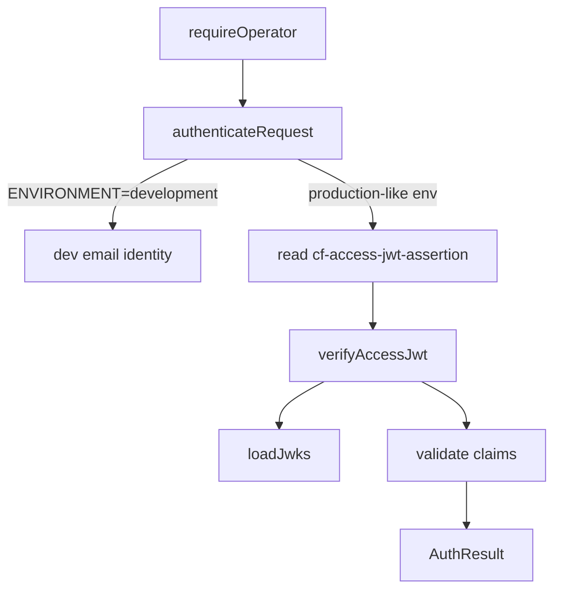

<!-- GENERATED FILE, do not edit by hand.
     Mirrored from .gitnexus/wiki (GitNexus knowledge graph wiki), source commit 5adb17f.
     Regenerate: node .gitnexus/run.cjs wiki, then: npm run docs:wiki -->

# Authentication & Authorization

`src/lib/access-jwt.ts` authenticates operator requests using Cloudflare Access JWTs. It is the gatekeeper used by `requireOperator` in `src/middleware.ts` before protected `/api` and `/manage` routes are allowed to continue.

The module fails closed by default: outside local development, requests are rejected unless Cloudflare Access configuration is present and the request includes a valid `cf-access-jwt-assertion` header.

## Request Flow



## Public API

### `AuthResult`

```ts
export type AuthResult =
  | { ok: true; email: string }
  | { ok: false; status: 401 | 403; reason: string };
```

All authentication paths return this discriminated union.

Successful authentication returns the operator email from the JWT `email` claim, or from `DEV_OPERATOR_EMAIL` in local development. Failed authentication returns an HTTP-oriented status and a diagnostic reason.

The module uses `401` only when the Access assertion header is missing. Invalid configuration, malformed tokens, signature failures, claim mismatches, and JWKS failures return `403`.

### `authenticateRequest(request, env, fetcher?)`

`authenticateRequest` is the main entry point for the rest of the application.

It handles environment-level policy before delegating token validation to `verifyAccessJwt`:

1. If `env.ENVIRONMENT === "development"`, JWT validation is bypassed.
2. If `ACCESS_TEAM_DOMAIN` or `ACCESS_APP_AUD` is missing, the request is rejected.
3. It reads `cf-access-jwt-assertion` from request headers.
4. It calls `verifyAccessJwt(token, env.ACCESS_TEAM_DOMAIN, env.ACCESS_APP_AUD, fetcher)`.

The development bypass logs a warning once per module lifetime using the module-level `devBypassWarned` flag. The returned email is `env.DEV_OPERATOR_EMAIL` when set, otherwise `dev@localhost`.

This bypass is deliberately narrow: only the exact `ENVIRONMENT=development` setting disables JWT validation.

### `verifyAccessJwt(token, teamDomain, expectedAud, fetcher?)`

`verifyAccessJwt` validates a Cloudflare Access JWT and returns an `AuthResult`.

Validation is performed in this order:

1. Split the token into three JWT segments.
2. Decode and validate the header.
3. Decode the payload.
4. Load the Cloudflare Access JWKS for the team domain.
5. Retry JWKS loading once if the token `kid` is not in the cached key set.
6. Verify the RS256 signature using Web Crypto.
7. Validate time-based claims.
8. Validate issuer.
9. Validate audience.
10. Require a non-empty `email` claim.

Accepted JWT headers must use:

```ts
{ alg: "RS256", kid: string }
```

Accepted signatures are verified with:

```ts
crypto.subtle.verify(
  "RSASSA-PKCS1-v1_5",
  key,
  base64UrlDecode(segments[2]),
  signed,
)
```

The signed input is the original encoded header and payload joined with a period:

```ts
`${segments[0]}.${segments[1]}`
```

The issuer must exactly match:

```ts
`https://${teamDomain}`
```

The expected audience must be present in the JWT `aud` claim. The code supports both string and string-array audience forms.

### `resetJwksCache()`

`resetJwksCache` clears the module-level JWKS cache.

It is exported for tests and is also used internally by `verifyAccessJwt` when the cached JWKS does not contain the JWT header `kid`. That retry path handles normal Cloudflare signing-key rotation without waiting for the cache TTL to expire.

## JWKS Loading and Caching

`loadJwks(teamDomain, fetcher)` fetches Cloudflare Access signing keys from:

```ts
https://${teamDomain}/cdn-cgi/access/certs
```

It imports RSA JWKs into `CryptoKey` instances using:

```ts
crypto.subtle.importKey(
  "jwk",
  jwk,
  { name: "RSASSA-PKCS1-v1_5", hash: "SHA-256" },
  false,
  ["verify"],
)
```

Only keys with a string `kid` and `kty === "RSA"` are imported. Imported keys are stored in a `Map<string, CryptoKey>` keyed by `kid`.

The cache is module-level:

```ts
let jwksCache: {
  teamDomain: string;
  fetchedAt: number;
  keys: Map<string, CryptoKey>;
} | null = null;
```

The cache is valid for one hour:

```ts
const JWKS_TTL_MS = 60 * 60 * 1000;
```

The cache is scoped to a single `teamDomain`. A request for a different team domain causes a fresh JWKS fetch.

## Claim Validation

The JWT payload shape is represented by `AccessJwtPayload`:

```ts
interface AccessJwtPayload {
  aud?: string | string[];
  email?: string;
  exp?: number;
  nbf?: number;
  iat?: number;
  iss?: string;
  sub?: string;
}
```

The module currently validates:

- `exp`: required and must not be expired.
- `nbf`: optional, but when present must not be in the future.
- `iss`: must be `https://${teamDomain}`.
- `aud`: must include `expectedAud`.
- `email`: required and non-empty.

A 60-second clock skew is allowed for `exp` and `nbf`:

```ts
const CLOCK_SKEW_SECONDS = 60;
```

`iat` and `sub` are decoded but not currently enforced.

## Internal Helpers

### `base64UrlDecode(segment)`

Converts a JWT base64url segment into bytes by replacing URL-safe characters and decoding with `atob`.

It is used for:

- JWT header decoding.
- JWT payload decoding.
- Signature bytes passed to `crypto.subtle.verify`.

### `decodeJson<T>(segment)`

Decodes a JWT segment as JSON and returns `null` on failure.

This keeps malformed header and payload handling explicit inside `verifyAccessJwt`:

```ts
const header = decodeJson<{ alg?: string; kid?: string }>(segments[0]);
const payload = decodeJson<AccessJwtPayload>(segments[1]);
```

## Integration Points

`requireOperator` in `src/middleware.ts` is the application-level caller. Its authentication path is:

```text
requireOperator
  -> authenticateRequest
    -> verifyAccessJwt
      -> decodeJson
        -> base64UrlDecode
      -> loadJwks
      -> resetJwksCache
```

Tests in `test/access-jwt.test.ts` call the exported functions directly:

- `authenticateRequest`
- `verifyAccessJwt`
- `resetJwksCache`

The optional `fetcher` argument on `authenticateRequest` and `verifyAccessJwt` exists to make JWKS fetching testable without relying on global network behavior.

## Failure Behavior

The module intentionally returns structured denial reasons instead of throwing for normal authentication failures.

Examples include:

- `token is not a JWT`
- `unsupported token header`
- `token payload does not parse`
- `JWKS fetch returned HTTP ...`
- `no JWKS key matches the token kid`
- `signature verification failed`
- `token is expired`
- `token is not yet valid`
- `issuer mismatch`
- `audience mismatch`
- `token has no email claim`

JWKS fetch and import failures are caught in `verifyAccessJwt` and converted into `{ ok: false, status: 403, reason }`.

## Security Model

This module authenticates a Cloudflare Access identity and returns the associated email. It does not implement role checks, group membership checks, or per-route permission logic. Any finer-grained authorization must happen after `requireOperator` receives a successful `AuthResult`.

The important security properties are:

- Production-like environments fail closed without `ACCESS_TEAM_DOMAIN` and `ACCESS_APP_AUD`.
- Missing Access headers return `401`.
- Invalid tokens and invalid configuration return `403`.
- Only RS256 JWTs are accepted.
- Signatures are verified against Cloudflare Access JWKS.
- Issuer and audience are checked after signature verification.
- The authenticated identity must include an `email` claim.
