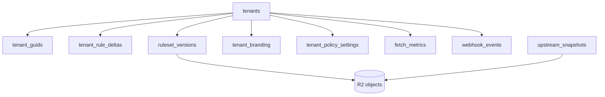
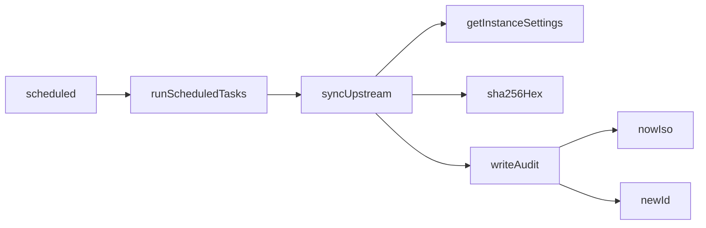

<!-- GENERATED FILE, do not edit by hand.
     Mirrored from .gitnexus/wiki (GitNexus knowledge graph wiki), source commit 5adb17f.
     Regenerate: node .gitnexus/run.cjs wiki, then: npm run docs:wiki -->

# Data Model & Persistence

## Purpose

The Data Model & Persistence module defines the Cloudflare D1 schema and the shared database helper layer used by routes, cron jobs, publishing, webhook handling, and tests.

The database stores control-plane metadata: tenants, public GUIDs, draft rule deltas, published ruleset metadata, branding, policy settings, instance settings, upstream snapshot metadata, audit records, fetch metrics, revoked GUID telemetry, and webhook events. Large JSON rule documents and binary assets are not stored directly in D1; D1 stores R2 object keys such as `rules/{tenant_id}/{version_number}.json`, `upstream/{fetched_at}-{hash}.json`, and `assets/{tenant_id}/logo.{ext}`.

The implementation is split across:

- `migrations/0001_init.sql`: the initial D1 schema.
- `src/lib/db.ts`: typed row interfaces, default instance settings, ID/time/hash helpers, and common D1 queries.

## Storage Architecture

D1 is the authoritative index for tenant state and publication metadata. R2 holds the durable rule payloads and assets referenced by rows.

## Core Tables

### `tenants`

`tenants` is the internal tenant registry.

Important columns:

- `id`: internal UUID. This is the stable primary key and is not meant to be exposed publicly.
- `name`, `notes`: operator-facing tenant metadata.
- `current_version_id`: points at the currently published `ruleset_versions.id`.
- `preview_token`: random 128-bit token used for preview URLs.
- `created_at`, `updated_at`: ISO timestamps.

The corresponding TypeScript shape is `TenantRow`.

`getTenant(db, id)` reads a tenant by internal ID.

### `tenant_guids`

`tenant_guids` maps public GUIDs to internal tenants.

Important columns:

- `guid`: public UUIDv4 used by deployed clients.
- `tenant_id`: foreign key to `tenants.id`.
- `status`: `"active"` or `"revoked"`.
- `label`: operator note, commonly used during rotations.
- `created_at`, `revoked_at`: lifecycle timestamps.

The corresponding TypeScript shape is `TenantGuidRow`.

`getActiveGuid(db, guid)` only returns rows where `status = 'active'`. This is the helper to use when serving active clients.

`getGuid(db, guid)` returns either active or revoked GUIDs. This is useful when the caller needs to distinguish “unknown GUID” from “known but revoked GUID”.

`countRevokedHit(db, guid)` records traffic that still targets a revoked GUID in `revoked_guid_hits`.

### `tenant_rule_deltas`

`tenant_rule_deltas` stores the tenant’s editable draft delta.

Important columns:

- `tenant_id`: one draft per tenant.
- `draft_json`: JSON delta document, stored as text.
- `updated_at`, `updated_by`: audit metadata for draft changes.

`getDraftDelta(db, tenantId)` returns the stored draft JSON, or `"{}"` when no draft row exists. Callers can treat absence as an empty delta.

### `ruleset_versions`

`ruleset_versions` stores immutable metadata for published rulesets.

Important columns:

- `id`: version record UUID.
- `tenant_id`: owner tenant.
- `version_number`: monotonic per tenant.
- `r2_key`: R2 location for the generated ruleset JSON.
- `etag`: SHA-256 hash of the generated body, also used as the HTTP ETag.
- `upstream_snapshot_id`: upstream snapshot used as the merge base.
- `delta_json`: frozen copy of the delta used for publication.
- `created_at`, `created_by`, `note`: publication metadata.

The corresponding TypeScript shape is `RulesetVersionRow`.

`getCurrentVersion(db, tenantId)` joins `tenants.current_version_id` to `ruleset_versions.id` and returns the active published version for the tenant.

Publishing code calls `newId()`, `nowIso()`, and `sha256Hex()` from this module when creating version records and hashes.

### `tenant_branding`

`tenant_branding` stores tenant-specific branding fields.

Important columns:

- `company_name`, `product_name`
- `support_email`, `support_url`
- `privacy_policy_url`, `about_url`
- `primary_color`
- `logo_r2_key`, `logo_content_type`

The TypeScript interface `TenantBrandingRow` also includes `use_default_logo: number`, where `1` opts the tenant out of inherited instance branding so the Check extension’s built-in logo and default primary color show. If migrations are changed, keep this interface and the D1 schema aligned.

Branding routes use `getInstanceSettings()` to combine tenant branding with instance defaults.

### `tenant_policy_settings`

`tenant_policy_settings` stores tenant-managed policy configuration as JSON text.

The `settings_json` field contains managed-schema settings such as:

- `enablePageBlocking`
- `showNotifications`
- `enableValidPageBadge`
- `validPageBadgeTimeout`
- `enableDebugLogging`
- `updateInterval`
- `urlAllowlist`
- `domainSquatting`
- generic webhook preferences
- `enableCippReporting`
- `cippServerUrl`
- `cippTenantId`

Policy routes use `getInstanceSettings()` to resolve inherited defaults.

### `instance_settings`

`instance_settings` is a string key-value table for deployment-wide configuration.

`DEFAULT_INSTANCE_SETTINGS` in `src/lib/db.ts` defines the complete expected default set:

- `public_base_url`
- `default_cipp_server_url`
- `metrics_retention_days`
- `webhook_retention_days`
- `stale_fetch_hours`
- `upstream_source_url`
- `upstream_keep_snapshots`
- `version_suffix_label`
- `false_positive_relay_url`
- `onboarding_completed_at`
- `tenant_defaults`
- `default_logo_r2_key`
- `default_logo_content_type`
- `baseline_rule_delta`

`getInstanceSettings(db)` reads all rows, inserts missing default keys with `INSERT OR IGNORE`, and returns a complete `Record<string, string>`. This makes first read idempotent and allows new settings to be added safely in code.

`putInstanceSetting(db, key, value)` upserts a single setting using `ON CONFLICT(key) DO UPDATE`.

Several higher-level flows depend on `getInstanceSettings()`:

- `relayWebhookEvent()` reads `false_positive_relay_url`.
- `buildMergedRuleset()` reads inherited defaults and `baseline_rule_delta`.
- branding, policy, tenant, instance, and upstream routes read instance-level defaults.
- `syncUpstream()` reads upstream source and retention settings.

### `upstream_snapshots`

`upstream_snapshots` records fetched upstream rule files.

Important columns:

- `id`: snapshot UUID.
- `fetched_at`: ISO timestamp.
- `upstream_version`: upstream file version field.
- `r2_key`: R2 object key for the fetched snapshot.
- `hash`: snapshot hash.
- `status`: `"active"`, `"superseded"`, or `"failed_validation"`.
- `diff_summary`: human-readable summary versus the previous snapshot.

The corresponding TypeScript shape is `UpstreamSnapshotRow`.

`getActiveSnapshot(db)` returns the most recent active snapshot by `fetched_at`.

The scheduled upstream sync flow calls `newId()`, `nowIso()`, `sha256Hex()`, and `getInstanceSettings()`.

### `audit_log`

`audit_log` stores immutable operator and system activity.

Important columns:

- `id`: audit record UUID.
- `ts`: ISO timestamp.
- `operator_email`: verified operator email or `"cron"`.
- `action`: action name such as `tenant.create`, `rules.publish`, or `guid.revoke`.
- `tenant_id`: optional affected tenant.
- `details_json`: action-specific details.

`writeAudit()` in `src/lib/audit.ts` depends on `newId()` and `nowIso()` from this module.

### `fetch_metrics`

`fetch_metrics` stores daily fetch counters by tenant and GUID.

Primary key:

- `(tenant_id, guid, day)`

Tracked values:

- `hits`: successful full fetches.
- `not_modified`: conditional requests answered as not modified.
- `last_fetch_at`: latest fetch timestamp.

`countFetchHit(db, tenantId, guid, notModified)` performs an upsert for today’s row. It increments `hits` when `notModified` is false and increments `not_modified` when `notModified` is true.

Rows are intended to be purged by cron after `metrics_retention_days`.

### `revoked_guid_hits`

`revoked_guid_hits` stores daily hit counts for revoked GUIDs.

Primary key:

- `(guid, day)`

`countRevokedHit(db, guid)` increments the current day’s counter. This gives operators visibility into clients still configured with dead GUIDs.

### `webhook_events`

`webhook_events` stores inbound webhook payloads.

Important columns:

- `id`: webhook event UUID.
- `tenant_id`, `guid`: resolved tenant and public GUID.
- `received_at`: ISO timestamp.
- `event_type`: payload report type or event name.
- `payload_json`: raw untrusted JSON text.
- `status`: `"new"`, `"reviewed"`, or `"dismissed"`.

The corresponding TypeScript shape is `WebhookEventRow`.

Render paths must HTML-escape `payload_json`; the schema comment explicitly treats it as untrusted. Rows are purged when dispositioned or after `webhook_retention_days`.

## Helper Functions

### Time and identity

`nowIso()` returns `new Date().toISOString()`.

`today()` returns the current UTC date as `YYYY-MM-DD` by slicing `toISOString()`.

`newId()` returns `crypto.randomUUID()`.

`newToken()` creates a 16-byte random token using `crypto.getRandomValues()` and returns it as 32 lowercase hex characters. It is used for tenant preview URLs.

Because these helpers use platform time and Web Crypto APIs directly, tests that depend on exact timestamps or IDs should isolate behavior at the call site.

### Hashing

`sha256Hex(body)` hashes a string with `crypto.subtle.digest("SHA-256", ...)` and returns lowercase hex.

Publishing uses this for generated tenant rulesets, where the resulting hash is stored as `ruleset_versions.etag`. Upstream sync also uses it when recording fetched upstream snapshots.

### Settings reads and writes

`getInstanceSettings(db)` is intentionally more than a read helper. It performs lazy default seeding:

1. Reads all rows from `instance_settings`.
2. Builds a plain object from existing rows.
3. Finds keys from `DEFAULT_INSTANCE_SETTINGS` that are missing.
4. Inserts missing keys with their default values using `db.batch()`.
5. Returns the complete object.

This pattern keeps old databases compatible when new settings are introduced. Any code reading instance settings should call `getInstanceSettings()` instead of querying `instance_settings` directly.

`putInstanceSetting(db, key, value)` writes a single key and updates existing rows in place.

### Tenant and GUID reads

`getTenant(db, id)` returns a `TenantRow | null`.

`getActiveGuid(db, guid)` returns only active GUIDs. Use this for public request paths that should reject revoked GUIDs.

`getGuid(db, guid)` returns active or revoked GUIDs. Use this for diagnostics, revocation handling, or paths that need to record revoked GUID traffic.

### Ruleset state reads

`getCurrentVersion(db, tenantId)` returns the version row pointed to by `tenants.current_version_id`.

`getDraftDelta(db, tenantId)` returns the editable draft JSON or `"{}"` if no draft exists.

`getActiveSnapshot(db)` returns the latest active upstream snapshot.

### Metrics writes

`countFetchHit(db, tenantId, guid, notModified)` updates `fetch_metrics` for the current day. The function calls both `today()` and `nowIso()`.

`countRevokedHit(db, guid)` updates `revoked_guid_hits` for the current day and calls `today()`.

Both helpers rely on SQLite upsert behavior and are safe to call repeatedly for the same key.

## How This Module Connects to Runtime Flows

### Scheduled upstream sync

The scheduled worker path flows through cron and upstream sync:

`syncUpstream()` uses instance settings to determine upstream behavior, hashes fetched content with `sha256Hex()`, writes snapshot metadata, and records audit activity through `writeAudit()`.

### Tenant publishing

Publishing depends on this module for IDs, timestamps, hashes, and instance-level merge settings.

`publishTenant()` calls:

- `newId()` for version identifiers.
- `nowIso()` for publication timestamps.
- `sha256Hex()` for the published ruleset ETag.

`buildMergedRuleset()` calls:

- `getInstanceSettings()` to apply `baseline_rule_delta` and inherited tenant defaults.

`republishAllTenants()` eventually reaches `buildMergedRuleset()` through `publishTenant()`, so global setting changes can affect generated tenant rulesets.

### Public rule fetches

Public rule-serving routes resolve GUIDs through `getActiveGuid()` and use the tenant’s current version through `getCurrentVersion()`.

Fetch telemetry is recorded with `countFetchHit()`. If a request targets a known revoked GUID, callers can use `getGuid()` and then `countRevokedHit()` to track stale clients.

### Admin APIs

Admin routes use the typed helpers and common primitives instead of duplicating SQL.

Examples from the call graph:

- `routes/api/tenants.ts` uses `newId()`, `newToken()`, `nowIso()`, and `getInstanceSettings()`.
- `routes/api/guids.ts` uses `newId()` and `nowIso()`.
- `routes/api/rules.ts` uses `nowIso()`.
- `routes/api/branding.ts` uses `getInstanceSettings()`.
- `routes/api/policy.ts` uses `getInstanceSettings()`.
- `routes/api/instance.ts` uses `nowIso()` and `getInstanceSettings()`.

### Webhook ingestion and relay

`src/routes/hook.ts` uses `newId()` and `nowIso()` when storing inbound webhook events.

`relayWebhookEvent()` reads instance settings through `getInstanceSettings()`, especially `false_positive_relay_url`, to decide whether to relay events to external automation systems.

## Persistence Patterns

### JSON is stored as text

Several tables store JSON as `TEXT`:

- `tenant_rule_deltas.draft_json`
- `ruleset_versions.delta_json`
- `tenant_policy_settings.settings_json`
- `instance_settings.value` for JSON-backed settings such as `tenant_defaults` and `baseline_rule_delta`
- `audit_log.details_json`
- `webhook_events.payload_json`

Validation is handled by callers before writing. This module does not parse or validate JSON payloads; it persists and retrieves strings.

### Published rulesets are immutable

`ruleset_versions` rows are historical records. A tenant’s live published version is selected by `tenants.current_version_id`, not by mutating version rows.

This gives the system a stable publication history:

- draft state lives in `tenant_rule_deltas`.
- published metadata lives in `ruleset_versions`.
- generated published JSON lives in R2.
- the live pointer lives on `tenants`.

### Public identity is separate from tenant identity

Internal tenant IDs and public GUIDs serve different purposes.

`tenants.id` is the internal stable identifier. `tenant_guids.guid` is the public client-facing vector and can be revoked or rotated without changing the tenant.

Code that handles public requests should start from GUID resolution, not from tenant ID.

### Settings are self-healing on read

`getInstanceSettings()` lazily backfills missing default keys. This is important for deployments upgraded from older schema or code versions.

When adding a new instance setting:

1. Add the key to `DEFAULT_INSTANCE_SETTINGS`.
2. Read settings through `getInstanceSettings()`.
3. Add validation at the write boundary if the value has structure or constraints.
4. Avoid direct `SELECT` reads that bypass default seeding.

### Daily counters use UTC dates

`today()` derives the day from `toISOString()`, so `fetch_metrics.day` and `revoked_guid_hits.day` are UTC dates. Retention and reporting code should use the same assumption.

## Contributor Notes

Use the row interfaces in `src/lib/db.ts` when adding D1 reads that return existing table rows. They document the expected nullable fields and string literal status values.

Prefer adding small shared helpers to `src/lib/db.ts` only when multiple routes or flows need the same query. Single-route SQL can remain close to its route handler if it is not reused.

Keep schema and TypeScript row shapes synchronized. `TenantBrandingRow.use_default_logo` is present in the TypeScript interface but not shown in `migrations/0001_init.sql`; any migration work around branding should verify the live schema path.

Do not store generated ruleset bodies or logos in D1. Store them in R2 and persist only their keys and metadata in D1.

Use `getActiveGuid()` for normal public access checks. Use `getGuid()` only when revoked GUIDs are meaningful to the caller.

Use `getInstanceSettings()` for reads, not direct `instance_settings` queries, so default seeding remains consistent across routes, cron, publishing, and relay logic.
