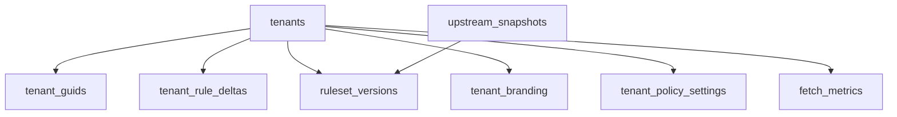

<!-- GENERATED FILE, do not edit by hand.
     Mirrored from .gitnexus/wiki (GitNexus knowledge graph wiki), source commit dc26798.
     Regenerate: node .gitnexus/run.cjs wiki, then: npm run docs:wiki -->

# Data Model & Persistence

The Data Model & Persistence module defines the D1 schema and the shared database helpers used by routes, publishing, scheduled sync, retention cleanup, webhook ingestion, and tests.

The schema lives in `migrations/0001_init.sql`. Runtime access is centralized in `src/lib/db.ts`, which provides typed row interfaces, default instance settings, ID/token/hash utilities, and a small set of reusable queries.

## Storage Model

The application stores metadata in D1 and stores versioned rule artifacts and assets externally by key. Several tables contain `r2_key` fields, but this module only records those keys; object reads and writes happen elsewhere.



`tenants` is the root tenant record. It uses an internal UUID `id`, tracks the currently published ruleset through `current_version_id`, and has a private `preview_token` used for preview JSON URLs.

`tenant_guids` maps public tenant GUIDs to internal tenant IDs. GUIDs can be `active` or `revoked`, allowing public identifiers to rotate without deleting tenant history.

`tenant_rule_deltas` stores the editable draft delta for a tenant. `getDraftDelta()` returns this document or `"{}"` when no row exists.

`ruleset_versions` stores immutable published versions. Each row records the tenant, monotonic `version_number`, R2 object key, SHA-256 `etag`, upstream snapshot used for the merge, frozen `delta_json`, creator, and optional note.

`tenant_branding` and `tenant_policy_settings` store tenant-specific UI/product metadata and managed-schema policy settings. The policy body is stored as JSON text in `settings_json`.

`instance_settings` stores global key/value configuration. Missing defaults are seeded lazily by `getInstanceSettings()`.

`upstream_snapshots` records fetched upstream rule files. The active snapshot is selected by `getActiveSnapshot()` using `status = 'active'` ordered by newest `fetched_at`.

`audit_log` records operator and cron actions indefinitely.

`fetch_metrics`, `revoked_guid_hits`, and `webhook_events` store operational telemetry. Metrics and webhook retention are governed by instance settings and cleaned up by cron code outside this module.

## Typed Row Interfaces

`src/lib/db.ts` exports TypeScript interfaces matching the D1 row shapes:

- `TenantRow`
- `TenantGuidRow`
- `RulesetVersionRow`
- `TenantBrandingRow`
- `UpstreamSnapshotRow`
- `WebhookEventRow`

These are used with D1 calls such as `.first<TenantRow>()` and `.all<{ key: string; value: string }>()`. The interfaces intentionally mirror database column names, including snake_case fields such as `tenant_id`, `current_version_id`, and `created_at`.

Status columns are represented as string unions where the code currently constrains them:

```ts
status: "active" | "revoked";
status: "active" | "superseded" | "failed_validation";
status: "new" | "reviewed" | "dismissed";
```

## Instance Settings

`DEFAULT_INSTANCE_SETTINGS` defines the global configuration keys expected by the application:

- `public_base_url`
- `default_cipp_server_url`
- `metrics_retention_days`
- `webhook_retention_days`
- `stale_fetch_hours`
- `upstream_source_url`
- `upstream_keep_snapshots`
- `version_suffix_label`

`getInstanceSettings(db)` reads all rows from `instance_settings`, inserts any missing defaults with `INSERT OR IGNORE`, adds those defaults to the returned object, and returns a complete `Record<string, string>`.

This lazy seeding behavior means callers can depend on default keys being present after reading settings. It is used by `routes/api/instance.ts`, `src/lib/cron.ts`, `src/lib/publish.ts`, `src/lib/artifacts.ts`, `src/lib/upstream.ts`, and tenant route logic.

`putInstanceSetting(db, key, value)` upserts a single setting with `ON CONFLICT(key) DO UPDATE`.

## Identity, Time, and Hash Utilities

`nowIso()` returns the current timestamp as an ISO string. It is used across audit logging, tenant and GUID changes, publishing, upstream sync, webhook ingestion, and tests.

`today()` returns the current UTC date in `YYYY-MM-DD` form. It is used only by metric counters in this module.

`newId()` wraps `crypto.randomUUID()` for internal IDs and row IDs. Callers include tenant creation, GUID creation, webhook ingestion, audit logging, upstream sync, publishing, and tests.

`newToken()` creates a 128-bit random hex token from `crypto.getRandomValues()`. It is used for tenant preview URLs.

`sha256Hex(body)` hashes a string with Web Crypto SHA-256 and returns lowercase hex. `syncUpstream()` uses it for upstream snapshot hashes, and `publishTenant()` uses it for ruleset ETags.

## Shared Queries

`getTenant(db, id)` fetches one tenant by internal ID.

`getActiveGuid(db, guid)` fetches a public GUID only when its status is `active`. This is the correct lookup for rule fetch paths that should reject revoked GUIDs.

`getGuid(db, guid)` fetches a GUID regardless of status. This supports flows that need to distinguish missing GUIDs from revoked GUIDs.

`getCurrentVersion(db, tenantId)` joins `tenants.current_version_id` to `ruleset_versions.id` and returns the currently published version for a tenant.

`getDraftDelta(db, tenantId)` returns the tenant draft delta JSON or `"{}"` if no draft row has been created.

`getActiveSnapshot(db)` returns the newest active upstream snapshot.

`countFetchHit(db, tenantId, guid, notModified)` increments daily fetch metrics using an upsert on `(tenant_id, guid, day)`. It increments `hits` for full fetches, increments `not_modified` for conditional 304-style fetches, and refreshes `last_fetch_at`.

`countRevokedHit(db, guid)` increments the daily count for clients still requesting a revoked GUID.

## How Other Modules Use This Module

API routes use this module for persistence primitives rather than duplicating common queries. Tenant routes use `newId()`, `newToken()`, `nowIso()`, and `getInstanceSettings()`. GUID routes use `newId()` and `nowIso()`. Instance routes use `getInstanceSettings()` and `putInstanceSetting()`.

Publishing code uses `getInstanceSettings()`, `nowIso()`, `newId()`, and `sha256Hex()` while building and recording published ruleset versions.

Scheduled work flows through `runScheduledTasks()`, then into `syncUpstream()` and retention cleanup. Upstream sync uses `getInstanceSettings()`, `getActiveSnapshot()`, `newId()`, `nowIso()`, and `sha256Hex()`. Retention cleanup reads retention settings through `getInstanceSettings()`.

Webhook ingestion uses `newId()` and `nowIso()` when storing `webhook_events`.

Audit logging uses `newId()` and `nowIso()` to write durable entries for operator and cron actions.

## Persistence Conventions

The module stores JSON documents as text columns: `draft_json`, `delta_json`, `settings_json`, `details_json`, and `payload_json`. Callers are responsible for validating, parsing, escaping, and rendering those JSON payloads safely.

Versioned artifacts are immutable once written. `ruleset_versions.delta_json` freezes the delta used for a publish, while `tenants.current_version_id` points at the published version currently served.

Public tenant access should go through GUIDs, not `tenants.id`. Internal IDs are database identifiers; `tenant_guids.guid` is the public tenant vector and supports revocation.

Most writes use explicit upsert statements where idempotence matters: instance settings, fetch metrics, and revoked GUID hit counters.
