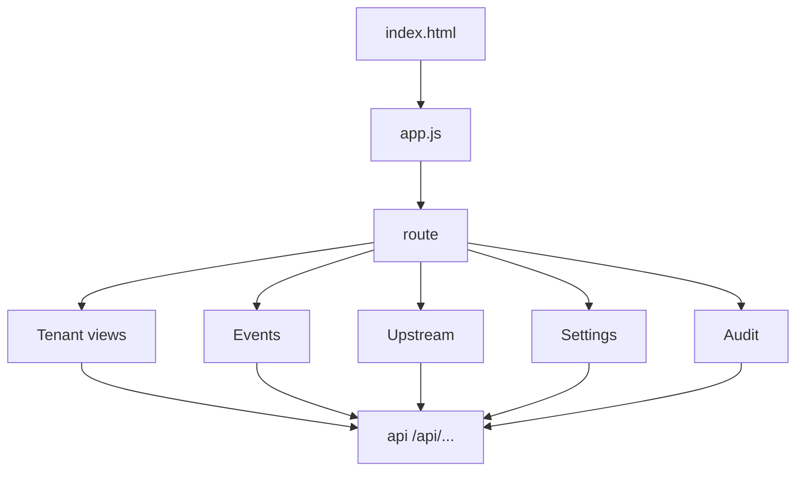

<!-- GENERATED FILE, do not edit by hand.
     Mirrored from .gitnexus/wiki (GitNexus knowledge graph wiki), source commit 3fe8c14.
     Regenerate: node .gitnexus/run.cjs wiki, then: npm run docs:wiki -->

# Management UI

The Management UI is a dependency-free browser dashboard for operating CheckDeployManager. It lives under `src/ui/manage/` and consists of:

- `index.html`: static shell, navigation, theme button, main render target, toast container.
- `app.js`: hash router, API client, page renderers, form handlers, copy/download helpers.
- `styles.css`: dark/light theme variables and layout styles.

The UI is intentionally simple: vanilla JavaScript, no build step, no client-side framework, and all navigation is handled through URL hashes such as `#/tenants`, `#/events`, and `#/tenants/{tenantId}/rules`.

## Runtime Shape



`index.html` provides a persistent top bar and a single `<main id="view">` mount point. `app.js` replaces `view.innerHTML` for each route and wires event listeners after rendering. The backend owns all persistent data; the UI keeps only transient client state such as active filters, theme preference, and artifact strings used for copy/download buttons.

## Routing

Routing is defined by the `routes` array in `app.js`:

```js
const routes = [
  { pattern: /^#\/tenants$/, render: renderTenantList, nav: "tenants" },
  { pattern: /^#\/tenants\/([0-9a-f-]+)(?:\/(\w+))?$/, render: renderTenantDetail, nav: "tenants" },
  { pattern: /^#\/events$/, render: renderEvents, nav: "events" },
  { pattern: /^#\/upstream$/, render: renderUpstream, nav: "upstream" },
  { pattern: /^#\/settings$/, render: renderSettings, nav: "settings" },
  { pattern: /^#\/audit$/, render: renderAudit, nav: "audit" },
];
```

`route()` reads `location.hash`, finds the first matching route, marks the corresponding top navigation link active, shows a loading placeholder, then awaits the route renderer. Renderer errors are caught and displayed as escaped text in the main panel.

Unknown routes are redirected to `#/tenants`.

The tenant detail route accepts an optional tab segment:

```text
#/tenants/{tenantId}
#/tenants/{tenantId}/rules
#/tenants/{tenantId}/versions
#/tenants/{tenantId}/branding
#/tenants/{tenantId}/policy
#/tenants/{tenantId}/artifacts
#/tenants/{tenantId}/guids
```

`renderTenantDetail(tenantId, tab)` fetches `/api/tenants/{tenantId}`, renders the shared tenant header, then delegates to the matching tab renderer.

## API Access

All backend calls go through `api(path, options)`:

```js
async function api(path, options) {
  const response = await fetch(`/api${path}`, options);
  ...
}
```

Callers pass paths without the `/api` prefix. The helper tries to parse JSON responses, throws an `Error` on non-2xx responses, and attaches `error.body` and `error.status` for handlers that need structured validation errors.

`jsonBody(method, payload)` creates JSON request options:

```js
jsonBody("PUT", { settings })
```

File uploads, such as tenant branding logos, bypass `jsonBody()` and send a `FormData` body directly.

## Rendering And Escaping

Most views build HTML strings and assign them to `innerHTML`. Because of that, the module centralizes escaping in `esc(value)` and uses it for API-derived values, IDs, names, timestamps, JSON, generated artifact content, and webhook payloads.

Important patterns:

- `esc()` converts nullish values to empty strings and escapes `&`, `<`, `>`, `"`, and `'`.
- `fmtTime(iso)` converts ISO timestamps to local display strings and escapes invalid raw values.
- `ago(iso)` renders relative fetch/traffic times and escapes invalid raw values.
- `renderEvents()` may parse `event.payload_json` only to pretty-print JSON, then still escapes the resulting string before rendering.
- Large generated artifact strings are stored in `artifactStore` instead of being embedded in HTML attributes.

Contributors should preserve the existing pattern: any value crossing from API data, stored webhook data, prompt input, or generated artifact content into `innerHTML` should pass through `esc()` unless it is static markup produced by this module.

## Shared UI Helpers

`toast(message, isError)` displays transient status messages in `#toast`. It toggles the `error` class and hides itself after 3.5 seconds.

`copyText(text)` writes to `navigator.clipboard` and reports success or failure through `toast()`.

`downloadText(filename, text, mime)` creates a temporary `Blob` URL and clicks an `<a>` element to download generated content.

A document-level click listener handles buttons with:

- `data-copy-key`
- `data-download-key`

The actual content comes from `artifactStore`, keyed by `artifactSection()`. This avoids placing long JSON, registry files, or PowerShell fragments inside HTML attributes.

## Theme Handling

The theme toggle is initialized at startup:

```js
applyTheme(localStorage.getItem("cdm-theme") || "dark");
```

`applyTheme(theme)` writes `data-theme` on `<html>`, updates the button label, and stores the preference under `cdm-theme`.

`styles.css` defines dark theme variables in `:root` and overrides them in `html[data-theme="light"]`. Components consume variables such as `--bg`, `--panel`, `--text`, `--accent`, `--good`, `--warn`, and `--bad`.

## Tenant List

`renderTenantList()` fetches:

```text
GET /api/tenants
```

It renders a table of tenants with status badges for:

- unpublished tenants
- current version number
- stale fetch state
- revoked GUID hits
- new webhook events

Rows are clickable and navigate to `#/tenants/{id}`. The “New tenant” button prompts for a tenant name and posts:

```text
POST /api/tenants
```

with:

```js
{ name: name.trim() }
```

On success, the UI navigates to the new tenant detail route.

## Tenant Detail Shell

`renderTenantDetail(tenantId, tab)` fetches:

```text
GET /api/tenants/{tenantId}
```

It renders:

- tenant name
- rename button
- delete button
- preview URL based on `tenant.preview_token`
- tenant tabs from `TENANT_TABS`

Tenant actions:

- Rename: `PATCH /api/tenants/{tenantId}` with `{ name }`
- Delete: `DELETE /api/tenants/{tenantId}`
- Copy preview URL: copies `${location.origin}/preview/{preview_token}.json`

Deletion is only attempted after a confirmation prompt. The backend is expected to enforce the rule shown in the prompt: all GUIDs must already be revoked.

## Rules Draft Tab

`renderRulesTab(container, tenantId, detail)` renders the tenant rule delta editor. It starts from `detail.draft.draft_json` when present, pretty-prints valid JSON, and otherwise shows the stored text.

The editor describes the supported delta keys:

- `add_exclusion_domain_patterns`
- `add_trusted_login_patterns`
- `add_phishing_indicators`
- `suppress_indicator_ids`
- `raw_overrides`

Actions:

```text
PUT /api/tenants/{tenantId}/rules
POST /api/tenants/{tenantId}/publish
```

Save flow:

1. Parse the textarea as JSON.
2. Send `{ delta }` to the rules endpoint.
3. Render returned validation findings with `renderFindings()`.
4. Show a success or warning toast based on `result.valid`.

Publish flow:

1. Confirm with the operator.
2. POST to the publish endpoint.
3. On success, navigate to the versions tab.
4. On validation failure, display `error.body.errors` when available.

`renderFindings(container, findings)` updates `#findings` with either “All validation gates pass.” or a list of escaped validation messages.

## Versions Tab

`renderVersionsTab(container, tenantId)` fetches:

```text
GET /api/tenants/{tenantId}/versions
```

It displays published versions, current version marker, publish metadata, ETag prefix, upstream base information, notes, and rollback buttons for non-current versions.

Rollback posts to:

```text
POST /api/tenants/{tenantId}/rollback/{versionId}
```

After rollback, the current route is re-rendered with `route()`.

## Branding Tab

`renderBrandingTab(container, tenantId, detail)` fetches:

```text
GET /api/tenants/{tenantId}/branding
```

It renders editable branding fields:

- company name
- product name
- support email
- support URL
- privacy policy URL
- about URL
- primary color
- logo upload

If a logo exists, it previews:

```text
/assets/{activeGuid}/logo?ts={Date.now()}
```

The active GUID is selected from `detail.guids` where `status === "active"`.

Saving branding sends `FormData` to:

```text
PUT /api/tenants/{tenantId}/branding
```

Logo removal sends JSON to the same endpoint:

```js
{ remove_logo: true }
```

## Policy Tab

`renderPolicyTab(container, tenantId)` fetches:

```text
GET /api/tenants/{tenantId}/policy
```

It edits extension behavior and reporting settings. The saved payload is built as a `settings` object and sent to:

```text
PUT /api/tenants/{tenantId}/policy
```

The UI currently handles:

- `enablePageBlocking`
- `showNotifications`
- `enableValidPageBadge`
- `enableDebugLogging`
- `validPageBadgeTimeout`
- `updateInterval`
- `urlAllowlist`
- `domainSquatting.enabled`
- `domainSquatting.deviationThreshold`
- `domainSquatting.Action`
- `genericWebhook.enabled`
- `genericWebhook.events`
- `enableCippReporting`
- `cippServerUrl`
- `cippTenantId`

The local `check(value, fallback)` helper treats undefined values as defaults while preserving explicit false values.

## Artifacts Tab

`renderArtifactsTab(container, tenantId)` fetches:

```text
GET /api/tenants/{tenantId}/artifacts
```

If artifact generation fails, it renders a single error panel. On success, it clears `artifactStore`, renders endpoint metadata, and creates copy/download sections through `artifactSection()`.

Generated artifacts include:

- Chrome and Edge managed storage JSON
- Firefox `policies.json` fragment
- full Firefox `policies.json`
- Chrome registry file
- Edge registry file
- Intune variable block for Check setup scripts
- CIPP standard field values

`artifactSection(key, title, description, content, filename, mime)` stores `content` in `artifactStore`, returns escaped preview markup, and emits buttons with data attributes used by the global click handler.

## GUIDs Tab

`renderGuidsTab(container, tenantId)` fetches:

```text
GET /api/tenants/{tenantId}/guids
```

It shows each GUID, status, label, fetch traffic, last fetch time, and revoked-hit warnings.

Actions:

```text
POST /api/tenants/{tenantId}/guids
POST /api/guids/{guid}/revoke
```

Rotation prompts for an optional label and mints a new GUID while old GUIDs remain visible. Revocation requires confirmation and warns that clients still using the GUID will receive 404 immediately.

## Webhook Inbox

`renderEvents()` displays webhook events. It tracks the selected filter on the function object itself:

```js
const statusFilter = renderEvents.filter || "new";
```

The filter controls the query:

```text
GET /api/events?status=new
GET /api/events?status=reviewed
GET /api/events?status=dismissed
GET /api/events
```

Each event renders as a `<details>` panel with status, event type, tenant, timestamp, escaped payload, and disposition buttons.

Disposition updates use:

```text
PATCH /api/events
```

with:

```js
{
  id: button.getAttribute("data-event"),
  status: button.getAttribute("data-disposition")
}
```

Supported dispositions in the UI are `reviewed` and `dismissed`.

## Upstream Sync

`renderUpstream()` fetches:

```text
GET /api/upstream
```

It renders the active upstream snapshot and snapshot history. The “Sync now” button posts:

```text
POST /api/upstream
```

While syncing, the button is disabled and its label changes to `Syncing...`.

The response status controls the toast:

- `updated`: shows diff summary and republished tenant count.
- `unchanged`: reports no upstream change.
- any other status: reports sync status and joined errors.

The route is refreshed after success or failure.

## Instance Settings

`SETTING_LABELS` defines the editable instance settings shown by `renderSettings()`:

- `public_base_url`
- `default_cipp_server_url`
- `upstream_source_url`
- `version_suffix_label`
- `metrics_retention_days`
- `webhook_retention_days`
- `stale_fetch_hours`
- `upstream_keep_snapshots`

`renderSettings()` fetches:

```text
GET /api/instance/settings
```

Saving collects all inputs with `data-setting` and sends:

```text
PUT /api/instance/settings
```

with:

```js
{ settings }
```

All values are sent as trimmed strings. Server-side code is responsible for type coercion and validation.

## Audit Log

`renderAudit()` displays audit entries and supports local filter state through `renderAudit.filters`.

Filters become query parameters:

```text
GET /api/audit?action=rules.publish&operator=user@example.com
```

The table renders:

- timestamp
- operator email
- action
- tenant ID
- raw `details_json`

`details_json` is escaped and displayed in a wrapping monospace cell to prevent long JSON strings from forcing the table beyond the viewport.

## Styling Model

`styles.css` provides a compact admin layout:

- sticky `.topbar`
- centered `main` with `max-width: 1100px`
- reusable `.panel`, `.row`, `.grid2`, `.tabs`, `.badge`, `.toast`, `.kv`
- responsive collapse for `.grid2` and `.kv` below 720px
- table overflow mitigation through `td.wrap`
- preformatted artifact/event blocks through `pre.code`

The UI does not define component classes in JavaScript. Renderers emit plain HTML that uses these shared CSS classes.

## Backend Contract Surface

The Management UI depends on the backend exposing these `/api` routes:

```text
GET    /tenants
POST   /tenants
GET    /tenants/{tenantId}
PATCH  /tenants/{tenantId}
DELETE /tenants/{tenantId}

PUT    /tenants/{tenantId}/rules
POST   /tenants/{tenantId}/publish
GET    /tenants/{tenantId}/versions
POST   /tenants/{tenantId}/rollback/{versionId}

GET    /tenants/{tenantId}/branding
PUT    /tenants/{tenantId}/branding
GET    /tenants/{tenantId}/policy
PUT    /tenants/{tenantId}/policy
GET    /tenants/{tenantId}/artifacts
GET    /tenants/{tenantId}/guids
POST   /tenants/{tenantId}/guids
POST   /guids/{guid}/revoke

GET    /events
PATCH  /events
GET    /upstream
POST   /upstream
GET    /instance/settings
PUT    /instance/settings
GET    /audit
```

It also expects non-API static/runtime routes:

```text
/manage/styles.css
/manage/app.js
/preview/{preview_token}.json
/assets/{guid}/logo
```

## Contribution Notes

When adding a new Management UI feature, follow the existing pattern:

1. Add a route entry if it is a top-level page.
2. Add or extend a renderer function that accepts a container or uses `view`.
3. Fetch data through `api()`.
4. Escape all rendered dynamic values with `esc()`.
5. Attach event listeners after assigning `innerHTML`.
6. Use `jsonBody()` for JSON requests and `FormData` for uploads.
7. Use `toast()` for operator feedback.
8. Re-render with `route()` after state-changing actions when the current view should refresh.

Avoid embedding raw JSON, webhook payloads, registry files, or script fragments in attributes. Store large strings in `artifactStore` and reference them by key, matching the existing `artifactSection()` pattern.
