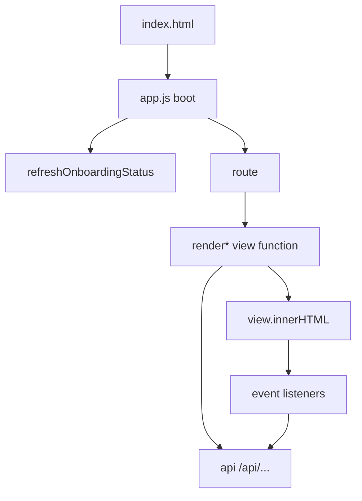

<!-- GENERATED FILE, do not edit by hand.
     Mirrored from .gitnexus/wiki (GitNexus knowledge graph wiki), source commit 5adb17f.
     Regenerate: node .gitnexus/run.cjs wiki, then: npm run docs:wiki -->

# Management UI

The Management UI is the browser dashboard for CheckDeployManager. It lives under `src/ui/manage/` and is intentionally small: vanilla JavaScript, static HTML, CSS variables for theming, no framework, no build step.

The module provides operator-facing workflows for:

- instance setup and onboarding
- tenant creation, onboarding, publishing, duplication, deletion, and GUID rotation
- tenant rules delta editing and validation
- branding and policy configuration
- deployment artifact generation
- webhook inbox review
- upstream rule synchronization
- instance-wide settings, defaults, baseline rules, and republishing
- audit log browsing

The UI is served from `index.html`, styled by `styles.css`, and driven by `app.js`.



## Files

### `src/ui/manage/index.html`

`index.html` defines the static shell:

- sticky header and top navigation
- `#view`, the single render target for all routes
- `#app-footer`, populated by `renderFooter()`
- `#toast`, used by `toast()`
- theme toggle button
- script include for `/manage/app.js`

Navigation uses hash routes such as `#/tenants`, `#/events`, and `#/settings`. There is no server-side routing for management screens after the initial page load.

### `src/ui/manage/app.js`

`app.js` contains all UI behavior:

- utility helpers
- hash router
- render functions for each screen
- tenant tab renderers
- setup and tenant onboarding wizards
- shared delta editor
- artifact copy/download behavior
- API wrapper

Every rendered value from API responses or webhook payloads is escaped through `esc()` before insertion into HTML. Webhook payloads are displayed as escaped text and are not interpreted.

### `src/ui/manage/styles.css`

`styles.css` provides the dashboard visual system:

- dark theme by default
- light theme via `html[data-theme="light"]`
- panel, table, form, tab, badge, toast, and code block styles
- responsive behavior for narrow screens
- shared utility classes such as `.row`, `.grid2`, `.muted`, `.mono`, `.badge`, and `.panel`

## Boot Flow

On load, `app.js`:

1. Gets `#view`.
2. Installs global copy/download handling for artifact buttons.
3. Applies the saved theme from `localStorage` through `applyTheme()`.
4. Registers the hash router.
5. Calls `refreshOnboardingStatus()`.
6. Calls `route()` after onboarding status is loaded.

`refreshOnboardingStatus()` calls `/api/instance/status`, stores the result in `onboardingStatus`, toggles the Setup nav item, and calls `renderFooter()`.

The first visit to `#/tenants` is redirected to `#/setup` when onboarding is incomplete. This redirect happens only once per page load through `redirectedToSetup`, so the rest of the dashboard remains reachable.

## Routing

Routes are defined in the `routes` array:

| Hash pattern | Renderer | Nav section |
| --- | --- | --- |
| `#/setup` | `renderSetup()` | `setup` |
| `#/tenants` | `renderTenantList()` | `tenants` |
| `#/tenants/:id/onboard` | `renderTenantOnboard(tenantId)` | `tenants` |
| `#/tenants/:id/:tab?` | `renderTenantDetail(tenantId, tab)` | `tenants` |
| `#/events` | `renderEvents()` | `events` |
| `#/upstream` | `renderUpstream()` | `upstream` |
| `#/settings` | `renderSettings()` | `settings` |
| `#/audit` | `renderAudit()` | `audit` |

`route()` reads `location.hash`, finds the matching route, marks the matching nav link active, writes a loading message, then awaits the renderer. If a renderer throws, the error message is escaped and displayed inside a panel.

Unknown routes are redirected to `#/tenants`.

## Core Helpers

### `esc(value)`

Escapes `&`, `<`, `>`, `"`, and `'` before rendering text into HTML strings. Use this for every value that comes from API data, user input, or webhook payloads.

### `api(path, options)`

Wraps `fetch()` for calls under `/api`.

Behavior:

- requests `/api${path}`
- attempts to parse JSON
- on non-2xx responses, throws an `Error`
- attaches `error.body` and `error.status`
- prefers `body.error`, then joined `body.errors`, then `HTTP ${status}` as the message

Renderers use this consistently for API access.

### `jsonBody(method, payload)`

Builds JSON request options:

```js
jsonBody("PUT", { settings })
```

This sets `Content-Type: application/json` and stringifies the payload.

### `fmtTime(iso)` and `ago(iso)`

`fmtTime()` formats timestamps with `toLocaleString()` and returns `"never"` for missing values.

`ago()` renders relative ages such as:

- `just now`
- `14 min ago`
- `6 h ago`
- `3 d ago`

Invalid timestamps are escaped and returned as text.

### `toast(message, isError)`

Displays a temporary toast in `#toast`. Error toasts toggle the `.error` class. The toast auto-hides after 3.5 seconds.

### Copy and Download Helpers

`copyText()` uses `navigator.clipboard.writeText()` and falls back to an error toast.

`downloadText()` creates a `Blob`, object URL, and temporary anchor click.

Large artifact strings are stored in `artifactStore`, a `Map`, rather than embedded in HTML attributes. Buttons use:

- `data-copy-key`
- `data-download-key`
- `data-filename`
- `data-mime`

A single document-level click listener handles both copy and download actions.

## Theme

The theme is controlled by:

- `applyTheme(theme)`
- `#theme-toggle`
- `localStorage["cdm-theme"]`
- `html[data-theme]`

Dark mode is the default. Clicking the toggle switches between `dark` and `light`, updates button text, and persists the selection.

CSS variables define the color system for both themes.

## Footer and Update Check

`renderFooter(status)` renders the footer with:

- product name
- current version, if available from `/api/instance/status`
- GitHub releases link
- optional update hint

When a version exists and `updateCheckDone` is false, it calls `checkForUpdate(version)`.

`checkForUpdate(current)` runs in the operator’s browser, not the Worker. It fetches:

```text
https://api.github.com/repos/DailenG/CheckDeployManager/releases/latest
```

If the latest tag is newer than the current version, it appends a release badge to the footer.

`isNewerVersion(candidate, current)` compares up to three numeric semver parts.

Failures are intentionally silent, so offline browsers, blocked GitHub access, or rate limits do not affect the dashboard.

## Tenant List

`renderTenantList()` calls:

```text
GET /api/tenants
```

It renders a table of tenants with:

- tenant name and id
- status badges
- last fetch age
- active GUID count

Status badges include:

- `unpublished`
- current version number
- `stale`
- revoked GUID hits
- new webhook events

Actions:

- **New tenant** prompts for a tenant name, posts to `POST /api/tenants`, then navigates to the tenant detail page.
- **Onboard wizard** creates a tenant the same way, then navigates to `#/tenants/:id/onboard`.
- Clicking a tenant row navigates to `#/tenants/:id`.

## Tenant Detail

`renderTenantDetail(tenantId, tab)` calls:

```text
GET /api/tenants/:tenantId
```

It renders:

- tenant heading
- preview URL
- actions for duplicate, rename, delete
- optional Continue onboarding button
- tenant tabs

Tabs are defined by `TENANT_TABS`:

- `rules`
- `versions`
- `branding`
- `policy`
- `artifacts`
- `guids`

The selected tab delegates to one of:

- `renderRulesTab(container, tenantId, detail)`
- `renderVersionsTab(container, tenantId)`
- `renderBrandingTab(container, tenantId, detail)`
- `renderPolicyTab(container, tenantId)`
- `renderArtifactsTab(container, tenantId)`
- `renderGuidsTab(container, tenantId)`

Tenant-level actions use:

- `POST /api/tenants/:tenantId/duplicate`
- `PATCH /api/tenants/:tenantId`
- `DELETE /api/tenants/:tenantId`

The preview copy button copies:

```text
${location.origin}/preview/${tenant.preview_token}.json
```

## Rules Delta Editing

The rules editor is shared by tenant rules and instance baseline rules.

Main functions:

- `deltaEditorHtml(initialText)`
- `wireDeltaEditor(container, options)`
- `parseDeltaText(text)`
- `domainToPattern(input, includeSubdomains)`
- `patternLines(text)`
- `cleanImportedValue(value)`
- `deltaCountsSummary(delta)`

### Delta Shape

The guided editor recognizes the three list fields in `DELTA_LIST_FIELDS`:

- `add_exclusion_domain_patterns`
- `add_trusted_login_patterns`
- `suppress_indicator_ids`

The remaining delta keys stay in the Advanced JSON block, especially:

- `add_phishing_indicators`
- `raw_overrides`

The saved delta is always composed as a JSON object. `parseDeltaText()` rejects arrays, primitives, and invalid JSON.

### Guided and Raw Modes

`deltaEditorHtml()` chooses initial mode based on whether `initialText` parses as a JSON object:

- valid object: guided mode
- invalid/non-object: raw JSON mode

`wireDeltaEditor()` returns:

```js
{
  composeDelta,
  getDirty,
  markSaved
}
```

`composeDelta()` reads the active editor mode and returns the composed delta object. It throws user-facing errors when JSON is invalid.

`getDirty()` tells callers whether the editor has unsaved edits.

`markSaved(delta)` updates the saved-delta reference, clears the dirty state, and rerenders the summary.

### Easy Add

`domainToPattern(input, includeSubdomains)` turns a plain domain or pasted URL into the anchored regex format expected by the rules engine. It normalizes the hostname, strips wildcard prefixes and URL suffixes, validates the domain shape, escapes dots, and returns `null` when no plausible hostname can be extracted.

The Easy add control appends the generated pattern to either:

- `add_exclusion_domain_patterns`
- `add_trusted_login_patterns`

Duplicate patterns are rejected client-side.

### Dirty State

The editor distinguishes unsaved editor contents from the saved draft. This matters because publishing uses the last saved draft, not whatever is currently typed into the editor.

`renderRulesTab()` makes that explicit in the publish confirmation:

- if dirty: warns that Publish uses the last saved draft
- if clean: asks to publish the saved draft

## Tenant Rules Tab

`renderRulesTab(container, tenantId, detail)` renders the tenant draft editor.

It shows:

- explanatory text about delta layering
- inherited baseline delta, if present
- shared delta editor
- validation findings
- Save and validate button
- Publish button
- last saved metadata

Save flow:

```text
PUT /api/tenants/:tenantId/rules
body: { delta }
```

The response is expected to include:

- `findings`
- `valid`

`renderFindings(container, findings)` displays validation results.

Publish flow:

```text
POST /api/tenants/:tenantId/publish
```

On success, the UI navigates to the Versions tab. On validation failure, findings are rendered from `error.body.errors` when available.

The summary compares the saved draft with the current published version’s frozen `delta_json`, including list additions/removals and changes to `add_phishing_indicators` or `raw_overrides`.

## Versions Tab

`renderVersionsTab(container, tenantId)` calls:

```text
GET /api/tenants/:tenantId/versions
```

It renders version history with:

- version number
- current badge
- published timestamp and operator
- ETag prefix
- upstream version and diff
- note
- rollback button for non-current versions

Rollback uses:

```text
POST /api/tenants/:tenantId/rollback/:versionId
```

After rollback, it calls `route()` to refresh the current view.

## Branding Tab

`renderBrandingTab(container, tenantId, detail)` calls:

```text
GET /api/tenants/:tenantId/branding
```

It renders tenant branding fields:

- company name
- product name
- support email
- support URL
- privacy policy URL
- about URL
- primary color
- logo upload

`brandingField(id, label, value, inherited)` renders text fields with inherited placeholders. If a tenant value is blank and an instance default exists, the field shows an `inherited` badge and uses the inherited value as the placeholder.

Save uses `FormData`:

```text
PUT /api/tenants/:tenantId/branding
```

Logo actions:

- upload logo with the same `PUT` request
- remove tenant logo with `{ remove_logo: true }`
- force Check’s built-in logo/color with `{ use_default_logo: true }`
- return to tenant/instance branding with `{ use_default_logo: false }`

Logo preview URLs use active tenant GUIDs:

```text
/assets/:activeGuid/logo?ts=:timestamp
```

The timestamp cache-busts the preview.

## Policy Tab

`renderPolicyTab(container, tenantId)` calls:

```text
GET /api/tenants/:tenantId/policy
```

Policy editing is based on three layers:

1. `POLICY_FALLBACKS`
2. instance tenant defaults from `data.defaults`
3. tenant-specific settings from `data.settings`

`eff(key)` returns the effective value for rendering. `inh(key)` adds an inherited badge when a value comes from instance defaults.

Policy fields include:

- page blocking
- notifications
- valid page badge
- debug logging
- badge timeout
- rules update interval
- URL allowlist
- domain squatting settings
- webhook reporting settings
- CIPP reporting settings

Save flow:

```text
PUT /api/tenants/:tenantId/policy
body: { settings }
```

Before saving, values equal to the default layer are removed from `settings`. This keeps those fields inherited instead of freezing them as tenant overrides.

`patternLines()` is used for URL allowlist normalization. It strips control characters and the Unicode replacement character before filtering blank lines.

## Artifacts Tab

`renderArtifactsTab(container, tenantId)` calls:

```text
GET /api/tenants/:tenantId/artifacts
```

If artifact generation fails, the tab shows the escaped error message.

Artifacts rendered include:

- config URL
- webhook URL
- logo URL
- GUID in use
- warnings
- Chrome and Edge managed storage JSON
- Firefox `policies.json` fragment
- full Firefox `policies.json`
- Chrome registry file
- Edge registry file
- GPO creation script
- RMM deployment script
- Intune variable block
- CIPP standard field values

`artifactSection(key, title, description, content, filename, mime)` stores content in `artifactStore`, renders Copy and Download buttons, and displays escaped content in a `<pre>` block.

The RMM script has browser include toggles:

- `$IncludeChrome`
- `$IncludeEdge`
- `$IncludeFirefox`

The tab rewrites those variable assignment lines in the stored artifact when checkboxes change, so Copy and Download reflect the selected browsers while the visible script remains editable by the operator.

## GUIDs Tab

`renderGuidsTab(container, tenantId)` calls:

```text
GET /api/tenants/:tenantId/guids
```

It renders each GUID with:

- GUID value
- active/revoked status
- label
- fetch count and last fetch age
- revoked-hit warning
- revoke button for active GUIDs

Rotation flow:

```text
POST /api/tenants/:tenantId/guids
body: { label }
```

Revocation flow:

```text
POST /api/guids/:guid/revoke
```

The UI warns that clients still using a revoked GUID receive 404 immediately.

## Webhook Inbox

`renderEvents()` renders the webhook inbox.

It keeps the current filter in `renderEvents.filter`, defaulting to `new`.

API calls:

```text
GET /api/events
GET /api/events?status=new
GET /api/events?status=reviewed
GET /api/events?status=dismissed
```

Each event is rendered as a `<details>` panel. The payload is stored verbatim by the backend and rendered escaped. The UI attempts JSON pretty-printing only for display; failed parsing falls back to the raw string.

Disposition buttons call:

```text
PATCH /api/events
body: {
  id,
  status: "reviewed" | "dismissed"
}
```

## Upstream Sync

`renderUpstream()` calls:

```text
GET /api/upstream
```

It renders:

- active upstream snapshot
- upstream version
- fetch timestamp
- diff summary
- snapshot history

The Sync now button calls:

```text
POST /api/upstream
```

Expected outcomes include:

- `updated`
- `unchanged`
- other statuses with `errors`

When updated, the toast includes the diff summary and republished tenant count.

## Instance Settings

`renderSettings()` calls:

```text
GET /api/instance/settings
```

It renders three major sections:

1. raw instance settings
2. tenant defaults
3. baseline rules delta

### Raw Settings

Fields are defined by `SETTING_LABELS` and saved as strings:

- `public_base_url`
- `default_cipp_server_url`
- `false_positive_relay_url`
- `upstream_source_url`
- `version_suffix_label`
- `metrics_retention_days`
- `webhook_retention_days`
- `stale_fetch_hours`
- `upstream_keep_snapshots`

Save flow:

```text
PUT /api/instance/settings
body: { settings }
```

### Tenant Defaults

`parseDefaultsSetting(raw)` parses the `tenant_defaults` setting into:

```js
{
  branding: {},
  policy: {}
}
```

Branding defaults use `DEFAULTS_BRANDING_FIELDS`.

Policy defaults use tri-state boolean controls via:

- `triState(id, label, value)`
- `readTriState(id)`

A tri-state field means:

- no default
- default on
- default off

The default logo is managed separately through:

```text
PUT /api/instance/default-logo
DELETE /api/instance/default-logo
GET /api/instance/default-logo
```

When saving tenant defaults, empty branding/policy defaults are stored as an empty string. Otherwise the value is serialized as JSON in `tenant_defaults`.

### Baseline Rules Delta

The baseline rules delta uses the same shared delta editor as tenant drafts.

It is stored in:

```text
baseline_rule_delta
```

Save flow:

```text
PUT /api/instance/settings
body: {
  settings: {
    baseline_rule_delta: string
  }
}
```

An empty delta is stored as an empty string.

Republishing all tenants uses:

```text
POST /api/instance/republish
```

The toast reports the number of republished tenants and any failures.

## Setup Wizard

`renderSetup()` is the first-run instance wizard. It refreshes onboarding status, loads settings, and derives step status from live server state.

Helper functions:

- `setupStep(number, title, state, body)`
- `finishSetup(message)`

Step states are rendered as badges:

- `done`
- `locked`
- `optional`
- `todo`

The setup wizard covers:

1. environment check
2. instance settings
3. standard branding defaults
4. first upstream sync
5. first tenant creation and publish
6. deploy and verify

The wizard does not maintain a separate step counter. It derives progress from `/api/instance/status` checks such as:

- settings configured
- upstream synced
- tenant count
- any published tenant

`finishSetup()` marks onboarding complete by setting:

```text
onboarding_completed_at
```

through `PUT /api/instance/settings`, then refreshes onboarding status and navigates to `#/tenants`.

The Skip button uses the same completion path.

## Tenant Onboarding Wizard

`renderTenantOnboard(tenantId)` is the per-tenant guided workflow. It loads:

```text
GET /api/tenants/:tenantId
GET /api/instance/settings
GET /api/tenants/:tenantId/branding
GET /api/tenants/:tenantId/policy
GET /api/tenants/:tenantId/artifacts
```

Artifacts are loaded only after the tenant has a published version.

The wizard steps are:

1. tenant created
2. branding
3. policy essentials
4. rules delta
5. publish
6. deploy to browsers
7. verify

The wizard explicitly distinguishes two delivery paths:

- rules are fetched remotely by browsers
- policy, branding, and config URL are deployed through generated artifacts

### Migration Import

The onboarding wizard includes an import path for operators migrating from the official Check GPO.

The UI links to:

```text
/manage/export-checkgpoconfig.ps1
```

Operators paste managed-storage-shaped JSON into the import box. The handler:

1. parses JSON
2. validates that it is an object
3. calls `cleanImportedValue()` to strip registry control junk
4. maps `customBranding` camelCase fields to tenant branding snake_case fields
5. whitelists known policy fields
6. copies `genericWebhook` preferences
7. ignores existing webhook URL and rules URL
8. saves recognized branding and policy values

Branding save:

```text
PUT /api/tenants/:tenantId/branding
```

Policy save:

```text
PUT /api/tenants/:tenantId/policy
```

### Deployment Methods

Tenant onboarding deployment options are defined by `ONBOARD_METHODS`.

Supported methods:

- RMM deployment script
- Managed storage JSON
- Registry files
- GPO creation script
- Firefox `policies.json`
- Intune variable block
- CIPP deployment standard

Each method contains:

- `key`
- `label`
- optional `untested`
- `downloads`
- checklist `steps`

Method selection is cosmetic and not saved. It only changes the displayed checklist and download buttons.

## Audit Log

`renderAudit()` supports optional filters stored in `renderAudit.filters`.

API call:

```text
GET /api/audit
GET /api/audit?action=...&operator=...
```

It renders:

- timestamp
- operator email
- action
- tenant id
- details JSON

The Apply button updates `renderAudit.filters` and calls `route()`.

## API Surface Used by the UI

The Management UI expects these API paths:

| Area | Methods and paths |
| --- | --- |
| Status | `GET /api/instance/status` |
| Settings | `GET /api/instance/settings`, `PUT /api/instance/settings` |
| Default logo | `GET /api/instance/default-logo`, `PUT /api/instance/default-logo`, `DELETE /api/instance/default-logo` |
| Republish | `POST /api/instance/republish` |
| Tenants | `GET /api/tenants`, `POST /api/tenants` |
| Tenant detail | `GET /api/tenants/:tenantId`, `PATCH /api/tenants/:tenantId`, `DELETE /api/tenants/:tenantId` |
| Tenant duplicate | `POST /api/tenants/:tenantId/duplicate` |
| Rules | `PUT /api/tenants/:tenantId/rules`, `POST /api/tenants/:tenantId/publish` |
| Versions | `GET /api/tenants/:tenantId/versions`, `POST /api/tenants/:tenantId/rollback/:versionId` |
| Branding | `GET /api/tenants/:tenantId/branding`, `PUT /api/tenants/:tenantId/branding` |
| Policy | `GET /api/tenants/:tenantId/policy`, `PUT /api/tenants/:tenantId/policy` |
| Artifacts | `GET /api/tenants/:tenantId/artifacts` |
| GUIDs | `GET /api/tenants/:tenantId/guids`, `POST /api/tenants/:tenantId/guids`, `POST /api/guids/:guid/revoke` |
| Events | `GET /api/events`, `PATCH /api/events` |
| Upstream | `GET /api/upstream`, `POST /api/upstream` |
| Audit | `GET /api/audit` |

Logo assets are displayed through non-API paths:

```text
/assets/:guid/logo
```

Preview URLs use:

```text
/preview/:previewToken.json
```

## Security and Rendering Model

The UI is string-template based, so escaping discipline is central.

Important patterns:

- Use `esc()` for API values before putting them in `innerHTML`.
- Use `textContent` when updating code blocks dynamically, as in the RMM script preview.
- Store large artifact text in `artifactStore`, not in attributes.
- Render webhook payloads escaped and never execute or interpret them.
- Parse webhook JSON only to pretty-print display text.
- Strip control characters from imported policy/rules text with `JUNK_CHARS`, `patternLines()`, and `cleanImportedValue()`.

The code intentionally avoids dependencies and dynamic script loading.

## Extension Points

When adding a new screen:

1. Add a route entry to `routes`.
2. Add a nav link in `index.html` if it should be top-level.
3. Implement a `render*()` function that writes to `view.innerHTML`.
4. Attach event listeners after rendering.
5. Use `api()` for backend calls.
6. Escape all interpolated values with `esc()`.

When adding a tenant tab:

1. Add an entry to `TENANT_TABS`.
2. Extend the dispatch block in `renderTenantDetail()`.
3. Implement the tab renderer with the same `(container, tenantId, detail)` pattern when tenant detail data is needed.

When adding a deployment artifact:

1. Return it from `/api/tenants/:tenantId/artifacts`.
2. Render it in `renderArtifactsTab()`.
3. Use `artifactSection()` when the artifact is text-like and should support Copy and Download.
4. Use `artifactStore` for generated content that may be large or contain characters unsafe for attributes.

When adding policy defaults:

1. Update `POLICY_FALLBACKS`.
2. Render tenant-level controls in `renderPolicyTab()`.
3. Render default controls in `renderSettings()`.
4. Preserve normalize-on-save behavior so inherited values remain inherited.
5. Ensure object key order stays stable when equality is checked with `JSON.stringify()`.

## Development Notes

This module uses a simple render-and-bind pattern:

```js
view.innerHTML = `...`;
document.getElementById("some-button").addEventListener("click", async () => {
  ...
});
```

There is no virtual DOM or component lifecycle. A call to `route()` rerenders the current route from server state. Many successful mutations end with `route()` to refresh derived badges, inherited values, and server-generated data.

State is intentionally minimal and stored in module-level variables only where needed:

- `onboardingStatus`
- `redirectedToSetup`
- `setupTenantResult`
- `updateCheckDone`
- `artifactStore`
- `renderEvents.filter`
- `renderAudit.filters`

Most UI state is treated as disposable and reconstructed from API responses. This keeps the management UI predictable after mutations, hash navigation, or page reloads.
