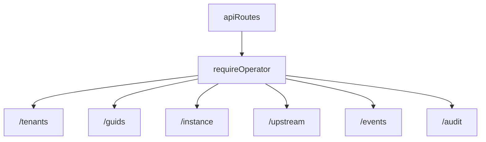

<!-- GENERATED FILE, do not edit by hand.
     Mirrored from .gitnexus/wiki (GitNexus knowledge graph wiki), source commit 5adb17f.
     Regenerate: node .gitnexus/run.cjs wiki, then: npm run docs:wiki -->

# Operator API

The Operator API is the authenticated administrative API for managing tenants, rule drafts and publishing, branding, policy settings, GUID lifecycle, upstream syncs, webhook events, audit history, and instance-wide settings.

All routes are composed in `src/routes/api/index.ts` under a shared `Hono<AppEnv>` instance:

```ts
export const apiRoutes = new Hono<AppEnv>();

apiRoutes.use("*", requireOperator);
```

`requireOperator` runs before every Operator API route. Route handlers then rely on `c.get("operatorEmail")` for audit attribution and on `c.env.DB` / `c.env.STORAGE` for D1 and R2-backed state.



## Route Composition

`index.ts` mounts feature routers by path prefix:

| Prefix | Router | Responsibility |
| --- | --- | --- |
| `/tenants` | `tenantsRoutes` | Tenant CRUD, duplication, dashboard tenant summary |
| `/tenants` | `rulesApiRoutes` | Tenant rule drafts, publish, rollback, versions |
| `/tenants` | `brandingRoutes` | Tenant branding and logo uploads |
| `/tenants` | `policyRoutes` | Tenant policy settings and inherited defaults |
| `/tenants` | `guidsRoutes` | Tenant GUID listing and rotation |
| `/tenants` | `artifactsRoutes` | Fresh artifact rendering |
| `/guids` | `guidRevokeRoutes` | GUID revocation by GUID value |
| `/instance` | `instanceRoutes` | Instance status, settings, default logo, fleet republish |
| `/upstream` | `upstreamRoutes` | Upstream snapshot status and manual sync |
| `/events` | `eventsRoutes` | Webhook inbox and disposition updates |
| `/audit` | `auditRoutes` | Audit log query API |

The module is intentionally thin: route handlers validate request shape, enforce tenant existence, perform small composition queries, and delegate rule publishing, artifact generation, upstream sync, settings helpers, and audit writes to `src/lib/*`.

## Shared Helpers

### `readJsonBody(c)`

Defined in `src/routes/api/util.ts`.

```ts
export async function readJsonBody(
  c: Context<AppEnv>,
): Promise<Record<string, unknown> | null>
```

`readJsonBody` safely parses a JSON request body and only accepts plain object payloads. It returns `null` when parsing fails, when the body is `null`, when the parsed value is not an object, or when it is an array.

Most JSON-mutating routes use this helper before validating required properties:

- `tenantsRoutes.post("/")`
- `tenantsRoutes.patch("/:id")`
- `guidsRoutes.post("/:id/guids")`
- `eventsRoutes.patch("/")`
- `policyRoutes.put("/:id/policy")`
- `rulesApiRoutes.put("/:id/rules")`
- `instanceRoutes.put("/settings")`

### `requireTenant(c)`

Defined in `src/routes/api/util.ts`.

```ts
export async function requireTenant(c: Context<AppEnv>): Promise<TenantRow | null>
```

`requireTenant` reads the `:id` route parameter and calls `getTenant(c.env.DB, id)`. Tenant-scoped routes use it as the first operation and return:

```ts
return c.json({ error: "tenant not found" }, 404);
```

when it returns `null`.

## Tenant Management

Implemented in `src/routes/api/tenants.ts`.

### `GET /tenants`

Lists tenants with dashboard health indicators. It loads `stale_fetch_hours` from `getInstanceSettings`, then returns each tenant with:

- current published version number
- last fetch timestamp
- active GUID count
- revoked GUID hits
- count of new webhook events
- computed `stale` flag

The `stale` flag is calculated in the route handler from `last_fetch_at` and the configured stale threshold.

### `POST /tenants`

Creates a tenant and its required companion rows in one `DB.batch`:

- `tenants`
- first active `tenant_guids` row
- default `tenant_rule_deltas` row with `{}` draft
- default `tenant_branding` row
- default `tenant_policy_settings` row

It uses:

- `newId()` for the tenant ID and first GUID
- `newToken()` for the preview token
- `nowIso()` for timestamps
- `writeAudit(..., "tenant.create", ...)`

The request body must contain a non-empty string `name`. `notes` is optional.

### `POST /tenants/:id/duplicate`

Creates a new tenant using another tenant as the rule-draft source. Only `tenant_rule_deltas.draft_json` is copied. Branding and policy are intentionally initialized as defaults so the new tenant continues to inherit instance-level defaults.

Audit action: `tenant.duplicate`.

### `GET /tenants/:id`

Returns the full tenant detail view:

- `tenant`
- tenant GUIDs
- current ruleset version, if any
- draft rule delta
- latest fetch timestamp
- parsed `baseline` from `settings.baseline_rule_delta`

The baseline parse is tolerant. Invalid stored JSON degrades to `null`; strict validation happens when instance settings are written.

### `PATCH /tenants/:id`

Updates tenant `name` and `notes`.

`name` defaults to the current name if omitted or blank. `notes` keeps the current value when omitted, stores a string when provided as a string, and stores `null` otherwise.

Audit action: `tenant.update`.

### `DELETE /tenants/:id`

Deletes a tenant only after all tenant GUIDs are revoked. If any active GUID remains, the route returns `409`:

```json
{ "error": "tenant still has active GUIDs; revoke them before deleting" }
```

Before deleting rows, it removes R2 artifacts for:

- published ruleset versions
- tenant custom logo

Then it clears `current_version_id` and deletes dependent rows from webhook events, metrics, revoked GUID hits, ruleset versions, rule deltas, branding, policy settings, GUIDs, and finally `tenants`.

Audit action: `tenant.delete`.

## Rules API

Implemented in `src/routes/api/rules.ts`.

The rules routes manage tenant draft deltas, publishing, rollback, and version history.

### `GET /tenants/:id/rules`

Returns the tenant draft row from `tenant_rule_deltas`:

```json
{ "draft": { ... } }
```

### `PUT /tenants/:id/rules`

Saves `body.delta` as the tenant draft.

Validation is intentionally split:

1. `validateDelta(deltaJson)` checks the delta schema.
2. If the delta is structurally valid, `buildMergedRuleset(c.env, deltaJson, nextVersion)` performs a dry run against the active upstream snapshot.

Invalid drafts still save. The response reports whether the saved draft is publishable:

```json
{
  "saved": true,
  "valid": false,
  "findings": ["..."]
}
```

This allows the dashboard to persist work-in-progress while keeping publish gated.

Audit action: `rules.draft_save`, with the first 10 findings stored.

### `POST /tenants/:id/publish`

Loads the current draft with `getDraftDelta` and delegates publishing to:

```ts
publishTenant(c.env, tenant.id, draft, c.get("operatorEmail"))
```

If publishing fails, the route returns `422` with `errors`. Successful responses are returned directly from `publishTenant`.

### `POST /tenants/:id/rollback/:versionId`

Rolls the tenant back by setting `tenants.current_version_id` to an existing `ruleset_versions.id` for that tenant.

The route does not create a new version. It switches the current pointer to the selected version and returns the selected version ID, version number, and ETag.

Audit action: `rules.rollback`.

### `GET /tenants/:id/versions`

Lists all published ruleset versions for a tenant in descending `version_number` order, including joined upstream snapshot metadata:

- `upstream_version`
- `upstream_diff`

The response also includes `current_version_id`.

## Tenant Branding

Implemented in `src/routes/api/branding.ts`.

Branding supports text fields, tenant custom logos, inherited instance defaults, and an explicit “use built-in default logo” opt-out.

### Constants

```ts
export const MAX_LOGO_BYTES = 512 * 1024;

export const LOGO_TYPES = {
  "image/png": "png",
  "image/jpeg": "jpg",
  "image/svg+xml": "svg",
};
```

The same logo constraints are reused by instance default-logo routes.

### `GET /tenants/:id/branding`

Returns:

- current row from `tenant_branding`
- parsed instance-level branding defaults from `tenant_defaults`
- `default_logo`, a boolean indicating whether an instance default logo is configured

Defaults are parsed with `parseTenantDefaults(settings.tenant_defaults ?? "").branding`.

### `PUT /tenants/:id/branding`

Accepts either JSON or `multipart/form-data`.

Supported text fields are:

- `company_name`
- `product_name`
- `support_email`
- `support_url`
- `privacy_policy_url`
- `about_url`
- `primary_color`

Multipart requests may include:

- `logo`
- `remove_logo=true`
- `use_default_logo=true|false`

JSON requests may include:

- text fields as strings
- `remove_logo: true`
- `use_default_logo: boolean`

Logo uploads are stored in R2 at:

```ts
assets/${tenant.id}/logo.${extension}
```

When a logo is removed or `use_default_logo` is set to `true`, the existing tenant logo object is deleted from R2 and `logo_r2_key` / `logo_content_type` are set to `null`.

`use_default_logo` has specific inheritance semantics:

- custom logo upload clears the opt-out
- plain `remove_logo` returns to instance-default inheritance
- `use_default_logo: true` pins the tenant to the extension’s built-in logo
- `use_default_logo: false` returns to inherited/default behavior

Audit action: `branding.update`.

## Tenant Policy

Implemented in `src/routes/api/policy.ts`.

Tenant policy is stored as JSON in `tenant_policy_settings.settings_json`. The module validates known managed-schema fields before writing.

### `validatePolicySettings(settings)`

```ts
export function validatePolicySettings(settings: Record<string, unknown>): string[]
```

Allowed policy keys and their expected types are defined by `POLICY_FIELDS`:

| Setting | Type check |
| --- | --- |
| `enablePageBlocking` | boolean |
| `showNotifications` | boolean |
| `enableValidPageBadge` | boolean |
| `validPageBadgeTimeout` | finite number |
| `enableDebugLogging` | boolean |
| `updateInterval` | finite number |
| `urlAllowlist` | string array |
| `domainSquatting` | non-array object |
| `genericWebhook` | non-array object |
| `enableCippReporting` | boolean |
| `cippServerUrl` | string |
| `cippTenantId` | string |

Unknown keys and wrong types produce validation errors.

### `validateTenantDefaults(raw)`

```ts
export function validateTenantDefaults(raw: string): string[]
```

This validates the instance-level `tenant_defaults` setting. It is exported from `policy.ts` and used by `instanceRoutes.put("/settings")`.

The accepted top-level sections are:

- `branding`
- `policy`

Branding defaults must use fields from `INHERITABLE_BRANDING_FIELDS` and string values.

Policy defaults must use fields from `INHERITABLE_POLICY_FIELDS`, must also exist in `POLICY_FIELDS`, and must pass the same type checks as tenant policy settings. Some valid per-tenant policy settings can still be rejected as defaults if they are not inheritable.

### `GET /tenants/:id/policy`

Returns the tenant’s policy settings plus parsed inherited defaults:

```json
{
  "settings": {},
  "defaults": {}
}
```

### `PUT /tenants/:id/policy`

Requires a JSON body with a `settings` object. The object is validated with `validatePolicySettings`, then upserted into `tenant_policy_settings`.

Audit action: `policy.update`.

## GUID Management

Implemented in `src/routes/api/guids.ts`.

GUIDs are tenant-bound fetch identifiers. Rotation and revocation are separate operations so clients can migrate gradually.

### `GET /tenants/:id/guids`

Lists tenant GUIDs with usage metrics:

- `fetch_hits`
- `last_fetch_at`
- `revoked_hits`

The metrics are calculated with subqueries over `fetch_metrics` and `revoked_guid_hits`.

### `POST /tenants/:id/guids`

Mints a new active GUID with `newId()`. The old GUID remains active until explicitly revoked.

Optional body field:

```json
{ "label": "..." }
```

Audit action: `guid.rotate`.

### `POST /guids/:guid/revoke`

Revokes a GUID by GUID value rather than tenant ID.

The route returns:

- `404` if the GUID does not exist
- `409` if it is already revoked
- `{ "ok": true }` after setting `status = 'revoked'` and `revoked_at = nowIso()`

Audit action: `guid.revoke`.

## Artifacts

Implemented in `src/routes/api/artifacts.ts`.

### `GET /tenants/:id/artifacts`

Generates tenant artifacts fresh on every request:

```ts
generateArtifacts(c.env, tenant.id, c.req.query("guid") ?? undefined)
```

Nothing generated by this endpoint is stored by the route. If artifact generation fails, the route returns `409` with the generation error.

Successful response:

```json
{ "artifacts": [...] }
```

## Instance API

Implemented in `src/routes/api/instance.ts`.

The instance routes manage first-run status, global settings, default logos, and fleet republishing.

### `GET /instance/status`

Returns aggregate setup status for the operator dashboard and onboarding wizard.

The route composes:

- operator email from `c.get("operatorEmail")`
- environment from `c.env.ENVIRONMENT`
- package version from `package.json`
- instance settings from `getInstanceSettings`
- active upstream snapshot from `getActiveSnapshot`
- tenant count
- whether any ruleset has been published

There is one lazy write: if `onboarding_completed_at` is missing and the deployment already has signs of prior configuration, the route stamps `onboarding_completed_at` with `nowIso()`. This prevents existing deployments from being forced through first-run onboarding.

### `GET /instance/settings`

Returns all instance settings from `getInstanceSettings`.

### `PUT /instance/settings`

Requires:

```json
{
  "settings": {
    "key": "value"
  }
}
```

Validation rules:

- keys must exist in `DEFAULT_INSTANCE_SETTINGS`
- values must be strings
- `metrics_retention_days`, `webhook_retention_days`, `stale_fetch_hours`, and `upstream_keep_snapshots` must be non-negative integer strings
- `default_logo_r2_key` and `default_logo_content_type` cannot be written directly
- `tenant_defaults` is validated with `validateTenantDefaults`
- non-empty `baseline_rule_delta` is validated with `validateDelta`

Logo settings are intentionally managed only through `/api/instance/default-logo` endpoints so the R2 object and setting keys stay synchronized.

Audit action: `instance.settings_update`.

### `GET /instance/default-logo`

Serves the configured instance default logo from R2.

If no logo is configured or the R2 object is missing, returns `404`.

Successful responses include:

- `Content-Type` from `default_logo_content_type`
- `Cache-Control: no-store`
- `X-Content-Type-Options: nosniff`

### `PUT /instance/default-logo`

Requires `multipart/form-data` with a `logo` file. The same logo validation as tenant branding applies:

- PNG, JPG, or SVG only
- maximum 512 KB

The logo is stored at:

```ts
assets/instance-default/logo.${extension}
```

The route updates:

- `default_logo_r2_key`
- `default_logo_content_type`

If the previous default logo used a different key, it is deleted from R2.

Audit action: `instance.default_logo_update`.

### `DELETE /instance/default-logo`

Deletes the current default logo object if configured, clears both default-logo settings, and audits the removal.

Audit action: `instance.default_logo_remove`.

### `POST /instance/republish`

Republishes all tenants with published versions by delegating to:

```ts
republishAllTenants(c.env, operator, "baseline republish", operator)
```

This is how a changed `baseline_rule_delta` is pushed across the fleet without waiting for individual tenant publishes.

Audit action: `rules.republish_all`.

## Upstream API

Implemented in `src/routes/api/upstream.ts`.

### `GET /upstream`

Returns upstream sync state:

- active snapshot from `getActiveSnapshot`
- latest 25 rows from `upstream_snapshots`
- most recent `audit_log` entry where `action = 'upstream.sync'`

### `POST /upstream`

Forces an upstream sync:

```ts
syncUpstream(c.env, c.get("operatorEmail"))
```

`syncUpstream` handles its own audit write. The API returns status `502` only when `outcome.status === "fetch_error"`; otherwise it returns `200`.

## Events API

Implemented in `src/routes/api/events.ts`.

The events API is the operator-facing view of the webhook inbox. Payloads remain untrusted strings; rendering code is responsible for HTML escaping.

Allowed event dispositions are:

```ts
new
reviewed
dismissed
```

### `GET /events`

Optional filters:

- `status`
- `tenant_id`
- `limit`

`status` is applied only when it is one of the allowed dispositions. `limit` defaults to `100` and is capped at `500`.

The query joins `webhook_events` to `tenants` so dashboard rows can include `tenant_name`.

### `PATCH /events`

Requires:

```json
{
  "id": "...",
  "status": "new|reviewed|dismissed"
}
```

The route verifies the event exists, updates `webhook_events.status`, and writes an audit entry tied to the event’s tenant.

Audit action: `events.disposition`.

## Audit API

Implemented in `src/routes/api/audit.ts`.

### `GET /audit`

Queries `audit_log` with optional filters:

- `tenant_id`
- `operator`
- `action`
- `before`
- `limit`

`before` filters by `ts < ?`. `limit` defaults to `100` and is capped at `500`.

The route returns entries ordered by newest first:

```json
{ "entries": [...] }
```

This endpoint does not write audit records.

## Validation and Error Patterns

Most routes follow the same failure conventions:

| Condition | Response |
| --- | --- |
| Missing tenant | `404 { "error": "tenant not found" }` |
| Invalid JSON shape | `400 { "error": "..." }` |
| Validation errors | `422 { "errors": [...] }` |
| Conflict or invalid state transition | `409 { "error": "..." }` |
| Oversized logo | `413 { "error": "logo exceeds 512 KB" }` |

Validation is deliberately close to the write boundary:

- policy writes use `validatePolicySettings`
- tenant defaults writes use `validateTenantDefaults`
- baseline and tenant rule deltas use `validateDelta`
- publish dry runs use `buildMergedRuleset`
- logo uploads validate MIME type and size before R2 writes

Read paths are generally tolerant. For example, tenant detail parsing of `baseline_rule_delta` catches malformed JSON and returns no baseline instead of failing the tenant detail request.

## Audit Logging

Mutating routes usually call `writeAudit(c.env.DB, c.get("operatorEmail"), action, tenantId, details)` after the database or storage change succeeds.

Common action names include:

- `tenant.create`
- `tenant.duplicate`
- `tenant.update`
- `tenant.delete`
- `rules.draft_save`
- `rules.rollback`
- `rules.republish_all`
- `branding.update`
- `policy.update`
- `guid.rotate`
- `guid.revoke`
- `events.disposition`
- `instance.settings_update`
- `instance.default_logo_update`
- `instance.default_logo_remove`

`upstreamRoutes.post("/")` delegates audit behavior to `syncUpstream`.

When adding new mutating Operator API routes, follow the existing pattern: validate input, perform the state change, then write a focused audit entry with stable action names and compact details.

## Storage Boundaries

The Operator API touches two storage systems through `AppEnv`.

D1 database access is done directly with prepared statements and helper functions from `src/lib/db.ts`. Route handlers use explicit SQL for route-specific projections and cleanup operations.

R2 object storage is used for:

- tenant logos under `assets/${tenant.id}/logo.${extension}`
- instance default logo under `assets/instance-default/logo.${extension}`
- ruleset version artifacts deleted during tenant removal

Ruleset publishing and artifact generation are delegated to `src/lib/publish.ts` and `src/lib/artifacts.ts`; the routes do not manually construct stored ruleset objects.

## Adding or Changing Routes

When contributing to this module, keep the existing route style:

1. Mount new feature routers from `index.ts` behind `requireOperator`.
2. Use `Hono<AppEnv>` so handlers have typed access to `c.env` and context variables.
3. Use `requireTenant` for tenant-scoped `/:id` routes.
4. Use `readJsonBody` for JSON object payloads.
5. Prefer strict validation on writes and tolerant parsing on reads when existing stored data may be malformed.
6. Use prepared SQL with bound parameters.
7. Audit successful mutations with `writeAudit`.
8. Keep business logic in `src/lib/*` when the behavior is shared, complex, or not specific to HTTP request handling.
