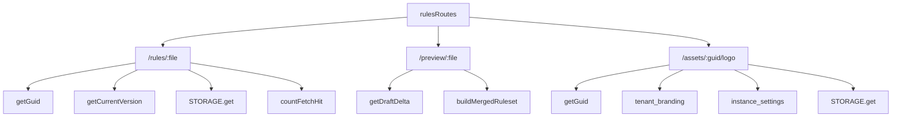

<!-- GENERATED FILE, do not edit by hand.
     Mirrored from .gitnexus/wiki (GitNexus knowledge graph wiki), source commit 5adb17f.
     Regenerate: node .gitnexus/run.cjs wiki, then: npm run docs:wiki -->

# Public Rules Delivery

`src/routes/rules.ts` defines the unauthenticated runtime delivery surface for published rulesets, preview rulesets, and tenant logos.

The module exports `rulesRoutes`, a Hono router mounted elsewhere in the application. It intentionally does not perform user authentication. Access control is based on unguessable GUIDs or preview tokens, and all lookup failures return the same bare `404` response to avoid leaking whether an identifier is unknown, revoked, inactive, or missing backing storage.

## Public Endpoints

This module owns three public route families:

- `GET|HEAD /rules/:file`
- `OPTIONS /rules/:file`
- `GET /preview/:file`
- `GET /assets/:guid/logo`

Expected file-style routes require a `.json` suffix:

- `/rules/{guid}.json`
- `/preview/{token}.json`

Requests without the `.json` suffix receive `404`.

## Design Goals

The module is optimized for public runtime delivery:

- No auth middleware on these routes.
- Unguessable identifiers are the access boundary.
- Unknown, inactive, revoked, and missing resources mostly collapse to a uniform bare `404`.
- Published rulesets are cacheable for short periods.
- Preview responses are never cached.
- Runtime fetches are counted for telemetry.
- Revoked GUID hits are counted separately.
- Content is served with `X-Content-Type-Options: nosniff`.

## Route Architecture



## Shared Helpers

### `bare404()`

Returns an empty `404` response:

```ts
function bare404(): Response {
  return new Response(null, { status: 404 });
}
```

This is used deliberately across public routes to avoid exposing details about failed lookups. Most invalid states do not return JSON errors, explanatory text, or different status codes.

### `rulesHeaders(etagHash)`

Builds the standard response headers for published ruleset JSON:

```ts
function rulesHeaders(etagHash: string): Headers
```

It sets:

- `Access-Control-Allow-Origin: *`
- `Access-Control-Allow-Methods: GET, HEAD, OPTIONS`
- `Content-Type: application/json; charset=utf-8`
- `Cache-Control: public, max-age=300`
- `ETag: formatEtagHeader(etagHash)`
- `X-Content-Type-Options: nosniff`

The ETag formatting is delegated to `formatEtagHeader` from `src/lib/publish.ts`, keeping ETag syntax consistent with the publish path.

## Published Ruleset Delivery

### `OPTIONS /rules/:file`

The preflight route returns `204` with the shared CORS headers:

```ts
rulesRoutes.options("/rules/:file", () => {
  return new Response(null, { status: 204, headers: CORS_HEADERS });
});
```

Only the `/rules` route has an explicit `OPTIONS` handler in this module.

### `GET|HEAD /rules/:file`

The main runtime delivery route serves the current published ruleset for a GUID.

High-level flow:

1. Validate that `:file` ends with `.json`.
2. Strip the suffix to get the GUID.
3. Look up the GUID with `getGuid`.
4. Return bare `404` for unknown GUIDs.
5. If the GUID exists but is not `active`, call `countRevokedHit` and return bare `404`.
6. Load the tenant's current published version with `getCurrentVersion`.
7. Return bare `404` if there is no current version.
8. Evaluate `If-None-Match` against the current version ETag.
9. Count the request with `countFetchHit`.
10. Return `304`, `200 HEAD`, or stream the ruleset object from `STORAGE`.

The route intentionally performs a single indexed GUID lookup for both unknown and revoked identifiers:

```ts
const guidRow = await getGuid(c.env.DB, guid);
if (guidRow === null) return bare404();
if (guidRow.status !== "active") {
  await countRevokedHit(c.env.DB, guid);
  return bare404();
}
```

That pattern avoids making enumeration probes distinguish unknown GUIDs from revoked GUIDs by route shape or response body. Revoked hits are still recorded through `countRevokedHit`.

### Current Version Lookup

After resolving an active GUID, the route loads the tenant's current published ruleset version:

```ts
const version = await getCurrentVersion(c.env.DB, guidRow.tenant_id);
if (version === null) return bare404();
```

`getCurrentVersion` comes from `src/lib/db.ts`. The returned version is expected to provide at least:

- `etag`
- `r2_key`

The `etag` is used for conditional requests. The `r2_key` is used to read the published JSON body from the configured storage binding.

### Conditional Requests

The route supports `If-None-Match` and returns `304` when the request already has the current version.

```ts
const etagHeader = formatEtagHeader(version.etag);
const ifNoneMatch = c.req.header("If-None-Match");
if (
  ifNoneMatch !== undefined &&
  ifNoneMatch
    .split(",")
    .map((v) => v.trim().replace(/^W\//, ""))
    .includes(etagHeader)
) {
  await countFetchHit(c.env.DB, guidRow.tenant_id, guid, true);
  return new Response(null, { status: 304, headers });
}
```

Important details:

- Multiple ETags are supported by splitting on commas.
- Weak ETag prefixes are normalized by removing `W/`.
- A `304` response is still counted as a fetch hit.
- The final argument to `countFetchHit` is `true` for a cache hit and `false` for a full response.

### `HEAD` Requests

For `HEAD`, the route performs the same validation, GUID lookup, version lookup, ETag handling, and fetch counting as `GET`.

If the request is not satisfied by `304`, it returns headers without fetching or streaming the R2 object body:

```ts
if (c.req.method === "HEAD") {
  return new Response(null, { status: 200, headers });
}
```

This keeps `HEAD` useful for cache validation and existence checks while avoiding unnecessary object reads.

### Object Fetch

For `GET`, the route reads the published object from `c.env.STORAGE`:

```ts
const object = await c.env.STORAGE.get(version.r2_key);
if (object === null) return bare404();
return new Response(object.body, { status: 200, headers });
```

If the database points to a missing object, the route still returns the same bare `404` shape used for other misses.

## Preview Ruleset Delivery

### `GET /preview/:file`

The preview route builds and returns a merged draft ruleset for a tenant preview token.

Flow:

1. Validate `.json` suffix.
2. Strip the suffix to get the preview token.
3. Look up the tenant by `tenants.preview_token`.
4. Return bare `404` if no tenant matches.
5. Load the draft delta with `getDraftDelta`.
6. Query the tenant's highest published `version_number`.
7. Call `buildMergedRuleset`.
8. Return validation errors as `422`.
9. Return the merged draft ruleset as JSON with `Cache-Control: no-store`.

The tenant lookup is performed inline:

```ts
const tenant = await c.env.DB.prepare(
  "SELECT id FROM tenants WHERE preview_token = ?",
)
  .bind(token)
  .first<{ id: string }>();
```

The draft delta comes from `getDraftDelta(c.env.DB, tenant.id)`. The preview version number passed into `buildMergedRuleset` is one greater than the tenant's highest published version:

```ts
(lastVersion?.max_version ?? 0) + 1
```

This lets preview builds use the same merge/build logic as publishing without persisting a new published version.

### Preview Errors

If `buildMergedRuleset` fails, the route returns JSON validation errors:

```ts
return c.json(
  { errors: built.errors },
  422,
  { "Cache-Control": "no-store", ...CORS_HEADERS },
);
```

Unlike most public misses, build failures are explicit because the preview endpoint is intended for draft validation and authoring feedback.

### Preview Success

Successful previews return the merged ruleset object:

```ts
return c.json(built.merged as Record<string, unknown>, 200, {
  "Cache-Control": "no-store",
  "X-Content-Type-Options": "nosniff",
  ...CORS_HEADERS,
});
```

Preview responses are never cacheable. This matters because previews reflect mutable draft state rather than immutable published objects.

## Logo Asset Delivery

### `GET /assets/:guid/logo`

The logo route serves a tenant-specific or inherited default logo for an active GUID.

Flow:

1. Resolve the GUID with `getGuid`.
2. Return bare `404` if the GUID is unknown or not active.
3. Load tenant branding from `tenant_branding`.
4. If the tenant explicitly opted out of the instance default, return bare `404`.
5. If the tenant has no logo, read instance default logo settings directly.
6. Return bare `404` if no logo key is available.
7. Fetch the logo object from `STORAGE`.
8. Return the object with its content type and long-lived public cache headers.

The route accepts a raw `:guid`, not a `.json` filename.

### Tenant Branding

The route reads:

```sql
SELECT logo_r2_key, logo_content_type, use_default_logo
FROM tenant_branding
WHERE tenant_id = ?
```

The returned values determine which logo to serve:

- `logo_r2_key` present: serve the tenant logo.
- `logo_r2_key` absent and `use_default_logo === 1`: return `404`.
- `logo_r2_key` absent and not opted out: try the instance default.

The `use_default_logo === 1` case intentionally serves nothing:

```ts
if (logoKey === null && branding?.use_default_logo === 1) return bare404();
```

That lets the Check extension fall back to its built-in logo.

### Instance Default Logo

When a tenant has no logo and has not opted out, the route reads the instance default directly from `instance_settings`:

```ts
SELECT key, value FROM instance_settings
WHERE key IN ('default_logo_r2_key', 'default_logo_content_type')
```

The route deliberately does not call `getInstanceSettings`, because that helper seeds missing defaults. This public unauthenticated route must not write to the database as a side effect.

### Logo Response

Logo objects are streamed from `c.env.STORAGE` and returned with:

- `Content-Type` from branding/default settings, or `application/octet-stream`
- `Cache-Control: public, max-age=86400`
- `X-Content-Type-Options: nosniff`
- shared CORS headers

## Dependencies

This module connects route handling to the database, publish logic, and object storage.

From `src/lib/db.ts`:

- `getGuid` resolves public GUIDs to tenant records and status.
- `getCurrentVersion` finds the current published ruleset version for a tenant.
- `getDraftDelta` loads draft changes for preview builds.
- `countFetchHit` records published ruleset fetches and conditional hits.
- `countRevokedHit` records access attempts against revoked or inactive GUIDs.

From `src/lib/publish.ts`:

- `formatEtagHeader` formats stored ETag hashes for HTTP headers.
- `buildMergedRuleset` builds a preview ruleset by merging draft state into the ruleset structure.

From `Env`:

- `c.env.DB` is used for D1-style prepared SQL and helper-backed database access.
- `c.env.STORAGE` is used to read published rulesets and logo assets by storage key.

## Caching Behavior

Published rulesets and logos have different cache lifetimes:

| Route | Cache-Control | Reason |
|---|---:|---|
| `/rules/:guid.json` | `public, max-age=300` | Published rulesets can be cached briefly and revalidated with ETags. |
| `/preview/:token.json` | `no-store` | Preview output reflects mutable draft state. |
| `/assets/:guid/logo` | `public, max-age=86400` | Logo assets are relatively stable and safe to cache longer. |

The published ruleset route also supports ETag-based `304` responses. Preview and logo routes do not implement conditional request handling in this module.

## Security Notes

The public delivery model depends on identifier secrecy and response uniformity.

Key patterns to preserve when modifying this module:

- Keep `/rules` and `/assets` unauthenticated unless the delivery model changes globally.
- Preserve bare `404` responses for identifier misses and inactive resources.
- Avoid adding response bodies that distinguish unknown, revoked, inactive, unpublished, or missing-storage cases.
- Do not introduce writes into `/assets/:guid/logo`; the route explicitly avoids settings helpers that seed defaults.
- Keep `X-Content-Type-Options: nosniff` on JSON and asset responses.
- Keep preview responses uncached.

## Contributor Notes

When changing published ruleset delivery, check both `GET` and `HEAD` behavior. The current implementation counts both request types and handles conditional requests before deciding whether to stream the object body.

When changing ETag behavior, keep `rulesHeaders` and the explicit `formatEtagHeader(version.etag)` comparison aligned. The route compares normalized `If-None-Match` values against the same formatted ETag string that is sent in the response.

When changing logo fallback behavior, preserve the distinction between tenant logo, explicit default opt-out, inherited instance default, and built-in extension fallback. The `use_default_logo === 1` branch currently means "serve no public logo from this endpoint," not "serve the instance default."
