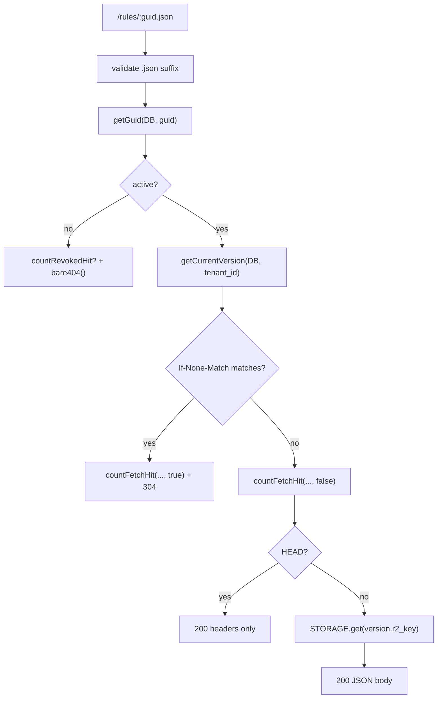

<!-- GENERATED FILE, do not edit by hand.
     Mirrored from .gitnexus/wiki (GitNexus knowledge graph wiki), source commit b99d78c.
     Regenerate: node .gitnexus/run.cjs wiki, then: npm run docs:wiki -->

# Public Rules Delivery

`src/routes/rules.ts` defines unauthenticated runtime delivery endpoints for published rulesets, draft previews, and tenant logos. Access control is based on unguessable GUIDs or preview tokens rather than authenticated sessions, and misses intentionally return the same empty `404` response through `bare404()`.

## Routes

### `OPTIONS /rules/:file`

Returns `204` with shared CORS headers:

```http
Access-Control-Allow-Origin: *
Access-Control-Allow-Methods: GET, HEAD, OPTIONS
```

This supports browser clients fetching public rules JSON.

### `GET|HEAD /rules/:guid.json`

Serves the current published ruleset for an active GUID.

Flow:



Important behavior:

- `file` must end with `.json`; otherwise the route returns `bare404()`.
- The GUID is the filename without the `.json` suffix.
- `getGuid(c.env.DB, guid)` is the first lookup for both unknown and revoked GUIDs. This keeps unknown and revoked probes closer in timing.
- Non-active GUIDs call `countRevokedHit(c.env.DB, guid)` and still return `bare404()`.
- Active GUIDs resolve the tenant’s current published version with `getCurrentVersion(c.env.DB, guidRow.tenant_id)`.
- `If-None-Match` is honored. The route splits comma-separated values, trims whitespace, strips a leading `W/`, and compares against `formatEtagHeader(version.etag)`.
- Cache hits are recorded with `countFetchHit(..., true)` before returning `304`.
- Normal fetches are recorded with `countFetchHit(..., false)`.
- `HEAD` returns headers only and does not read the R2 object body.
- `GET` reads the published artifact from `c.env.STORAGE.get(version.r2_key)` and streams `object.body`.

Responses use `rulesHeaders(version.etag)`, which sets:

```http
Content-Type: application/json; charset=utf-8
Cache-Control: public, max-age=300
ETag: <formatted etag>
X-Content-Type-Options: nosniff
Access-Control-Allow-Origin: *
Access-Control-Allow-Methods: GET, HEAD, OPTIONS
```

### `GET /preview/:token.json`

Builds and returns a no-store preview ruleset for a tenant draft.

Flow:

1. Validates the `.json` suffix.
2. Extracts the preview token from the filename.
3. Looks up the tenant directly:

```sql
SELECT id FROM tenants WHERE preview_token = ?
```

4. Loads the draft delta with `getDraftDelta(c.env.DB, tenant.id)`.
5. Reads the latest published version number:

```sql
SELECT MAX(version_number) AS max_version
FROM ruleset_versions
WHERE tenant_id = ?
```

6. Calls `buildMergedRuleset(c.env, draft, nextVersionNumber)`.

If `buildMergedRuleset()` fails, the route returns:

```http
422 Unprocessable Entity
Cache-Control: no-store
```

with a JSON body:

```json
{
  "errors": []
}
```

If the build succeeds, the route returns the merged ruleset as JSON with:

```http
Cache-Control: no-store
X-Content-Type-Options: nosniff
Access-Control-Allow-Origin: *
Access-Control-Allow-Methods: GET, HEAD, OPTIONS
```

Preview output is generated dynamically and is not served from the published R2 object referenced by `ruleset_versions.r2_key`.

### `GET /assets/:guid/logo`

Serves the active tenant’s logo asset.

Flow:

1. Resolves the GUID with `getGuid(c.env.DB, guid)`.
2. Requires `guidRow.status === "active"`.
3. Loads tenant branding:

```sql
SELECT logo_r2_key, logo_content_type
FROM tenant_branding
WHERE tenant_id = ?
```

4. Returns `bare404()` if no branding row exists, no logo key is set, or the R2 object is missing.
5. Streams the logo from `c.env.STORAGE.get(branding.logo_r2_key)`.

Logo responses use:

```http
Content-Type: <logo_content_type or application/octet-stream>
Cache-Control: public, max-age=86400
X-Content-Type-Options: nosniff
Access-Control-Allow-Origin: *
Access-Control-Allow-Methods: GET, HEAD, OPTIONS
```

## Key Components

### `rulesRoutes`

`rulesRoutes` is the exported Hono router:

```ts
export const rulesRoutes = new Hono<{ Bindings: Env }>();
```

It depends on the Worker `Env` binding type from `../types`. The route handlers use:

- `c.env.DB` for D1 queries and helper calls.
- `c.env.STORAGE` for published ruleset and logo objects.

This module has no incoming calls in the provided call graph; it is intended to be mounted by the application’s route composition layer.

### `bare404()`

```ts
function bare404(): Response {
  return new Response(null, { status: 404 });
}
```

`bare404()` standardizes all public misses as empty `404` responses. The module uses it for:

- Invalid filenames.
- Unknown GUIDs.
- Revoked or inactive GUIDs.
- Missing current versions.
- Missing R2 objects.
- Unknown preview tokens.
- Missing branding/logo assets.

This is part of the public delivery security model: clients should not be able to distinguish unknown, revoked, unpublished, or missing-resource states from response body content.

### `rulesHeaders(etagHash)`

Builds the shared response headers for published rules JSON. It formats the raw version hash through `formatEtagHeader(etagHash)` from `src/lib/publish.ts`.

Use this helper for published ruleset responses so JSON content type, public cache policy, ETag formatting, CORS, and `nosniff` stay consistent.

## Codebase Connections

This module is a thin delivery layer over database and publishing helpers:

- `getGuid()` resolves public GUIDs to tenant records and status.
- `getCurrentVersion()` finds the current published ruleset version for a tenant.
- `countFetchHit()` records ruleset delivery metrics, including conditional `304` hits.
- `countRevokedHit()` records access attempts against revoked/non-active GUIDs.
- `getDraftDelta()` loads tenant draft state for preview generation.
- `buildMergedRuleset()` validates and merges a draft into a complete ruleset.
- `formatEtagHeader()` centralizes ETag string formatting.
- `c.env.STORAGE.get()` retrieves immutable published ruleset/logo objects by R2 key.

The published `/rules/:guid.json` path is optimized around already-built artifacts in storage. The preview path is intentionally different: it rebuilds from draft state on demand, marks the response `no-store`, and returns validation errors directly to the caller.

## Contributor Notes

Keep the public-delivery invariants intact when modifying this module:

- Public routes should remain unauthenticated, but identifiers must stay unguessable.
- Misses should continue using `bare404()` unless there is a deliberate product/security decision to expose more detail.
- Do not add differentiated bodies or status codes for unknown versus revoked GUIDs.
- Preserve `countRevokedHit()` for non-active GUID probes.
- Preserve `countFetchHit()` for both `304` and `200` ruleset requests.
- Avoid reading from R2 on `HEAD` requests.
- Keep published rules cacheable and preview rules non-cacheable.
- Route additions should use the same CORS and `X-Content-Type-Options: nosniff` posture unless the asset type requires a different policy.
