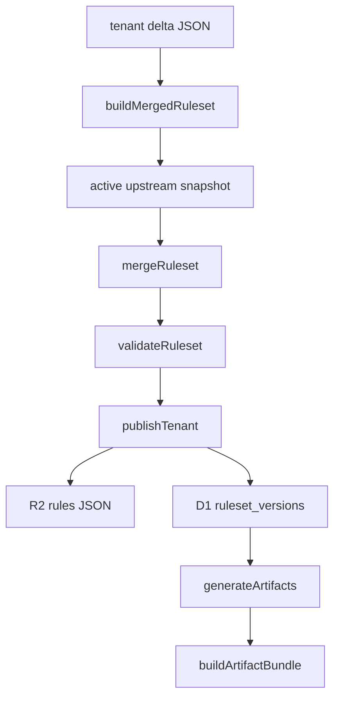

<!-- GENERATED FILE, do not edit by hand.
     Mirrored from .gitnexus/wiki (GitNexus knowledge graph wiki), source commit 8784ca7.
     Regenerate: node .gitnexus/run.cjs wiki, then: npm run docs:wiki -->

# Publishing & Artifacts

The Publishing & Artifacts module turns tenant configuration into deployable policy outputs.

It has two main responsibilities:

1. `src/lib/publish.ts` validates and publishes tenant ruleset versions.
2. `src/lib/artifacts.ts` generates browser deployment artifacts from current D1 state.

Published rulesets are stored in R2 and recorded in D1. Deployment artifacts are rendered fresh on demand and are never stored.



## Publishing Rulesets

Publishing creates an immutable tenant ruleset version from:

- a tenant delta JSON document
- the active upstream snapshot
- instance settings
- operator metadata

The public entry point is `publishTenant(env, tenantId, deltaJson, operator, note?)`.

### Publish Flow

`publishTenant` first determines the next `version_number` for the tenant:

```ts
SELECT MAX(version_number) AS max_version
FROM ruleset_versions
WHERE tenant_id = ?
```

The next version is `max_version + 1`, or `1` when the tenant has no published versions.

It then calls `buildMergedRuleset(env, deltaJson, versionNumber)`, which performs all validation and merge gates before anything is written.

If the merged ruleset is valid, `publishTenant`:

1. Serializes the merged ruleset as pretty JSON.
2. Computes a SHA-256 hash with `sha256Hex`.
3. Writes the JSON body to R2 under `rules/{tenantId}/{versionNumber}.json`.
4. Inserts a row into `ruleset_versions`.
5. Updates `tenants.current_version_id`.
6. Writes a `rules.publish` audit event through `writeAudit`.

The success result includes:

```ts
{
  ok: true,
  versionId,
  versionNumber,
  etag
}
```

Validation or merge failures return:

```ts
{
  ok: false,
  errors: string[]
}
```

### `buildMergedRuleset`

`buildMergedRuleset` is the shared publishing gate. It is used by publishing, dry-run validation, and live preview routes.

Its responsibilities are deliberately broader than just merging:

1. Validate the tenant delta with `validateDelta`.
2. Load the active upstream snapshot with `getActiveSnapshot`.
3. Fetch the snapshot body from R2 through `loadSnapshotRuleset`.
4. Read instance settings with `getInstanceSettings`.
5. Merge upstream rules and tenant delta through `mergeRuleset`.
6. Validate the final merged ruleset with `validateRuleset`.

The version metadata passed into `mergeRuleset` comes from instance settings and runtime state:

```ts
{
  suffixLabel: settings.version_suffix_label,
  versionNumber,
  publishedAt: nowIso()
}
```

Because `buildMergedRuleset` validates both the input delta and the final merged output, callers can rely on an `ok: true` result being safe to publish or preview.

### Snapshot Loading

`loadSnapshotRuleset(env, snapshot)` loads the upstream snapshot JSON from R2 using `snapshot.r2_key`.

It returns `null` when the R2 object is missing. `buildMergedRuleset` converts that into a publish-blocking error:

```ts
active upstream snapshot object missing from R2: {snapshot.r2_key}
```

This function is also used by `syncUpstream`, so changes to its behavior affect both publishing and upstream sync logic.

### ETags

`formatEtagHeader(etagHash)` formats stored SHA-256 hashes for HTTP responses:

```ts
"sha256-{first12chars}"
```

For example, a stored hash beginning with `abcdef123456...` becomes:

```http
ETag: "sha256-abcdef123456"
```

Routes in `src/routes/rules.ts` use this helper when serving ruleset content.

## Artifact Generation

Artifacts are generated from current database state by `generateArtifacts(env, tenantId, requestedGuid?)`.

Unlike published rulesets, artifacts are not persisted. They are rendered fresh every time from:

- instance settings
- active tenant GUID
- tenant branding
- tenant policy settings

The pure rendering function is `buildArtifactBundle(input)`, which makes artifact generation easy to test without D1 or R2.

## Artifact Outputs

`ArtifactBundle` contains all deployment formats produced by the module:

```ts
interface ArtifactBundle {
  guid: string;
  config_url: string;
  hook_url: string;
  logo_url: string;
  chrome_managed_storage: Record<string, unknown>;
  edge_managed_storage: Record<string, unknown>;
  firefox_fragment: Record<string, unknown>;
  firefox_policies_full: Record<string, unknown>;
  reg_chrome: string;
  reg_edge: string;
  intune_variables: string;
  cipp_fields: { field: string; value: string }[];
}
```

The bundle targets Chrome, Edge, Firefox, Intune, and CIPP deployment workflows.

## `generateArtifacts`

`generateArtifacts` is the database-backed artifact entry point used by `routes/api/artifacts.ts`.

It first loads instance settings and requires `public_base_url` to be configured. If the setting is empty, it returns:

```ts
{
  ok: false,
  error: "public_base_url is not set; configure it under instance settings before generating artifacts"
}
```

It then resolves the tenant GUID:

- if `requestedGuid` is provided, it must match an active GUID for the tenant
- otherwise, the newest active tenant GUID is selected

If no active GUID exists, generation fails with:

```ts
tenant has no active GUID
```

Branding is loaded from `tenant_branding`. If no row exists, an empty default branding record is used with `primary_color` set to `#F77F00`.

Policy settings are loaded from `tenant_policy_settings.settings_json`; missing settings default to `{}`.

Finally, `generateArtifacts` calls `buildArtifactBundle`.

## `buildArtifactBundle`

`buildArtifactBundle(input)` is a pure renderer. It performs no database or storage access.

It normalizes `baseUrl` by removing trailing slashes, resolves policy defaults through `resolvePolicy`, then constructs tenant URLs:

```ts
const configUrl = `${baseUrl}/rules/${guid}.json`;
const hookUrl = `${baseUrl}/hook/${guid}`;
const logoUrl = branding.logo_r2_key !== null
  ? `${baseUrl}/assets/${guid}/logo`
  : "";
```

The same managed storage payload is used for both Chrome and Edge:

```ts
chrome_managed_storage: managedStorage,
edge_managed_storage: managedStorage,
```

Firefox artifacts are generated in two forms:

- `firefox_fragment`: only the managed-storage fragment under `policies["3rdparty"]`
- `firefox_policies_full`: a complete Firefox `policies.json` structure with extension install settings

## Policy Resolution

`resolvePolicy(settings, defaultCippServerUrl)` converts loose tenant policy JSON into a typed `ResolvedPolicy`.

It applies defaults for missing or invalid values:

- `updateInterval`: `24`
- `enablePageBlocking`: `true`
- `showNotifications`: `true`
- `enableValidPageBadge`: `true`
- `validPageBadgeTimeout`: `5`
- `enableDebugLogging`: `false`
- `urlAllowlist`: `[]`
- `genericWebhook.events`: `["false_positive_report", "page_blocked", "threat_detected"]`
- `domainSquatting`: `{ enabled: true, deviationThreshold: 2, Action: "block" }`

`asBoolean` and `asNumber` are intentionally strict. They only accept actual boolean and finite number values; strings like `"true"` or `"24"` do not pass type checks and fall back to defaults.

CIPP reporting is only enabled when both conditions are met:

```ts
cippServerUrl.length > 0 &&
asBoolean(settings.enableCippReporting, false)
```

This prevents a fresh install with no configured CIPP server from emitting enabled CIPP settings.

## Managed Storage

`buildManagedStorage(policy, branding, urls)` creates the extension policy payload shared by Chrome, Edge, and Firefox.

The payload includes:

- `customRulesUrl`
- update and UI behavior settings
- `urlAllowlist`
- optional CIPP fields
- `genericWebhook`
- `domainSquatting`
- `customBranding`

CIPP fields are only included when `policy.enableCippReporting` is true:

```ts
if (policy.enableCippReporting) {
  payload.cippServerUrl = policy.cippServerUrl;
  payload.cippTenantId = policy.cippTenantId;
}
```

Branding fields come directly from `TenantBrandingRow`, with `logoUrl` derived from whether `logo_r2_key` exists.

## Registry Artifacts

`buildRegFile(browser, payload)` renders Windows `.reg` content for Chrome or Edge.

The browser choice changes:

- policy hive path
- extension ID
- extension update URL

Chrome uses:

```ts
CHROME_EXTENSION_ID = "benimdeioplgkhanklclahllklceahbe"
CHROME_UPDATE_URL = "https://clients2.google.com/service/update2/crx"
```

Edge uses:

```ts
EDGE_EXTENSION_ID = "knepjpocdagponkonnbggpcnhnaikajg"
EDGE_UPDATE_URL = "https://edge.microsoft.com/extensionwebstorebase/v1/crx"
```

Registry string escaping is handled by `regEscape`, `regString`, and `regNumberedStrings`. Numeric and boolean values are rendered as DWORD values through `regDword`.

Arrays such as `urlAllowlist` and webhook `events` are emitted as numbered registry values:

```reg
"1"="value"
"2"="value"
```

The generated registry structure includes:

- forced extension installation
- extension update URL
- root policy values
- optional `urlAllowlist`
- `genericWebhook`
- webhook `events`
- `domainSquatting`
- `customBranding`

## Intune Variables

`buildIntuneVariables(policy, branding, urls)` generates a PowerShell variable block for Check's `Setup-Windows-Chrome-and-Edge.ps1` deployment script.

The generated text is constrained for PowerShell deployment safety:

- 7-bit ASCII only via `toAscii`
- double quotes escaped through `powershellQuote`
- arrays rendered through `powershellArray`
- no shell chaining syntax

CIPP variables are blanked when CIPP reporting is disabled:

```ts
$cippServerUrl = ""
$cippTenantId = ""
```

The output includes variables for:

- CIPP reporting
- custom rules URL
- URL allowlist
- webhook URL and events
- branding
- logo URL
- domain squatting enabled flag

## CIPP Fields

`buildCippFields(policy, branding, urls)` returns a simple field/value list for CIPP-oriented UI or copy workflows.

It includes config URL, reporting status, CIPP server URL, tenant identifier, branding values, color, and logo URL.

When `cippTenantId` is empty, the field value is:

```text
(auto-filled per CIPP tenant)
```

## Firefox Policies

`buildFirefoxFull(fragment)` wraps the Firefox managed-storage fragment into a complete `policies.json` shape.

It sets the Check Firefox extension as locked and force-installed:

```ts
FIREFOX_EXTENSION_ID = "check@cyberdrain.com"
```

The `install_url` is intentionally empty, matching the enterprise template where deployers provide their own XPI source.

## Integration Points

Publishing connects to:

- `src/lib/db.ts` for IDs, timestamps, hashing, instance settings, and active snapshots
- `src/lib/merge.ts` for `mergeRuleset`
- `src/lib/validate.ts` for `validateDelta` and `validateRuleset`
- `src/lib/audit.ts` for `writeAudit`
- `src/routes/rules.ts` and `routes/api/rules.ts` for publish, preview, and ETag behavior
- `src/lib/upstream.ts`, which also uses `loadSnapshotRuleset` and calls `publishTenant`

Artifacts connect to:

- `src/lib/db.ts` for instance settings and tenant branding types
- `routes/api/artifacts.ts` through `generateArtifacts`
- tests through `buildArtifactBundle`, which is the preferred target for golden artifact assertions

## Testing Guidance

Use `buildArtifactBundle` for deterministic artifact tests because it has no database dependency. Tests can pass fixed `ArtifactInput` values and compare generated JSON, registry text, PowerShell variable blocks, and CIPP fields.

Use `generateArtifacts` tests when verifying database behavior, especially:

- missing `public_base_url`
- requested GUID lookup
- latest active GUID selection
- default branding fallback
- policy JSON parsing

For publishing, tests should exercise `publishTenant` when validating the full write path, including R2 writes, D1 version records, tenant current-version updates, and audit creation.

Use `buildMergedRuleset` directly for dry-run and validation behavior, especially cases where:

- delta JSON is invalid
- there is no active upstream snapshot
- the active snapshot R2 object is missing
- merged output fails `validateRuleset`

## Contributor Notes

Keep `buildMergedRuleset` as the single shared gate for publish-like behavior. Adding validation only inside `publishTenant` can create drift between real publishing, dry-run validation, and preview endpoints.

Keep `buildArtifactBundle` pure. Database lookups belong in `generateArtifacts`; rendering logic belongs in pure helpers so golden tests remain stable and cheap.

Be careful when changing registry or PowerShell rendering helpers. `buildRegFile` depends on `regEscape`, `regString`, `regDword`, and `regNumberedStrings` for deployment-safe output, while `buildIntuneVariables` depends on `toAscii`, `powershellQuote`, and `powershellArray`.

Do not store generated artifacts unless the product requirements change. The current design intentionally renders artifacts from D1 state every time, while only published ruleset JSON is written to R2.
