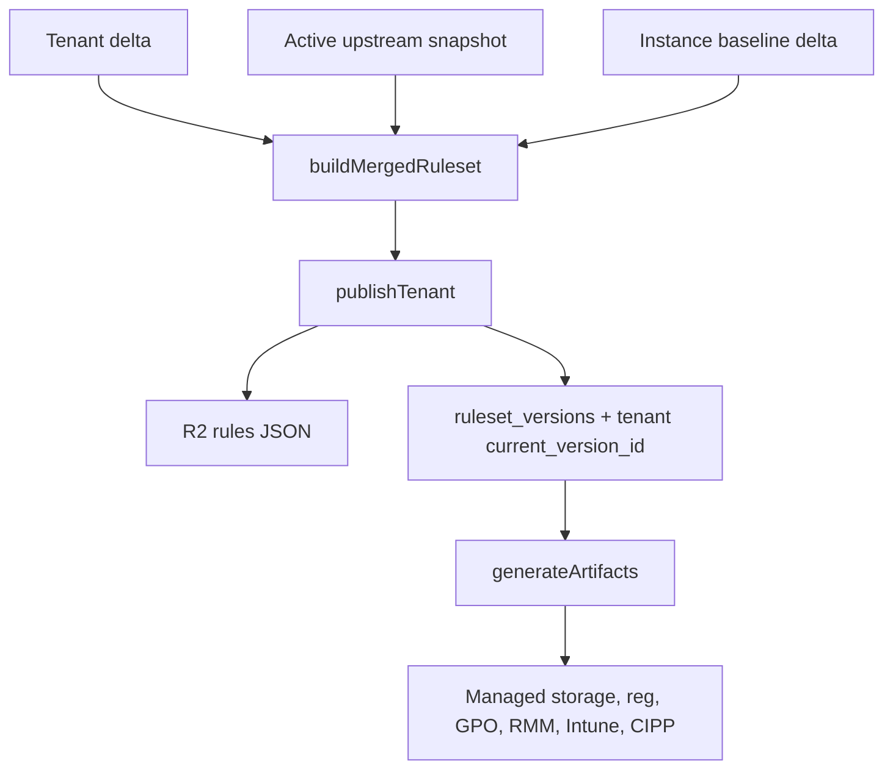

<!-- GENERATED FILE, do not edit by hand.
     Mirrored from .gitnexus/wiki (GitNexus knowledge graph wiki), source commit 5adb17f.
     Regenerate: node .gitnexus/run.cjs wiki, then: npm run docs:wiki -->

# Publishing & Artifacts

The Publishing & Artifacts module turns tenant configuration into deployable Check extension policy outputs.

It has two distinct responsibilities:

- `src/lib/publish.ts` publishes tenant rulesets by merging tenant deltas with the active upstream snapshot, validating the result, storing the JSON ruleset in R2, and recording a version in D1.
- `src/lib/artifacts.ts` generates deployment artifacts for browser policy rollout from current D1 state. Generated artifacts are rendered fresh on demand and are not stored.



## Publishing Rulesets

Publishing creates immutable tenant ruleset versions. The public rules endpoint later serves these published versions by tenant GUID.

The main entry points are:

- `buildMergedRuleset(env, deltaJson, versionNumber)`
- `publishTenant(env, tenantId, deltaJson, operator, note?)`
- `republishAllTenants(env, publishAs, note, auditOperator)`
- `loadSnapshotRuleset(env, snapshot)`
- `formatEtagHeader(etagHash)`

### `buildMergedRuleset`

`buildMergedRuleset` is the shared merge-and-validation path used by publishing, dry-run validation, and live preview endpoints.

The function performs the publishing gates in this order:

1. Validate the tenant delta with `validateDelta(deltaJson)`.
2. Load the active upstream snapshot row with `getActiveSnapshot(env.DB)`.
3. Load the upstream ruleset JSON from R2 via `loadSnapshotRuleset(env, snapshot)`.
4. Load instance settings with `getInstanceSettings(env.DB)`.
5. Apply `settings.baseline_rule_delta` underneath the tenant delta, when present.
6. Merge the tenant delta with `mergeRuleset`.
7. Validate the final merged ruleset with `validateRuleset`.

The baseline delta is intentionally applied before the tenant delta:

```ts
base = applyDelta(upstream, baselineCheck.ruleset as TenantDelta);
const merged = mergeRuleset(base, delta, {
  suffixLabel: settings.version_suffix_label,
  versionNumber,
  publishedAt: nowIso(),
});
```

That means instance-wide MSP defaults become the base policy, while tenant-specific settings can still override or extend them through the tenant delta.

If the active upstream snapshot is missing, publishing fails with:

```text
no active upstream snapshot; run an upstream sync first
```

If the R2 object referenced by the active snapshot is missing, publishing fails with:

```text
active upstream snapshot object missing from R2: <r2_key>
```

A stored bad `baseline_rule_delta` is treated as a hard failure. Errors from that validation path are prefixed with `baseline_rule_delta:` so operators can distinguish instance settings failures from tenant delta failures.

### `loadSnapshotRuleset`

`loadSnapshotRuleset(env, snapshot)` reads the upstream snapshot object from R2 using `snapshot.r2_key`.

It returns:

- parsed JSON object when the R2 object exists
- `null` when `env.STORAGE.get(snapshot.r2_key)` returns `null`

The caller is responsible for deciding whether missing storage is recoverable. `buildMergedRuleset` treats it as a publishing error.

### `publishTenant`

`publishTenant` creates the next ruleset version for one tenant.

It first computes the next version number from D1:

```sql
SELECT MAX(version_number) AS max_version
FROM ruleset_versions
WHERE tenant_id = ?
```

The new `versionNumber` is `max_version + 1`, or `1` for a tenant with no published versions.

After `buildMergedRuleset` succeeds, `publishTenant`:

1. Serializes the merged ruleset as pretty JSON.
2. Computes a SHA-256 hash with `sha256Hex(body)`.
3. Writes the JSON to R2 at `rules/${tenantId}/${versionNumber}.json`.
4. Inserts a row into `ruleset_versions`.
5. Updates `tenants.current_version_id`.
6. Writes a `rules.publish` audit event with `writeAudit`.

The inserted version row stores the original `deltaJson` alongside the generated ruleset metadata. That frozen delta is important for later republishing: automatic republish operations use the previously published delta, not an operator draft.

Successful publishes return:

```ts
{
  ok: true,
  versionId,
  versionNumber,
  etag,
}
```

Failures return:

```ts
{
  ok: false,
  errors,
}
```

The `etag` value is the full SHA-256 hex digest of the stored JSON body. HTTP callers format it with `formatEtagHeader`.

### `formatEtagHeader`

`formatEtagHeader(etagHash)` converts the stored hash into the HTTP header form used by the rules routes:

```ts
"sha256-${etagHash.slice(0, 12)}"
```

The resulting value is quoted, for example:

```http
ETag: "sha256-abc123def456"
```

The helper is called by `src/routes/rules.ts` and `rulesHeaders`.

### `republishAllTenants`

`republishAllTenants` republishes every tenant that already has a current version.

It selects tenants by joining `tenants.current_version_id` to `ruleset_versions.id`:

```sql
SELECT t.id AS tenant_id, v.delta_json
FROM tenants t
JOIN ruleset_versions v ON v.id = t.current_version_id
```

For each row, it calls:

```ts
publishTenant(env, row.tenant_id, row.delta_json, publishAs, note)
```

This deliberately republishes the frozen delta from the current published version. It does not use any draft state.

This function is shared by:

- upstream sync auto-publish in `src/lib/upstream.ts`
- baseline-delta republish actions in `routes/api/instance.ts`

Failures are collected per tenant and audited as `rules.publish_failed` with the supplied `auditOperator`.

## Artifact Generation

Artifact generation renders deployment material for a tenant GUID. Unlike published rulesets, artifacts are not persisted. Everything is generated from D1 state each time.

The main entry points are:

- `generateArtifacts(env, tenantId, requestedGuid?)`
- `buildArtifactBundle(input)`

`generateArtifacts` is the database-backed route helper. `buildArtifactBundle` is a pure renderer used by tests and golden artifact generation.

### `generateArtifacts`

`generateArtifacts` loads the runtime state needed to build artifacts:

1. Instance settings from `getInstanceSettings(env.DB)`.
2. Public base URL from `settings.public_base_url`.
3. Active tenant GUID from `tenant_guids`, or a specific active GUID when `requestedGuid` is supplied.
4. Tenant branding from `tenant_branding`.
5. Tenant policy settings from `tenant_policy_settings`.
6. Instance tenant defaults through `parseTenantDefaults(settings.tenant_defaults ?? "")`.

Artifact generation requires `public_base_url`. If it is empty after trimming trailing slashes, generation fails with:

```text
public_base_url is not set; configure it under instance settings before generating artifacts
```

If no active GUID exists for the tenant, generation fails with:

```text
tenant has no active GUID
```

When no branding row exists, `generateArtifacts` supplies a default `TenantBrandingRow` using `CHECK_DEFAULT_PRIMARY_COLOR`.

### `buildArtifactBundle`

`buildArtifactBundle(input)` is the pure renderer. Given an `ArtifactInput`, it returns an `ArtifactBundle` containing URLs, managed storage payloads, browser policy files, scripts, Intune variables, CIPP fields, and warnings.

It derives tenant URLs from the normalized base URL and GUID:

```ts
const configUrl = `${baseUrl}/rules/${input.guid}.json`;
const hookUrl = `${baseUrl}/hook/${input.guid}`;
const logoUrl = `${baseUrl}/assets/${input.guid}/logo`;
```

`logoUrl` is only emitted when the tenant has a logo object or when an instance default logo should be used. An empty logo URL tells the Check extension to use its built-in logo.

The returned bundle includes:

- `chrome_managed_storage`
- `edge_managed_storage`
- `firefox_fragment`
- `firefox_policies_full`
- `reg_chrome`
- `reg_edge`
- `gpo_script`
- `rmm_script`
- `intune_variables`
- `cipp_fields`
- `warnings`

Chrome and Edge managed storage currently share the same payload object. Browser-specific differences are handled in registry and script generation.

## Policy Resolution

`resolvePolicy` combines three layers:

1. Hardcoded fallbacks in `resolvePolicy`
2. Instance-level defaults from `tenantDefaults.policy`
3. Tenant-specific `policySettings`

The merge pattern is:

```ts
const settings = { ...policyDefaults, ...tenantSettings };
```

Tenant keys win outright. Missing tenant keys inherit instance defaults, and missing defaults fall back to hardcoded values.

Important fallbacks include:

- `updateInterval`: `24`
- `enablePageBlocking`: `true`
- `showNotifications`: `true`
- `enableValidPageBadge`: `true`
- `validPageBadgeTimeout`: `5`
- `enableDebugLogging`: `false`
- `urlAllowlist`: `[]`
- `domainSquatting`: `{ enabled: true, deviationThreshold: 2, Action: "block" }`
- `genericWebhook.events`: `["false_positive_report", "page_blocked", "threat_detected"]`

CIPP reporting is only enabled when both conditions are true:

- `enableCippReporting` resolves to `true`
- a non-empty CIPP server URL is available from tenant settings or `defaultCippServerUrl`

This prevents a fresh install with no CIPP server configured from emitting enabled CIPP policy.

## Branding Resolution

`resolveBranding` applies instance branding defaults per field.

Only fields listed in `INHERITABLE_BRANDING_FIELDS` inherit from instance defaults. A tenant field with an empty string means “use the instance default” for those fields.

Logo handling is intentionally separate. Logo URLs are resolved in `buildArtifactBundle`, and the asset route handles fallback content so tenant URLs remain stable.

`CHECK_DEFAULT_PRIMARY_COLOR` is exported as:

```ts
export const CHECK_DEFAULT_PRIMARY_COLOR = "#F77F00";
```

When `branding.use_default_logo === 1`, `resolveBranding` pins `primary_color` to the Check default color. This preserves the tenant’s stored custom color for later use if the tenant opts out of the default look.

## Managed Storage Payload

`buildManagedStorage(policy, branding, urls)` produces the canonical extension policy payload. This object is reused across Chrome, Edge, and Firefox policy formats.

The payload includes:

- `customRulesUrl`
- update and page-blocking settings
- notification and badge settings
- debug logging flag
- `urlAllowlist`
- optional CIPP fields
- `genericWebhook`
- `domainSquatting`
- `customBranding`

CIPP fields are only included when `policy.enableCippReporting` is true:

```ts
if (policy.enableCippReporting) {
  payload.cippServerUrl = policy.cippServerUrl;
  payload.cippTenantId = policy.cippTenantId;
}
```

This keeps disabled CIPP deployments from carrying stale server or tenant values.

## Registry-Based Artifacts

Registry output is centralized around `registryWrites(browser, payload)`.

That function returns an ordered list of `RegistryWrite` objects describing every registry value needed for Chrome or Edge policy deployment. Both `.reg` files and PowerShell scripts use this same table, which prevents drift between artifact formats.

Browser differences handled there include:

- Chrome extension ID: `benimdeioplgkhanklclahllklceahbe`
- Edge extension ID: `knepjpocdagponkonnbggpcnhnaikajg`
- Chrome update URL: `https://clients2.google.com/service/update2/crx`
- Edge update URL: `https://edge.microsoft.com/extensionwebstorebase/v1/crx`
- Chrome toolbar pin key: `toolbar_pin = force_pinned`
- Edge toolbar pin key: `toolbar_state = force_shown`

`buildRegFile(browser, payload)` renders the ordered writes into Windows `.reg` format. It groups consecutive values with the same subkey into the same section and uses CRLF line endings.

String and DWORD formatting is handled by:

- `regEscape`
- `regString`
- `regDword`

## PowerShell Artifacts

The module generates three PowerShell-oriented outputs:

- `gpo_script`
- `rmm_script`
- `intune_variables`

PowerShell string escaping is centralized in:

- `toAscii`
- `powershellQuote`
- `powershellSingleQuote`
- `powershellArray`

Generated scripts intentionally reduce non-ASCII characters to `?` through `toAscii`. This keeps generated PowerShell text 7-bit ASCII and avoids encoding-sensitive deployment issues.

### `buildGpoScript`

`buildGpoScript(payload)` creates a ready-to-run Group Policy script for Chrome and Edge.

It imports the `GroupPolicy` module, creates or updates a GPO, then writes all Chrome and Edge policy values using `Set-GPRegistryValue`.

The generated helper function `Set-CheckGpoRegistryValue` retries `UnauthorizedAccessException` briefly because a newly created GPO’s SYSVOL permissions may not be ready immediately.

The script links to Check’s ADMX templates through `CHECK_ADMX_URL`:

```ts
export const CHECK_ADMX_URL =
  "https://github.com/CyberDrain/Check/tree/v1.1.0/enterprise/admx";
```

The templates are linked, not vendored.

### `buildRmmScript`

`buildRmmScript(payload, firefoxFull)` creates a standalone endpoint deployment script intended to run as SYSTEM from an RMM.

It includes three browser toggles:

```powershell
$IncludeChrome = $true
$IncludeEdge = $true
$IncludeFirefox = $true
```

For Chrome and Edge, it writes the same registry values used by `.reg` and GPO artifacts.

For Firefox, it embeds the full generated `policies.json` and writes it to each installed Firefox `distribution` directory. Existing `policies.json` files are backed up to `.bak`.

Firefox policy JSON is written with ASCII encoding because the generated text is already reduced to 7-bit ASCII and a BOM can break Firefox policy parsing.

### `buildIntuneVariables`

`buildIntuneVariables(policy, branding, urls)` renders a variable block for Check’s `Setup-Windows-Chrome-and-Edge.ps1`.

It emits variables such as:

- `$enableCippReporting`
- `$cippServerUrl`
- `$customRulesUrl`
- `$urlAllowlist`
- `$enableGenericWebhook`
- `$webhookEvents`
- `$companyName`
- `$productName`
- `$primaryColor`
- `$logoUrl`
- `$domainSquattingEnabled`

The function uses `powershellQuote` and `powershellArray` so generated values can safely contain URLs, names, and patterns.

## Firefox Artifacts

Firefox uses two related outputs:

- `firefox_fragment`
- `firefox_policies_full`

`firefox_fragment` contains only the managed `3rdparty` policy payload for the Check extension:

```ts
{
  policies: {
    "3rdparty": {
      Extensions: {
        [FIREFOX_EXTENSION_ID]: managedStorage,
      },
    },
  },
}
```

`buildFirefoxFull(fragment)` wraps that fragment in a complete Firefox `policies.json` structure with extension install settings.

The Firefox extension ID is:

```ts
export const FIREFOX_EXTENSION_ID = "check@cyberdrain.com";
```

The generated full policy intentionally leaves `install_url` blank, matching Check’s upstream template. Deployers must fill in the XPI source before enabling Firefox force-install.

## CIPP Fields and Warnings

`buildCippFields(policy, branding, urls)` produces a human-readable list of fields for CIPP deployment standards. It includes config URL, CIPP settings, tenant/domain value, branding fields, and logo URL.

When CIPP reporting is enabled but `cippTenantId` is empty, `buildArtifactBundle` adds a warning. This is only a direct-deployment problem. CIPP deployment standards can fill the tenant ID per tenant, so the warning text explicitly says when it can be ignored.

## Connections to the Rest of the Codebase

Publishing is consumed by rules and upstream flows:

- `routes/api/rules.ts` calls `publishTenant` and `buildMergedRuleset`.
- `src/routes/rules.ts` calls `buildMergedRuleset` and `formatEtagHeader`.
- `src/lib/upstream.ts` calls `loadSnapshotRuleset` and `republishAllTenants`.
- `routes/api/instance.ts` calls `republishAllTenants` for baseline republish behavior.
- Tests call `publishTenant` from `rules-endpoint.test.ts` and `upstream.test.ts`.

Artifacts are consumed by the artifacts API and tests:

- `routes/api/artifacts.ts` calls `generateArtifacts`.
- `test/artifacts.test.ts` calls `buildArtifactBundle`.

The module depends on shared lower-level libraries:

- `src/lib/db.ts` for D1 helpers, IDs, timestamps, and hashes.
- `src/lib/merge.ts` for `applyDelta`, `mergeRuleset`, and `TenantDelta`.
- `src/lib/validate.ts` for `validateDelta` and `validateRuleset`.
- `src/lib/audit.ts` for publish audit events.
- `src/lib/tenant-defaults.ts` for inherited tenant defaults.

## Contributor Notes

Use `buildMergedRuleset` for any code path that needs to preview or publish a merged ruleset. It is the only path that consistently applies the active upstream snapshot, instance baseline delta, tenant delta, version metadata, and final ruleset validation.

Use `buildArtifactBundle` for tests and deterministic artifact rendering. It is pure and does not read D1 or R2.

When adding a new Chrome or Edge registry-backed policy value, add it to `registryWrites`. That automatically updates `.reg`, GPO, and RMM outputs together.

When adding a new extension policy setting, update the full chain deliberately:

- `ResolvedPolicy`
- `resolvePolicy`
- `buildManagedStorage`
- browser-specific renderers if the setting needs registry/script output
- `buildIntuneVariables` or `buildCippFields` if operators need it there
- golden artifact tests, because output order and bytes are intentionally locked

Do not store generated artifacts. The design of `artifacts.ts` assumes artifacts are always derived from current tenant, instance, policy, branding, and GUID state.
