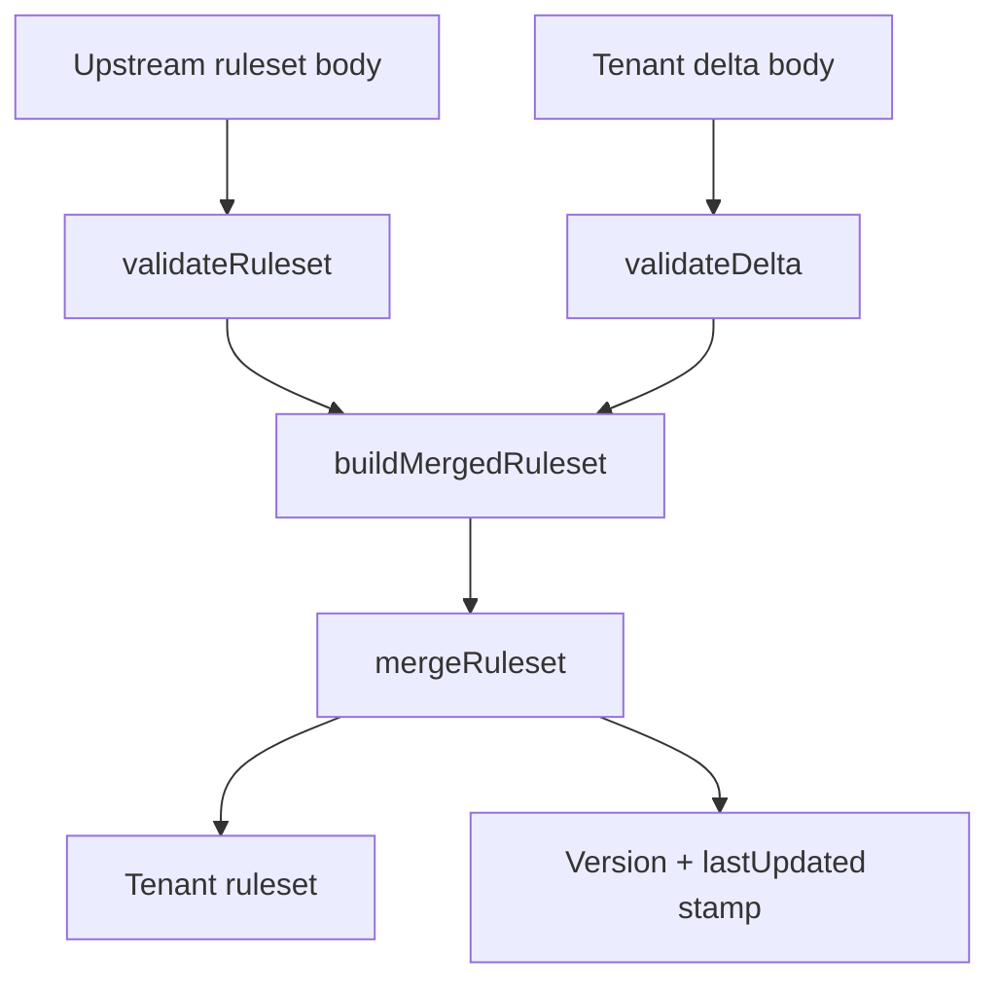

<!-- GENERATED FILE, do not edit by hand.
     Mirrored from .gitnexus/wiki (GitNexus knowledge graph wiki), source commit 921327d.
     Regenerate: node .gitnexus/run.cjs wiki, then: npm run docs:wiki -->

# Ruleset Validation & Merge

The Ruleset Validation & Merge module is responsible for checking upstream rulesets, validating tenant-specific delta documents, and producing tenant-published rulesets from those inputs.

It is implemented in two files:

- `src/lib/validate.ts`: structural validation for serialized upstream rulesets and tenant deltas.
- `src/lib/merge.ts`: pure merge logic that applies a validated tenant delta to an upstream ruleset.

The module intentionally avoids a strict JSON Schema because the upstream Check ruleset format does not publish one. Instead, it enforces the project’s required safety gates while tolerating unknown upstream fields.



## Validation Model

Validation returns a `ValidationResult`:

```ts
export interface ValidationResult {
  ok: boolean;
  errors: string[];
  ruleset?: Record<string, unknown>;
}
```

For both rulesets and deltas, validation parses a serialized JSON body and returns:

- `ok: true` when all checks pass.
- `errors` containing developer/operator-readable failure messages.
- `ruleset` containing the parsed object when parsing succeeds, even if later structural validation fails.

The `ruleset` property is also used by `validateDelta`; in that case it contains the parsed delta document.

## Upstream Ruleset Validation

`validateRuleset(body: string)` validates a serialized upstream ruleset body.

It runs five gates:

1. Size and JSON parsing.
2. Required top-level sections.
3. Per-indicator structural checks.
4. Regex compilation checks for trusted and exclusion patterns.
5. JSON round-trip safety.

### Size and JSON Parsing

Rulesets are capped by `MAX_RULESET_BYTES`:

```ts
export const MAX_RULESET_BYTES = 1024 * 1024;
```

`validateRuleset` measures UTF-8 byte length using `TextEncoder`. Bodies that are `1 MB` or larger fail immediately:

```ts
if (new TextEncoder().encode(body).length >= MAX_RULESET_BYTES) {
  return { ok: false, errors: ["body is 1 MB or larger"] };
}
```

The body must parse as a JSON object. Arrays, `null`, invalid JSON, and scalar values fail validation.

### Required Sections

The ruleset must contain these top-level sections:

```ts
const REQUIRED_SECTIONS = [
  "trusted_login_patterns",
  "exclusion_system",
  "phishing_indicators",
  "m365_detection_requirements",
  "blocking_rules",
  "detection_settings",
];
```

Unknown top-level keys are allowed. This keeps validation compatible with future upstream fields while still enforcing the sections required by the publishing pipeline.

### Phishing Indicator Checks

When `phishing_indicators` exists, it must be an array. Each entry must be an object.

For each indicator, `validateRuleset` checks:

- `id` exists and is a non-empty string.
- `id` values are unique within the array.
- `pattern`, when present, compiles as a JavaScript `RegExp`.
- `severity`, when present, is one of `low`, `medium`, `high`, or `critical`.
- `action`, when present, is one of `block`, `warn`, or `monitor`.
- `confidence`, when present, is a number between `0` and `1`.

Regex validation is handled by the private helper `compileRegex(pattern, flags)`. If the indicator has a `flags` property and it is a string, those flags are passed to `new RegExp`.

### Trusted Login and Exclusion Pattern Checks

`trusted_login_patterns` must be an array when present. Each entry is compiled as a regex without flags.

`exclusion_system` must be an object when present. If it contains `domain_patterns`, each domain pattern is compiled as a regex.

The code only validates `exclusion_system.domain_patterns` when that property is an array. Unknown fields inside `exclusion_system` are tolerated.

### JSON Round Trip

The final gate verifies the parsed object can survive:

```ts
JSON.parse(JSON.stringify(ruleset))
```

The serialized form of the round-tripped object must match the serialized form of the parsed ruleset. This catches values that cannot be safely represented in JSON-compatible output.

## Tenant Delta Validation

`validateDelta(body: string)` validates per-tenant delta documents before they are merged.

Unlike upstream ruleset validation, delta validation is strict about top-level keys. This prevents operator typos from silently producing no changes.

Allowed delta keys are:

```ts
export const DELTA_KEYS = [
  "add_exclusion_domain_patterns",
  "add_trusted_login_patterns",
  "add_phishing_indicators",
  "suppress_indicator_ids",
  "raw_overrides",
];
```

Any other key produces an `unknown delta key` error.

### Additive Pattern Fields

These fields are optional, but when present must be arrays:

- `add_exclusion_domain_patterns`
- `add_trusted_login_patterns`

Every entry is compiled using `compileRegex(pattern, undefined)`.

### Indicator Additions and Suppressions

`add_phishing_indicators` must be an array when present. `validateDelta` does not perform the full per-indicator validation used by `validateRuleset`; the merged output is expected to pass `validateRuleset` later in the publish path.

`suppress_indicator_ids` must be an array of strings. These IDs are used by `mergeRuleset` to remove matching upstream indicators before tenant-added indicators are appended.

### Raw Overrides

`raw_overrides` must be an object when present. It is the escape hatch for tenant-specific changes that are not covered by the additive delta fields.

Because `raw_overrides` can replace arbitrary fields during merge, contributors should treat it as a powerful compatibility mechanism rather than the preferred extension point.

## Merge Model

`mergeRuleset(upstream, delta, options)` applies a `TenantDelta` to an upstream ruleset and returns a new merged object.

```ts
export function mergeRuleset(
  upstream: Record<string, unknown>,
  delta: TenantDelta,
  options: MergeOptions,
): Record<string, unknown>
```

The merge function is pure with respect to its inputs. It starts by deep-copying the upstream object:

```ts
let merged: Record<string, unknown> = JSON.parse(JSON.stringify(upstream));
```

This allows callers to reuse the same upstream snapshot for multiple tenants without cross-tenant mutation.

## TenantDelta

`TenantDelta` defines the supported merge operations:

```ts
export interface TenantDelta {
  add_exclusion_domain_patterns?: string[];
  add_trusted_login_patterns?: string[];
  add_phishing_indicators?: Record<string, unknown>[];
  suppress_indicator_ids?: string[];
  raw_overrides?: Record<string, unknown>;
}
```

The merge order is significant:

1. Append trusted login patterns.
2. Append exclusion domain patterns.
3. Suppress and append phishing indicators.
4. Apply `raw_overrides`.
5. Stamp `version` and `lastUpdated`.

Because `raw_overrides` runs late, it can replace or modify fields created by earlier merge steps. Because version stamping runs last, `raw_overrides.version` and `raw_overrides.lastUpdated` do not control the final published values.

## MergeOptions

`MergeOptions` supplies the publish-time metadata:

```ts
export interface MergeOptions {
  suffixLabel: string;
  versionNumber: number;
  publishedAt: string;
}
```

After merge, the ruleset version is rewritten as:

```ts
`${baseVersion}+${options.suffixLabel}.${options.versionNumber}`
```

`baseVersion` is taken from `merged.version` before any existing build metadata suffix. For example, an upstream version of `1.2.3+upstream.7` becomes:

```text
1.2.3+tenantLabel.42
```

If `merged.version` is missing or not a non-empty string, the base version defaults to `0.0.0`.

`lastUpdated` is always set to `options.publishedAt`.

## Deep Merge Behavior

`raw_overrides` is applied through the private recursive helper `deepMerge(base, override)`.

The helper uses `isPlainObject(value)` to distinguish mergeable objects from arrays and scalars:

```ts
function isPlainObject(value: unknown): value is Record<string, unknown> {
  return value !== null && typeof value === "object" && !Array.isArray(value);
}
```

Merge rules:

- Plain objects merge recursively.
- Arrays replace the existing value.
- Scalars replace the existing value.
- `null` replaces the existing value.

This means `raw_overrides` can surgically update nested object fields, but cannot append to arrays. Array append behavior is only provided by the explicit additive delta fields.

## Integration Points

The module is used by the publishing and ingestion paths:

- `syncUpstream` calls `validateRuleset` to validate fetched upstream rulesets.
- `buildMergedRuleset` calls `validateRuleset`, `validateDelta`, and `mergeRuleset` while preparing tenant output.
- `publishTenant` reaches validation through `buildMergedRuleset`.
- `routes/api/rules.ts` calls `validateDelta`, likely to validate operator-submitted tenant deltas.
- `test/validate.test.ts` covers `validateRuleset` and `validateDelta`.
- `test/merge.test.ts` covers `mergeRuleset` and merged-output validation.

The internal call graph is intentionally small:

- `validateRuleset` and `validateDelta` share `compileRegex`.
- `mergeRuleset` uses `isPlainObject` directly and through `deepMerge`.
- `deepMerge` is recursive.

There are no outgoing project-level calls from this module. Its only external dependencies are built-in JavaScript runtime features such as `JSON.parse`, `JSON.stringify`, `RegExp`, `Set`, and `TextEncoder`.

## Contributor Notes

When changing validation behavior, preserve the distinction between upstream rulesets and tenant deltas:

- Upstream rulesets should remain tolerant of unknown fields.
- Tenant deltas should remain strict about unknown top-level keys.
- Regex-bearing fields should continue to fail early through `compileRegex`.
- Added delta fields should be reflected in both `DELTA_KEYS` and `TenantDelta`.

When changing merge behavior, keep the merge order in mind. Existing behavior depends on `raw_overrides` being applied after additive operations and publish metadata being stamped last.

If new tenant customization features are added, prefer explicit delta fields over expanding reliance on `raw_overrides`. Explicit fields are easier to validate, test, and reason about during publishing.
