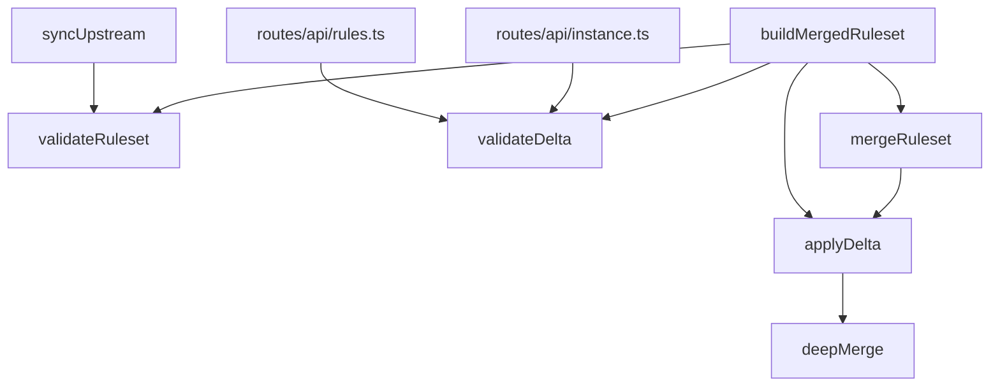

<!-- GENERATED FILE, do not edit by hand.
     Mirrored from .gitnexus/wiki (GitNexus knowledge graph wiki), source commit 5adb17f.
     Regenerate: node .gitnexus/run.cjs wiki, then: npm run docs:wiki -->

# Ruleset Validation & Merge

The Ruleset Validation & Merge module validates upstream rulesets and tenant delta documents, then applies tenant-specific changes to produce a publishable ruleset.

It is split across two files:

- `src/lib/validate.ts` validates serialized JSON input.
- `src/lib/merge.ts` applies validated delta objects to ruleset objects.

The module is intentionally structural rather than schema-driven. Check does not publish a formal JSON Schema, so `validateRuleset()` enforces required shape, known safety gates, and regex correctness while tolerating unknown upstream keys.

## Architecture



The validation functions operate on JSON strings. The merge functions operate on parsed objects.

## Validation Results

Both `validateRuleset()` and `validateDelta()` return `ValidationResult`:

```ts
export interface ValidationResult {
  ok: boolean;
  errors: string[];
  ruleset?: Record<string, unknown>;
}
```

When parsing fails or the parsed value is not a JSON object, `ruleset` is omitted. When JSON parses successfully but structural validation fails, the parsed object is returned as `ruleset` so callers can inspect or report against the submitted body.

## Ruleset Validation

`validateRuleset(body: string)` validates a serialized upstream or merged ruleset.

It runs five validation gates.

### Gate 1: Size And JSON Object

The ruleset body must be smaller than `MAX_RULESET_BYTES`, which is currently `1024 * 1024`.

Bodies at or above the cap fail with:

```text
body is 1 MB or larger
```

The body must parse as JSON and the parsed value must be a non-array object. Invalid JSON and top-level arrays/nulls are rejected.

### Gate 2: Required Sections

The following top-level sections must exist:

```ts
const REQUIRED_SECTIONS = [
  "trusted_login_patterns",
  "exclusion_system",
  "phishing_indicators",
  "m365_detection_requirements",
  "blocking_rules",
  "detection_settings",
];
```

Unknown additional sections are allowed. This keeps validation tolerant of future upstream fields while still ensuring the ruleset has the expected operational sections.

### Gate 3: Phishing Indicator Checks

If `phishing_indicators` exists, it must be an array.

Each indicator must be an object with a non-empty string `id`. Duplicate IDs are rejected across the array.

For each indicator:

- `pattern`, when present, must compile as a JavaScript `RegExp`.
- `flags`, when present and a string, are passed to the `RegExp` constructor.
- `severity`, when present, must be one of `low`, `medium`, `high`, or `critical`.
- `action`, when present, must be one of `block`, `warn`, or `monitor`.
- `confidence`, when present, must be a number from `0` through `1`.

Regex validation is centralized in the private `compileRegex(pattern, flags)` helper.

### Gate 4: Trusted And Exclusion Pattern Checks

`trusted_login_patterns`, when present, must be an array of regex pattern strings. Each entry is compiled with `compileRegex(pattern, undefined)`.

`exclusion_system`, when present, must be an object. If it contains `domain_patterns`, that property is expected to be an array and each pattern is compiled.

The validator only checks `exclusion_system.domain_patterns` when it is an array. Other `exclusion_system` keys are tolerated.

### Gate 5: JSON Round Trip

The parsed ruleset must survive:

```ts
JSON.parse(JSON.stringify(ruleset))
```

The stringified result must match the original parsed object after stringification. This catches values that cannot be represented cleanly through JSON serialization.

## Delta Validation

`validateDelta(body: string)` validates a serialized per-tenant delta document.

Unlike ruleset validation, delta validation is strict about top-level keys. This is intentional: tenant deltas are operator-authored, and unknown keys are more likely to be typos than forward-compatible upstream additions.

Allowed delta keys are defined by `DELTA_KEYS`:

```ts
export const DELTA_KEYS = [
  "add_exclusion_domain_patterns",
  "add_trusted_login_patterns",
  "add_phishing_indicators",
  "suppress_indicator_ids",
  "raw_overrides",
];
```

Unknown keys produce errors such as:

```text
unknown delta key: add_trusted_logins
```

### Additive Pattern Fields

The following fields must be arrays when present:

- `add_exclusion_domain_patterns`
- `add_trusted_login_patterns`

Each item must compile as a regex pattern string. Invalid values are reported with the array key and index.

### Added Indicators

`add_phishing_indicators`, when present, must be an array.

`validateDelta()` does not fully validate the objects inside `add_phishing_indicators`. Instead, the merged output is expected to pass through `validateRuleset()`, where duplicate indicator IDs, regex patterns, severity, action, and confidence are checked in the context of the final ruleset.

### Suppressed Indicators

`suppress_indicator_ids`, when present, must be an array of strings.

Each non-string entry is reported by index.

### Raw Overrides

`raw_overrides`, when present, must be a non-array object.

This field is the escape hatch for structured changes that are not covered by the additive delta fields. Its contents are not deeply validated by `validateDelta()`; the final merged ruleset should be validated with `validateRuleset()`.

## Merge Model

`src/lib/merge.ts` defines the shape of a tenant delta:

```ts
export interface TenantDelta {
  add_exclusion_domain_patterns?: string[];
  add_trusted_login_patterns?: string[];
  add_phishing_indicators?: Record<string, unknown>[];
  suppress_indicator_ids?: string[];
  raw_overrides?: Record<string, unknown>;
}
```

The merge engine is pure with respect to its inputs: it deep-copies the base ruleset before mutation and returns a new merged object.

The intended layering model is:

1. Start with an upstream ruleset snapshot.
2. Apply an instance baseline delta with `applyDelta()`.
3. Apply a tenant delta with `mergeRuleset()` or another `applyDelta()` call.
4. Validate the final result with `validateRuleset()` before publishing.

Because additive arrays append to the current input, callers should re-merge from the same upstream snapshot and delta when rebuilding a tenant ruleset. Applying the same delta repeatedly to an already-merged object will append the additive entries again.

## `applyDelta()`

`applyDelta(base, delta)` applies tenant changes without version stamping.

It begins by deep-copying `base` through JSON serialization:

```ts
let merged: Record<string, unknown> = JSON.parse(JSON.stringify(base));
```

This lets callers reuse the same upstream object across multiple tenants without cross-tenant mutation.

### Trusted Login Patterns

When `delta.add_trusted_login_patterns` contains values, they are appended to `merged.trusted_login_patterns`.

If the existing section is missing or not an array, it is treated as an empty array.

### Exclusion Domain Patterns

When `delta.add_exclusion_domain_patterns` contains values, they are appended to:

```ts
merged.exclusion_system.domain_patterns
```

If `merged.exclusion_system` is not a plain object, it is treated as `{}`. Existing non-array `domain_patterns` values are treated as empty.

### Phishing Indicator Suppression And Addition

Suppression and addition are handled together.

`delta.suppress_indicator_ids` is converted to a `Set`, then existing indicators whose `id` is in that set are removed. After suppression, `delta.add_phishing_indicators` is appended.

This ordering matters: a tenant delta can suppress an upstream or baseline-added indicator, then add replacement indicators.

### Raw Overrides

If `delta.raw_overrides` exists and is not empty, it is merged last using `deepMerge()`.

Raw overrides therefore win over all additive delta behavior.

## `deepMerge()`

`deepMerge(base, override)` recursively merges plain objects.

The merge rule is simple:

- If both existing and override values are plain objects, merge them recursively.
- Otherwise, the override value replaces the base value.

Arrays are not merged element-by-element. An override array replaces the existing value.

The helper `isPlainObject()` defines the object boundary:

```ts
value !== null && typeof value === "object" && !Array.isArray(value)
```

## `mergeRuleset()`

`mergeRuleset(upstream, delta, options)` applies a delta and stamps publish metadata.

Its options are:

```ts
export interface MergeOptions {
  suffixLabel: string;
  versionNumber: number;
  publishedAt: string;
}
```

After calling `applyDelta()`, it derives the upstream version from `merged.version`.

If `merged.version` is a non-empty string, that value is used. Otherwise, it falls back to `0.0.0`.

Build metadata is stripped by splitting on `+`, then tenant-specific build metadata is added:

```ts
merged.version = `${baseVersion}+${options.suffixLabel}.${options.versionNumber}`;
```

For example, an upstream version of `1.2.3+upstream.4` with:

```ts
{
  suffixLabel: "tenant",
  versionNumber: 7,
  publishedAt: "2026-07-09T12:00:00.000Z"
}
```

becomes:

```text
1.2.3+tenant.7
```

`lastUpdated` is set to `options.publishedAt`.

## Codebase Integration

`validateRuleset()` is used anywhere a complete ruleset enters or leaves the system:

- `syncUpstream()` validates upstream rulesets before accepting them.
- `buildMergedRuleset()` validates source and final rulesets during publish.
- `merge.test.ts` and `validate.test.ts` cover expected validation behavior.

`validateDelta()` is used at tenant and instance delta boundaries:

- `routes/api/rules.ts` validates tenant rule delta submissions.
- `routes/api/instance.ts` validates instance-level delta submissions.
- `buildMergedRuleset()` validates deltas before merge during publish.
- `republishAllTenants()` reaches it through `publishTenant()` and `buildMergedRuleset()`.

`applyDelta()` and `mergeRuleset()` are used by the publishing path:

- `buildMergedRuleset()` calls `applyDelta()` for baseline layering.
- `buildMergedRuleset()` calls `mergeRuleset()` for tenant-specific output and version stamping.

## Error Handling Pattern

Validation functions accumulate structural errors where possible instead of failing fast after parsing. This lets callers return a complete list of operator-fixable problems.

Examples include:

```text
missing required section: phishing_indicators
duplicate indicator id: suspicious-domain
indicator suspicious-domain: illegal severity: severe
trusted_login_patterns[2] does not compile: Invalid regular expression
unknown delta key: add_trusted_patterns
```

Parsing and top-level type errors return immediately because there is no reliable object structure to inspect.

## Contributor Notes

When adding new ruleset sections, prefer extending `validateRuleset()` only where the section is required for runtime correctness. Unknown upstream keys are intentionally tolerated.

When adding new delta operations:

1. Add the key to `DELTA_KEYS`.
2. Validate its serialized form in `validateDelta()`.
3. Apply it in `applyDelta()`.
4. Ensure the final merged document is still validated through `validateRuleset()`.

Keep raw override behavior last unless there is a strong reason to change precedence. Today, `raw_overrides` is the highest-precedence escape hatch and can replace arrays, scalars, or nested object fields after all additive merge operations.
