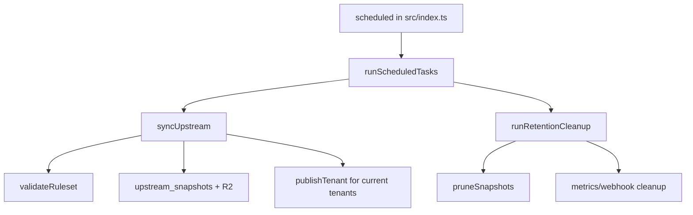

<!-- GENERATED FILE, do not edit by hand.
     Mirrored from .gitnexus/wiki (GitNexus knowledge graph wiki), source commit 3fe8c14.
     Regenerate: node .gitnexus/run.cjs wiki, then: npm run docs:wiki -->

# Upstream Sync & Retention

The Upstream Sync & Retention module keeps the instance-wide upstream ruleset current, snapshots every accepted or invalid upstream payload for traceability, republishes tenant rules when the upstream changes, and removes old operational data on the scheduled cleanup path.

It is implemented across:

- `src/lib/upstream.ts`: upstream fetch, validation, snapshotting, diff summaries, tenant republishing, snapshot pruning.
- `src/lib/cron.ts`: daily scheduled orchestration and retention cleanup.

## Runtime Flow



`runScheduledTasks(env, fetcher)` is the scheduled entry point. It runs `syncUpstream(env, "cron", fetcher)` first, then `runRetentionCleanup(env)`. This ordering means tenant publications are updated against the newest valid upstream snapshot before old metrics, webhook events, and snapshots are removed.

## Upstream Synchronization

`syncUpstream(env, operator, fetcher = fetch)` performs the full upstream refresh cycle:

1. Reads instance settings with `getInstanceSettings(env.DB)`.
2. Fetches `settings.upstream_source_url` with `accept: application/json`.
3. Hashes the response body with `sha256Hex(body)`.
4. Compares the hash to `getActiveSnapshot(env.DB)`.
5. Validates changed content with `validateRuleset(body)`.
6. Writes the payload to R2 using a key shaped as `upstream/{timestamp}-{hashPrefix}.json`.
7. Inserts a row into `upstream_snapshots`.
8. Supersedes the prior active snapshot when a new valid snapshot is accepted.
9. Republishes every tenant that has `current_version_id` set.
10. Writes audit records through `writeAudit`.

The optional `fetcher` parameter makes the function testable without using the global `fetch`.

## `SyncOutcome`

`syncUpstream` returns a `SyncOutcome`:

```ts
export interface SyncOutcome {
  status: "unchanged" | "updated" | "failed_validation" | "fetch_error";
  snapshotId?: string;
  diffSummary?: string;
  errors?: string[];
  republished?: number;
  republishFailures?: { tenantId: string; errors: string[] }[];
}
```

Status meanings:

- `unchanged`: the fetched body hash matches the active snapshot hash. No new snapshot is written.
- `updated`: validation passed, a new active snapshot was stored, the previous active snapshot was marked `superseded`, and tenant republishing was attempted.
- `failed_validation`: the fetched body changed but failed `validateRuleset`. The invalid body is stored in R2 and recorded in `upstream_snapshots` as `failed_validation`, but it does not replace the active snapshot.
- `fetch_error`: the upstream request failed or returned a non-OK HTTP status. No snapshot is stored.

## Snapshot Storage

Valid and invalid changed upstream payloads are written to `env.STORAGE` with JSON content metadata:

```ts
httpMetadata: { contentType: "application/json; charset=utf-8" }
```

Valid snapshots insert an `upstream_snapshots` row with:

- `status = 'active'`
- `upstream_version` set from `ruleset.version` when it is a string
- `diff_summary` from `computeDiffSummary`

When there is an existing active snapshot, `syncUpstream` batches the new insert with:

```sql
UPDATE upstream_snapshots SET status = 'superseded' WHERE id = ?
```

Validation failures insert an `upstream_snapshots` row with:

- `status = 'failed_validation'`
- `upstream_version = null`
- `diff_summary = 'validation failed: ...'`

This preserves bad upstream payloads for forensics while keeping the previous active snapshot intact.

## Diff Summaries

`computeDiffSummary(previous, next)` produces a human-readable one-line description of the structural change between snapshots.

It reports:

- Initial snapshot version when `previous === null`.
- Version changes via `previous.version !== next.version`.
- `phishing_indicators` additions, removals, and changes by string `id`.
- `trusted_login_patterns` additions and removals.
- `exclusion_system.domain_patterns` additions and removals.
- Added or removed top-level sections.

If no tracked differences are found, it returns:

```text
no structural changes
```

`phishing_indicators` comparison uses an internal `indexById` helper that maps each object with a string `id` to `JSON.stringify(item)`. That means changes are detected at the serialized object level for matching IDs.

`summarizeStringArray(label, previous, next)` is the shared helper for array-like sections. It coerces array items with `String(...)`, compares them as sets, and returns strings such as:

```text
trusted_login_patterns +2 -1
```

It returns `null` when there are no additions or removals.

## Tenant Republishing

After accepting a valid new upstream snapshot, `syncUpstream` republishes every tenant with a current published version:

```sql
SELECT t.id AS tenant_id, v.delta_json
FROM tenants t
JOIN ruleset_versions v ON v.id = t.current_version_id
```

Each tenant is republished with:

```ts
publishTenant(
  env,
  row.tenant_id,
  row.delta_json,
  "cron",
  `upstream auto-publish of snapshot ${snapshotId}`,
)
```

The important behavior is that republishing uses `delta_json` from the tenant’s current published version. It does not use an operator draft. This preserves tenant-specific deltas while re-merging them against the newly active upstream ruleset.

Successful tenant republishes increment `republished`. Failed republishes are collected in `republishFailures`, and each failure writes a `rules.publish_failed` audit event with the tenant ID, snapshot ID, and errors.

The final `upstream.sync` audit event records the update status, snapshot ID, diff summary, republished count, and failure count.

## Audit Behavior

`syncUpstream` writes audit records for all terminal outcomes:

- Fetch HTTP failure: `upstream.sync` with `status: "fetch_error"`.
- Fetch exception: `upstream.sync` with the exception message.
- Unchanged hash: `upstream.sync` with `status: "unchanged"` and active `snapshotId`.
- Validation failure: `upstream.sync` with `status: "failed_validation"`, `snapshotId`, and up to 10 validation errors.
- Successful update: `upstream.sync` with `status: "updated"`, `snapshotId`, `diffSummary`, `republished`, and `republishFailures` count.
- Tenant republish failure: `rules.publish_failed` for the affected tenant.

`operator` is passed through to `writeAudit`. Scheduled work passes `"cron"`.

## Retention Cleanup

`runRetentionCleanup(env)` removes old operational data according to instance settings:

```ts
const metricsDays = Number(settings.metrics_retention_days) || 7;
const webhookDays = Number(settings.webhook_retention_days) || 90;
const keepSnapshots = Number(settings.upstream_keep_snapshots) || 10;
```

It deletes:

- `fetch_metrics` rows where `day < metricsCutoffDay`.
- `revoked_guid_hits` rows where `day < metricsCutoffDay`.
- `webhook_events` rows where `status != 'new' OR received_at < webhookCutoff`.
- Old upstream snapshots via `pruneSnapshots(env, keepSnapshots)`.

It returns a `CleanupSummary`:

```ts
export interface CleanupSummary {
  metricsDeleted: number;
  revokedHitsDeleted: number;
  webhookEventsDeleted: number;
  snapshotsDeleted: number;
}
```

Database deletion counts come from `result.meta.changes ?? 0`.

## Snapshot Pruning

`pruneSnapshots(env, keep)` keeps the newest `keep` snapshot rows plus the active snapshot, regardless of where the active snapshot appears in the ordered list.

It loads snapshots newest-first:

```sql
SELECT id, r2_key, status
FROM upstream_snapshots
ORDER BY fetched_at DESC
```

Then it computes:

```ts
const excess = results.slice(keep).filter((row) => row.status !== "active");
```

Each excess snapshot is deleted from R2 first with `env.STORAGE.delete(row.r2_key)`, then removed from `upstream_snapshots`.

The function returns the number of deleted snapshot rows.

## Integration Points

Incoming production flow:

- `scheduled` in `src/index.ts` calls `runScheduledTasks`.

Incoming API flow:

- `routes/api/upstream.ts` calls `syncUpstream`, allowing upstream sync outside the scheduled path.

Test and fixture flow:

- `test/upstream.test.ts` covers `syncUpstream` and `pruneSnapshots`.
- `test/cron.test.ts` covers `runScheduledTasks` and `runRetentionCleanup`.
- `seedUpstream` in `test/helpers.ts` uses `syncUpstream` to prepare test state.

Outgoing dependencies:

- `getInstanceSettings`, `getActiveSnapshot`, `newId`, `nowIso`, and `sha256Hex` from `src/lib/db.ts`.
- `loadSnapshotRuleset` and `publishTenant` from `src/lib/publish.ts`.
- `validateRuleset` from `src/lib/validate.ts`.
- `writeAudit` from `src/lib/audit.ts`.

## Development Notes

Keep the validation boundary strict: invalid upstream content should be stored for investigation but must not become active.

When changing `computeDiffSummary`, preserve its role as a concise operator-facing summary. It should highlight meaningful structural changes without becoming a full diff engine.

When changing tenant republishing, preserve the current-version behavior: `syncUpstream` republishes from `ruleset_versions.delta_json` for `tenants.current_version_id`, not from mutable drafts.

When changing retention logic, keep `pruneSnapshots` active-safe. The active snapshot must survive even if it falls outside the newest `keep` rows.
