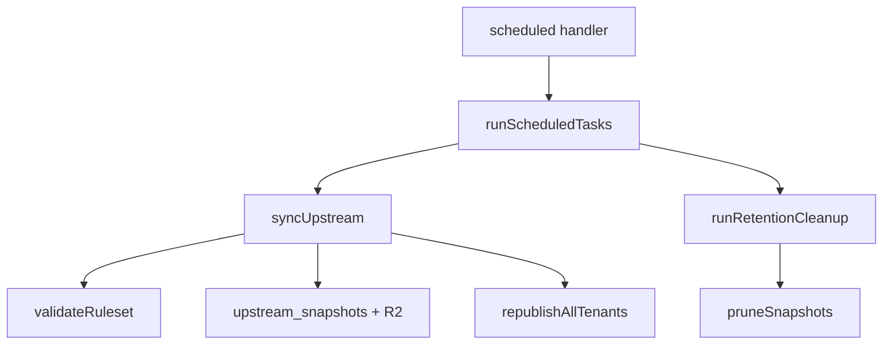

<!-- GENERATED FILE, do not edit by hand.
     Mirrored from .gitnexus/wiki (GitNexus knowledge graph wiki), source commit 5adb17f.
     Regenerate: node .gitnexus/run.cjs wiki, then: npm run docs:wiki -->

# Upstream Sync & Retention

The Upstream Sync & Retention module keeps the application’s upstream ruleset current, stores every meaningful fetch as a snapshot, republishes tenant outputs when the upstream source changes, and removes old operational data on the scheduled cleanup path.

It is implemented primarily in:

- `src/lib/upstream.ts`: upstream fetch, validation, snapshot storage, diffing, tenant republish, snapshot pruning
- `src/lib/cron.ts`: scheduled orchestration and broader retention cleanup

The module is used by the scheduled Worker handler through `runScheduledTasks()`, by API routes that trigger upstream sync manually, and by tests/helpers that seed upstream state.

## Responsibilities

This module owns four related behaviors:

1. Fetch the configured upstream ruleset from `instance_settings.upstream_source_url`.
2. Validate and snapshot fetched upstream JSON.
3. Promote valid changed snapshots to active status and republish affected tenant outputs.
4. Prune old snapshots, metrics, revoked GUID hit records, and webhook events according to instance settings.

The sync path is deliberately conservative: validation failures are stored for forensics but never replace the active snapshot.

## Scheduled Flow



`runScheduledTasks(env, fetcher)` is the scheduled entry point in `src/lib/cron.ts`. It always performs upstream sync first, then retention cleanup:

```ts
const sync = await syncUpstream(env, "cron", fetcher);
const cleanup = await runRetentionCleanup(env);
return { sync, cleanup };
```

The returned object contains both the upstream sync result and cleanup counts:

```ts
Promise<{ sync: SyncOutcome; cleanup: CleanupSummary }>
```

## Sync Outcomes

`syncUpstream()` returns a `SyncOutcome` describing the result:

```ts
export interface SyncOutcome {
  status: "unchanged" | "updated" | "failed_validation" | "fetch_error";
  snapshotId?: string;
  diffSummary?: string;
  errors?: string[];
  republished?: number;
  republishFailures?: { tenantId: string; errors: string[] }[];
}
```

The four statuses mean:

- `unchanged`: fetched content hash matches the current active snapshot
- `updated`: fetched content is valid, changed, stored, promoted active, and tenant republish was attempted
- `failed_validation`: fetched content was stored for review but not activated
- `fetch_error`: upstream could not be fetched or returned a non-OK HTTP status

## `syncUpstream()`

`syncUpstream(env, operator, fetcher = fetch)` is the core upstream synchronization function.

It depends on:

- `getInstanceSettings()` for `upstream_source_url`
- `sha256Hex()` for body hashing
- `getActiveSnapshot()` for current active snapshot lookup
- `validateRuleset()` for ruleset validation
- `loadSnapshotRuleset()` to load the previous active ruleset for diffing
- `republishAllTenants()` to regenerate tenant outputs after activation
- `writeAudit()` for audit trail entries
- `newId()` and `nowIso()` for snapshot metadata

### Fetch Handling

The upstream URL comes from instance settings:

```ts
const settings = await getInstanceSettings(env.DB);
const url = settings.upstream_source_url;
```

The fetch request asks for JSON:

```ts
const response = await fetcher(url, {
  headers: { accept: "application/json" },
});
```

If the response is not OK, `syncUpstream()` returns `fetch_error` and writes an `upstream.sync` audit event. Thrown fetch errors are also converted into `fetch_error`, with the error message included in `errors`.

### Hash-Based No-Change Detection

After a successful fetch, the raw response body is hashed:

```ts
const hash = await sha256Hex(body);
const active = await getActiveSnapshot(env.DB);
```

If the active snapshot has the same hash, the sync does not validate, store, or republish anything. It returns:

```ts
{ status: "unchanged", snapshotId: active.id }
```

An audit record is still written for visibility.

### Snapshot Key Format

Changed fetches receive a new snapshot id and R2 object key:

```ts
const fetchedAt = nowIso();
const snapshotId = newId();
const r2Key = `upstream/${fetchedAt.replace(/[:.]/g, "-")}-${hash.slice(0, 12)}.json`;
```

The key includes the fetch timestamp and first 12 hash characters, which makes stored objects sortable by time and easy to correlate with database rows.

### Validation Failure Path

`validateRuleset(body)` validates the raw upstream JSON before activation.

When validation fails:

1. The raw body is stored in R2.
2. A row is inserted into `upstream_snapshots` with `status = 'failed_validation'`.
3. The active snapshot is left untouched.
4. An `upstream.sync` audit event is written with a capped error list.
5. `syncUpstream()` returns `failed_validation`.

The database row stores a truncated diagnostic summary in `diff_summary`:

```ts
`validation failed: ${validation.errors.slice(0, 5).join("; ")}`
```

This path is important because bad upstream data remains available for investigation without affecting tenant publishing.

### Successful Activation Path

For valid changed rulesets, `syncUpstream()`:

1. Parses the validated ruleset from `validation.ruleset`.
2. Loads the previous active ruleset with `loadSnapshotRuleset(env, active)` when one exists.
3. Builds a human-readable diff with `computeDiffSummary(previousRuleset, ruleset)`.
4. Stores the raw body in R2.
5. Inserts a new `upstream_snapshots` row with `status = 'active'`.
6. Marks the previous active snapshot as `superseded`.
7. Calls `republishAllTenants()`.

The insert and previous-active update are executed together through `env.DB.batch(statements)`.

Only string `ruleset.version` values are stored as `upstream_version`; non-string versions are stored as `null`:

```ts
typeof ruleset.version === "string" ? ruleset.version : null
```

### Tenant Republishing

After a valid snapshot becomes active, the module republishes every tenant that already has a published version:

```ts
await republishAllTenants(
  env,
  "cron",
  `upstream auto-publish of snapshot ${snapshotId}`,
  operator,
);
```

The surrounding comment documents an important publishing invariant: republish uses the delta frozen in the tenant’s published version, not the operator’s current draft.

The final `updated` outcome includes:

- `snapshotId`
- `diffSummary`
- `republished`
- `republishFailures`

The audit record stores the failure count, not the full failure objects:

```ts
republishFailures: republishFailures.length
```

## Diff Summaries

`computeDiffSummary(previous, next)` produces a compact, human-readable description of what changed between two upstream rulesets.

For the first valid snapshot, it returns:

```ts
initial snapshot, version ${String(next.version ?? "unknown")}
```

For later snapshots, it compares selected high-value sections instead of dumping a full structural diff.

It reports:

- version changes
- `phishing_indicators` additions, removals, and changed entries by `id`
- `trusted_login_patterns` additions/removals
- `exclusion_system.domain_patterns` additions/removals
- top-level sections added or removed

If no tracked structural changes are found, it returns:

```ts
no structural changes
```

### `phishing_indicators` Comparison

`computeDiffSummary()` indexes indicator arrays by each object’s string `id`:

```ts
const indexById = (value: unknown): Map<string, string> => { ... }
```

Each item is serialized with `JSON.stringify(item)`. If the same `id` exists in both snapshots but the serialized object differs, it counts as changed:

```ts
indicators +${added} -${removed} ~${changed}
```

This makes the summary sensitive to any object-level change for a known indicator id.

### String Array Comparison

The private helper `summarizeStringArray(label, previous, next)` compares array-like sections as sets of strings.

It is used for:

- `trusted_login_patterns`
- `exclusion_system.domain_patterns`

The output format is:

```ts
${label} +${added} -${removed}
```

The helper ignores duplicate array entries because it compares through `Set`.

## Retention Cleanup

Retention cleanup lives in `src/lib/cron.ts`.

`runRetentionCleanup(env)` deletes old operational records and calls `pruneSnapshots()` for upstream snapshot retention.

It returns:

```ts
export interface CleanupSummary {
  metricsDeleted: number;
  revokedHitsDeleted: number;
  webhookEventsDeleted: number;
  snapshotsDeleted: number;
}
```

Retention settings come from `getInstanceSettings(env.DB)`:

```ts
const metricsDays = Number(settings.metrics_retention_days) || 7;
const webhookDays = Number(settings.webhook_retention_days) || 90;
const keepSnapshots = Number(settings.upstream_keep_snapshots) || 10;
```

Defaults are applied when settings are missing or not numeric:

- metrics retention: 7 days
- webhook retention: 90 days
- upstream snapshots retained: 10 newest snapshots, plus active snapshot protection

### Metrics and Revoked GUID Hits

Metrics and revoked GUID hits are pruned by day:

```ts
DELETE FROM fetch_metrics WHERE day < ?
DELETE FROM revoked_guid_hits WHERE day < ?
```

The cutoff format is `YYYY-MM-DD`, derived from the configured metrics retention window.

### Webhook Events

Webhook events are deleted when either condition is true:

```sql
status != 'new' OR received_at < ?
```

That means dispositioned events are removed regardless of age, while still-new events are retained until they pass the webhook retention cutoff.

## Snapshot Pruning

`pruneSnapshots(env, keep)` keeps the newest `keep` rows from `upstream_snapshots`, regardless of status, and also protects any active snapshot outside that newest window.

It queries snapshots newest first:

```ts
SELECT id, r2_key, status FROM upstream_snapshots ORDER BY fetched_at DESC
```

Then computes removable rows:

```ts
const excess = results.slice(keep).filter((row) => row.status !== "active");
```

For each removable snapshot, it deletes the R2 object first, then deletes the database row:

```ts
await env.STORAGE.delete(row.r2_key);
await env.DB.prepare("DELETE FROM upstream_snapshots WHERE id = ?")
  .bind(row.id)
  .run();
```

The return value is the number of snapshots removed.

Because active snapshots are filtered out of the deletion set, an old active row is retained even if it falls outside the newest `keep` rows.

## Audit Behavior

`syncUpstream()` writes `upstream.sync` audit records for every terminal sync result:

- fetch error
- unchanged
- failed validation
- updated

The audit payload is intentionally bounded on noisy paths. Validation failures include only the first 10 validation errors in the audit record, while the returned `SyncOutcome` includes the full `validation.errors` array.

Updated syncs audit the diff summary, republish count, and number of republish failures.

## Integration Points

### Scheduled Worker

The scheduled Worker entry point calls `runScheduledTasks()`:

```ts
scheduled (src/index.ts) -> runScheduledTasks()
```

This is the normal production path for daily upstream sync and retention cleanup.

### API Route

`routes/api/upstream.ts` calls `syncUpstream()` directly. This allows upstream sync to be triggered outside the scheduled path while still using the same validation, snapshot, activation, republish, and audit logic.

### Publishing

`syncUpstream()` delegates tenant output regeneration to `republishAllTenants()` from `src/lib/publish.ts`. The upstream module does not perform tenant merge logic itself; it only activates the new upstream snapshot and asks publishing code to regenerate affected tenant outputs.

### Storage and Database

The module uses both configured environment bindings:

- `env.DB` for settings, snapshot metadata, audit records, metrics cleanup, revoked GUID cleanup, and webhook cleanup
- `env.STORAGE` for raw upstream snapshot JSON in R2

The database row and R2 object are linked by `upstream_snapshots.r2_key`.

## Failure Semantics

The module separates fetch, validation, activation, and republish concerns clearly:

- Fetch failures do not create snapshots.
- Validation failures create forensic snapshots but do not activate them.
- Unchanged hashes do not revalidate or republish.
- Valid changed snapshots are activated before tenant republish starts.
- Republish failures are reported in `SyncOutcome.republishFailures`; they do not roll back the active upstream snapshot.

This means a valid upstream update can become active even if one or more tenant republish attempts fail. Downstream callers should inspect `republishFailures` when they need to surface partial publishing problems.

## Testing Surface

The main test-facing functions are:

- `syncUpstream()` in `test/upstream.test.ts`
- `pruneSnapshots()` in `test/upstream.test.ts`
- `runRetentionCleanup()` in `test/cron.test.ts`
- `runScheduledTasks()` in `test/cron.test.ts`

`syncUpstream()` accepts an injectable `fetcher`, which keeps tests deterministic and avoids relying on global network behavior:

```ts
syncUpstream(env, operator, fetcher)
```

`runScheduledTasks()` also accepts the same injectable fetcher and passes it through to `syncUpstream()`.
